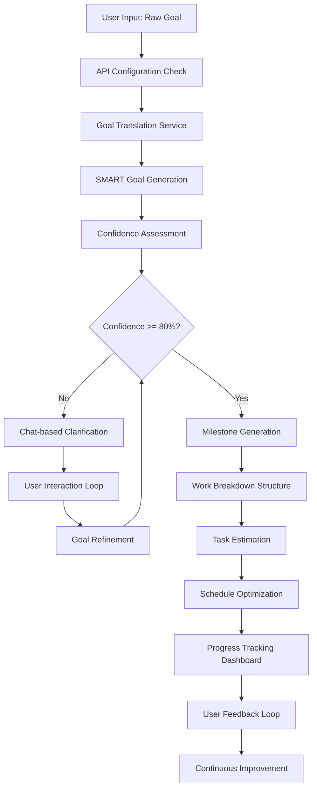

# PersonalEA Complete User Flow Architecture

## Executive Summary

This document defines the complete end-to-end user flow architecture for the PersonalEA system, focusing on the testable core flow: **Raw Goal Input → SMART Goal → Execution Planning → Progress Tracking**.

## 1. System Architecture Overview

### Core Services
- **Dialog Gateway**: Central communication hub with WebSocket/HTTP support
- **Goal Strategy Service**: SMART goal processing and strategic planning
- **Email Processing Service**: Email ingestion and summarization
- **Calendar Service**: Scheduling and availability management
- **Knowledge Base Service**: Obsidian/Google Docs integration
- **Auth Service**: JWT authentication and authorization
- **Chat LLM Service**: Conversational AI interactions
- **Scheduler Service**: Schedule optimization and planning

### Frontend Components
- **React TypeScript UI**: Chat-based interface with real-time updates
- **API Configuration**: Dynamic authentication management
- **Component Library**: Modular UI components for goal management

## 2. Complete User Flow Design

### 2.1 Primary User Journey: Goal-to-Execution Flow



### 2.2 Detailed Flow Steps

#### Phase 1: Goal Input & Authentication
1. **User Authentication**
   - JWT token validation
   - OpenAI API key configuration
   - Scope-based authorization

2. **Raw Goal Input**
   - Natural language goal description
   - Optional context (timeframe, resources, constraints)
   - Priority level setting

#### Phase 2: SMART Goal Transformation
3. **Goal Translation**
   - AI-powered analysis using OpenAI GPT-4
   - SMART criteria extraction (Specific, Measurable, Achievable, Relevant, Time-bound)
   - Confidence scoring for each criterion

4. **Quality Assessment**
   - Overall confidence calculation
   - Missing criteria identification
   - Clarification questions generation

#### Phase 3: Interactive Refinement (if needed)
5. **Chat-based Clarification**
   - Conversational interface for goal improvement
   - Component-specific questioning
   - Real-time goal updates
   - Progress visualization

6. **User Response Processing**
   - Natural language understanding
   - Context-aware conversation management
   - Goal refinement based on user input

#### Phase 4: Execution Planning
7. **Milestone Generation**
   - Strategic breakdown of goal into phases
   - Dependency mapping
   - Timeline estimation

8. **Work Breakdown Structure (WBS)**
   - Detailed task creation
   - Resource allocation
   - Risk assessment

9. **Task Estimation**
   - Time estimation for each task
   - Effort analysis
   - Complexity assessment

#### Phase 5: Schedule Integration
10. **Calendar Integration**
    - Availability checking
    - Time block allocation
    - Conflict resolution

11. **Schedule Optimization**
    - Priority-based scheduling
    - Focus time protection
    - Buffer time allocation

#### Phase 6: Execution & Tracking
12. **Progress Monitoring**
    - Real-time progress updates
    - Milestone completion tracking
    - Performance metrics

13. **Adaptive Planning**
    - Schedule adjustments
    - Goal modifications
    - Resource reallocation

## 3. Data Flow Architecture

### 3.1 Request Flow
```
Frontend → API Gateway → Auth Service → Goal Service → LLM Service → Database
```

### 3.2 Response Flow
```
Database → Goal Service → Chat Service → API Gateway → Frontend (WebSocket)
```

### 3.3 Real-time Updates
```
Goal Updates → Event Bus → WebSocket → Frontend Components → UI Updates
```

## 4. Component Integration Points

### 4.1 Frontend Components
- **ChatDemo**: Main conversation interface
- **SmartGoalViewer**: Goal visualization and editing
- **ApiConfig**: Authentication management
- **MilestonesDisplay**: Progress tracking
- **WBSDisplay**: Task breakdown visualization
- **EstimationDisplay**: Time and effort tracking

### 4.2 API Endpoints
- `POST /api/v1/goals/translate` - Goal translation
- `POST /api/v1/goals/{id}/clarify` - Interactive clarification
- `POST /api/v1/milestones/generate` - Milestone creation
- `POST /api/v1/wbs/generate` - WBS generation
- `POST /api/v1/estimations/estimate` - Task estimation
- `POST /api/v1/goals/contextual-help` - Conversation support

### 4.3 Service Dependencies
- **Goal Service** depends on: Auth, Chat LLM, Database
- **Chat Service** depends on: OpenAI API, Context Store
- **Milestone Service** depends on: Goal Service, Estimation Engine
- **WBS Service** depends on: Milestone Service, Template Engine

## 5. Testing Architecture

### 5.1 Test Flow Coverage
1. **API Configuration Testing**
   - Authentication validation
   - API key format verification
   - Authorization scope checking

2. **Goal Translation Testing**
   - Multiple goal types (learning, professional, fitness)
   - Various complexity levels
   - Edge cases and error handling

3. **Conversation Quality Testing**
   - Natural language processing accuracy
   - Context preservation
   - Response relevance

4. **Integration Testing**
   - Service-to-service communication
   - Data consistency across services
   - Error propagation and handling

### 5.2 Quality Metrics
- **Goal Improvement**: Confidence increase measurement
- **Conversation Naturalness**: Flow quality assessment
- **User Satisfaction**: Predicted satisfaction scoring
- **SMART Criteria Fulfillment**: Completeness measurement

## 6. Implementation Blueprint

### 6.1 Core Services Implementation

#### Goal Strategy Service
```typescript
interface GoalStrategyService {
  translateGoal(input: RawGoalInput): Promise<SmartGoal>
  clarifyGoal(goalId: string, clarifications: ClarificationAnswers): Promise<SmartGoal>
  generateMilestones(goalId: string): Promise<Milestone[]>
  assessProgress(goalId: string): Promise<ProgressReport>
}
```

#### Chat LLM Service
```typescript
interface ChatLLMService {
  generateQuestion(context: GoalContext): Promise<ClarificationQuestion>
  processResponse(question: string, answer: string): Promise<GoalUpdate>
  generateJustification(decision: PrioritizationDecision): Promise<Justification>
}
```

#### Frontend API Client
```typescript
interface GoalAPI {
  translateToSmart(originalGoal: string): Promise<Goal>
  clarifyGoal(goalId: string, clarifications: Record<string, string>): Promise<Goal>
  generateMilestones(goalId: string): Promise<Milestone[]>
  generateWBS(milestoneId: string): Promise<WBSTask[]>
  estimateTask(taskId: string): Promise<TaskEstimation>
}
```

### 6.2 Frontend State Management
```typescript
interface AppState {
  currentGoal: Goal | null
  originalGoal: Goal | null
  conversationHistory: Message[]
  isLoading: boolean
  error: string | null
  apiConfig: ApiConfig | null
  showChat: boolean
  isComplete: boolean
}
```

### 6.3 Real-time Communication
```typescript
interface WebSocketEvents {
  'goal-updated': (goal: Goal) => void
  'milestone-generated': (milestones: Milestone[]) => void
  'conversation-message': (message: Message) => void
  'progress-updated': (progress: ProgressUpdate) => void
}
```

## 7. Security & Privacy Implementation

### 7.1 Authentication Flow
1. JWT token validation at gateway
2. Scope-based service authorization
3. API key encryption and secure storage
4. Request correlation tracking

### 7.2 Data Protection
- End-to-end encryption for sensitive data
- Local-first processing where possible
- Secure API key management
- Privacy-preserving analytics

## 8. Performance Optimization

### 8.1 Caching Strategy
- Goal translation result caching
- Conversation context preservation
- API response optimization
- Frontend state persistence

### 8.2 Real-time Performance
- WebSocket connection management
- Progressive loading for complex operations
- Background processing for non-critical tasks
- Optimistic UI updates

## 9. Error Handling & Resilience

### 9.1 Error Categories
- **Network Errors**: Connection failures, timeouts
- **Authentication Errors**: Invalid tokens, expired sessions
- **API Errors**: Rate limits, service unavailability
- **Validation Errors**: Invalid input, missing data

### 9.2 Recovery Strategies
- Automatic retry with exponential backoff
- Graceful degradation for non-critical features
- User-friendly error messages
- Fallback mechanisms for critical operations

## 10. Monitoring & Analytics

### 10.1 Key Metrics
- Goal completion rates
- User engagement levels
- Conversation quality scores
- System performance metrics

### 10.2 Health Checks
- Service availability monitoring
- API response time tracking
- Error rate monitoring
- User satisfaction measurement

## Conclusion

This architecture provides a complete, testable user flow that covers:
- **End-to-end goal management** from raw input to execution
- **Interactive refinement** through conversational AI
- **Comprehensive integration** across all system components
- **Robust testing framework** with quality metrics
- **Production-ready implementation** with security and performance considerations

The design ensures that every component is testable, every integration point is clearly defined, and the complete user journey is optimized for both functionality and user experience.