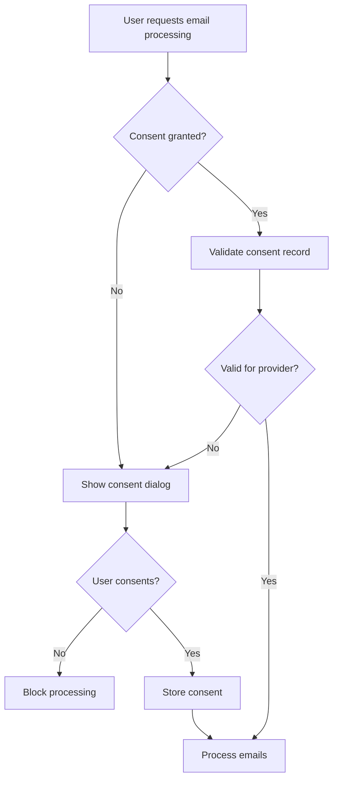
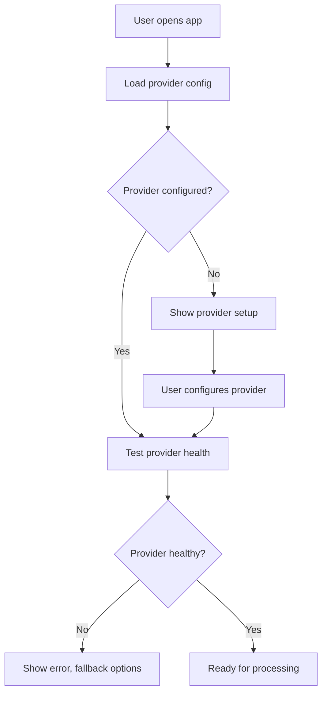

# Privacy Implementation Plan

## Overview
This plan addresses privacy requirements for PersonalEA's open source release, focusing on user consent for email processing and LLM provider abstraction.

## Core Privacy Principles

### ✅ **Goals Processing**: No Consent Required
- User's personal goals are their own data
- Direct LLM processing acceptable without additional consent
- Clear in UI that goals will be processed by selected LLM

### ⚠️ **Email Processing**: Consent Required
- Email content contains private information from third parties
- Requires explicit user acknowledgment before processing
- Must inform user which LLM provider will process emails

## Implementation Strategy

### Phase 1: Email Consent System

#### 1.1 Frontend Consent UI
**Location**: `testing/goal-strategy-test/src/components/EmailConsentDialog.tsx`

```typescript
interface EmailConsentProps {
  selectedProvider: LLMProvider;
  onConsent: (granted: boolean) => void;
  emailCount: number;
}
```

**Features**:
- Clear explanation of email processing
- Display selected LLM provider
- Number of emails to be processed
- Checkbox: "I understand my email content will be sent to [Provider] for AI processing"
- Remember consent choice per session

#### 1.2 Backend Consent Validation
**Location**: `services/email-processing/src/middleware/consent-validator.ts`

```typescript
interface ConsentRecord {
  sessionId: string;
  emailProcessingConsent: boolean;
  consentTimestamp: Date;
  llmProvider: string;
}
```

**Logic**:
- Block email processing without valid consent
- Validate consent per LLM provider
- Return 403 if consent not granted

### Phase 2: LLM Provider Abstraction

#### 2.1 Provider Interface
**Location**: `shared/llm-providers/src/interfaces/LLMProvider.ts`

```typescript
interface LLMProvider {
  id: string;
  name: string;
  type: 'cloud' | 'local';
  endpoint?: string;
  requiresApiKey: boolean;
  supportsStreaming: boolean;
  
  processGoal(goal: string): Promise<SmartGoal>;
  processEmail(email: EmailContent): Promise<EmailSummary>;
  isHealthy(): Promise<boolean>;
}
```

#### 2.2 Provider Implementations

**OpenAI Provider**: `shared/llm-providers/src/providers/OpenAIProvider.ts`
- Existing OpenAI integration
- Requires API key
- Cloud-based

**Llama Provider**: `shared/llm-providers/src/providers/LlamaProvider.ts`
- Local Ollama integration
- No API key required
- Configurable endpoint (default: localhost:11434)

**Generic Provider**: `shared/llm-providers/src/providers/GenericProvider.ts`
- OpenAI-compatible API format
- Configurable endpoint
- For services like Anthropic, Groq, local APIs

#### 2.3 Provider Selection UI
**Location**: `testing/goal-strategy-test/src/components/LLMProviderSelector.tsx`

```typescript
interface ProviderOption {
  id: string;
  name: string;
  description: string;
  privacyLevel: 'local' | 'cloud';
  requiresSetup: boolean;
}
```

**Options**:
- OpenAI GPT-4 (Cloud, requires API key)
- Local Llama (Private, requires Ollama)
- Custom Endpoint (Configurable)

### Phase 3: Configuration Management

#### 3.1 User-Controlled API Keys
**Location**: `testing/goal-strategy-test/src/components/ApiConfig.tsx` (extend existing)

**Enhanced Features**:
- Support multiple provider configurations
- Secure client-side storage (sessionStorage)
- Per-provider health testing
- Clear privacy implications for each provider

#### 3.2 Environment Security
**Location**: Multiple `.env` files

**Changes**:
- Remove hardcoded API keys
- Add provider selection defaults
- Document secure key management

## Implementation Priority

### 🚨 **IMMEDIATE** (This Week)
1. **Secure API Keys**
   - Remove exposed OpenAI key from `.env.production`
   - Update all environment files to use placeholders
   - Document secure key management process

2. **Email Consent Dialog**
   - Implement basic consent UI
   - Block email processing without consent
   - Inform user about data processing

### 🔥 **HIGH** (Next 2 Weeks)
3. **LLM Provider Abstraction**
   - Create provider interface
   - Implement OpenAI and Llama providers
   - Add provider selection UI

4. **Update Existing Services**
   - Modify email-processing service to use new providers
   - Update goal-strategy service for consistency
   - Add provider health checks

### 📚 **MEDIUM** (Following 2 Weeks)
5. **Documentation Updates**
   - Privacy setup guide
   - LLM provider configuration guide
   - Security deployment documentation

6. **Enhanced Features**
   - Provider performance monitoring
   - Fallback provider configuration
   - Usage analytics (privacy-preserving)

## Technical Details

### Email Consent Flow


### LLM Provider Selection


## Security Considerations

### Data Flow Protection
- **Goals**: User → Selected LLM Provider
- **Emails**: User → Consent → Selected LLM Provider
- **Local Processing**: User → Local Ollama (no external data transfer)

### API Key Security
- Never commit real API keys to repository
- Use environment variables with clear documentation
- Support user-provided keys stored securely client-side
- Regular key rotation recommendations

### Provider Trust Levels
- **Local Providers**: Highest privacy (Llama, local APIs)
- **User-Controlled Cloud**: Medium privacy (user's own API keys)
- **Shared Cloud**: Lower privacy (shared service keys)

## Success Metrics

### Privacy Compliance
- ✅ Zero hardcoded API keys in repository
- ✅ User consent required for all email processing
- ✅ Clear privacy implications for each LLM provider
- ✅ Support for fully local processing

### User Experience
- ✅ Simple provider setup process
- ✅ Clear privacy choices
- ✅ Fallback options if primary provider fails
- ✅ Performance comparable to current implementation

### Developer Experience
- ✅ Easy to add new LLM providers
- ✅ Clean abstraction layer
- ✅ Comprehensive documentation
- ✅ Secure development practices

## Next Steps

1. **Review and approve this plan**
2. **Begin immediate security fixes**
3. **Implement email consent system**
4. **Create LLM provider abstraction**
5. **Update documentation**
6. **Test with multiple providers**
7. **Prepare for open source release**

This plan ensures PersonalEA respects user privacy while maintaining functionality and supporting diverse deployment scenarios.