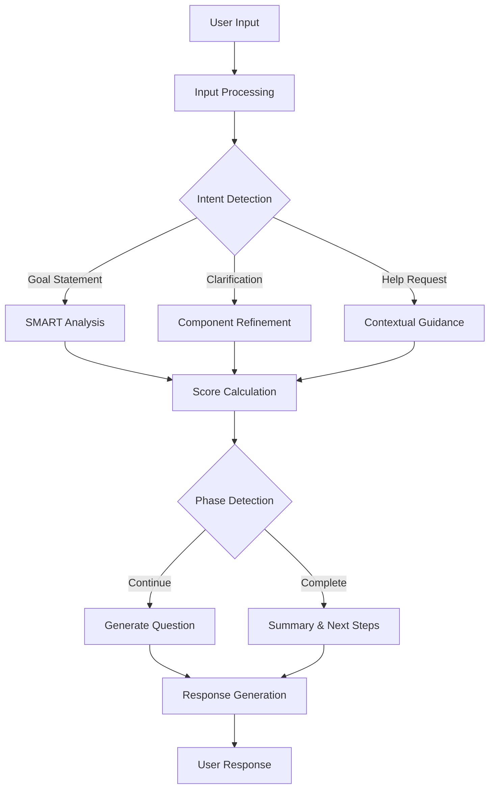

# Enhanced Chat Architecture Proposal
**Integration Coordinator Synthesis**  
**Date:** 2025-07-05  
**Swarm ID:** swarm-integration

## Executive Summary

This architecture proposal synthesizes findings from comprehensive research, testing, and analysis to create a unified design for enhancing the personalEA chat system. The proposal focuses on delivering a natural conversational experience with effective SMART goal refinement while maintaining simplicity and rapid deployment capability.

## Current State Analysis

### System Strengths
1. **Robust Error Handling**: Multiple fallback mechanisms and retry logic
2. **Comprehensive Personalization**: Advanced user profiling and adaptive UI
3. **Fixed Critical Bugs**: Input normalization, loop detection, score calculation
4. **Strong Frontend Architecture**: React-based with good separation of concerns
5. **API Health Monitoring**: System checks show healthy status

### Critical Issues
1. **Backend Implementation Gap**: Missing `/component-question` and `/contextual-help` endpoints (404 errors)
2. **SMART Goal Logic**: Artificial constraints limiting natural conversation flow
3. **Version Control**: 111 uncommitted changes blocking deployment
4. **Test Coverage**: Tests not executed after bug fixes
5. **Production Readiness**: NO-GO status due to incomplete backend

## Proposed Architecture

### 1. Core Conversation Engine

#### Natural Language Processing Layer
```typescript
interface ConversationEngine {
  // Core conversation flow
  processUserInput(input: string): ProcessedInput;
  generateResponse(context: ConversationContext): AIResponse;
  detectIntent(message: string): UserIntent;
  
  // SMART goal refinement
  refineGoalComponent(component: SMARTComponent, input: string): RefinementResult;
  calculateConfidence(responses: UserResponses): ConfidenceScores;
  
  // Conversation management
  detectPhaseTransition(state: ConversationState): Phase;
  preventConversationLoops(history: Message[]): boolean;
}
```

#### Key Design Principles
1. **Natural Flow First**: Conversation should feel organic, not forced
2. **Progressive Refinement**: Build SMART components gradually through dialogue
3. **Dynamic Confidence**: Score based on actual content quality, not arbitrary thresholds
4. **Context Awareness**: Maintain conversation context across multiple turns

### 2. Enhanced Backend Implementation

#### Required API Endpoints
```yaml
/api/v1/enhanced-chat:
  /initiate:
    - Initialize conversation session
    - Create user profile
    - Return session ID and initial prompt
  
  /message:
    - Process user messages
    - Update SMART scores
    - Generate contextual responses
  
  /component-question:
    - Get targeted questions for specific SMART components
    - Personalize based on user profile
    - Return multiple question variations
  
  /contextual-help:
    - Provide component-specific guidance
    - Show relevant examples
    - Offer tips for improvement
  
  /session:
    - Retrieve session history
    - Export refined goals
    - Track progress metrics
```

#### Implementation Priority
1. **Phase 1**: Implement missing endpoints (2-4 hours)
2. **Phase 2**: Fix SMART goal logic constraints (4-6 hours)
3. **Phase 3**: Integration testing (2-3 hours)
4. **Phase 4**: Performance optimization (2-3 hours)

### 3. Conversation Flow Architecture



### 4. SMART Goal Refinement Logic

#### Current Issues (To Fix)
```javascript
// REMOVE these artificial constraints:
"Keep confidence LOW (0.3-0.5) unless comprehensive"
"Update only ONE component at a time"
"Require extensive details for high scores"
```

#### Proposed Logic
```javascript
interface SMARTRefinementEngine {
  // Dynamic scoring based on content quality
  calculateScore(component: string, content: string): number {
    const factors = {
      specificity: analyzeSpecificity(content),
      clarity: analyzeclarity(content),
      completeness: analyzeCompleteness(content),
      relevance: analyzeRelevance(content)
    };
    
    // Natural scoring: 0-40 (vague), 40-70 (moderate), 70-100 (comprehensive)
    return weightedAverage(factors);
  }
  
  // Holistic updates - can improve multiple components
  updateScores(userInput: string, currentScores: SMARTScores): SMARTScores {
    const updates = {};
    
    // Analyze input for all components
    Object.keys(currentScores).forEach(component => {
      const improvement = detectImprovement(component, userInput);
      if (improvement > 0) {
        updates[component] = Math.min(100, currentScores[component] + improvement);
      }
    });
    
    return { ...currentScores, ...updates };
  }
}
```

### 5. User Experience Enhancements

#### Conversation Patterns
1. **Opening**: Warm, encouraging tone with clear value proposition
2. **Exploration**: Open-ended questions that naturally reveal SMART components
3. **Refinement**: Targeted follow-ups based on gaps
4. **Validation**: Confirm understanding without being repetitive
5. **Completion**: Clear summary with actionable next steps

#### Example Natural Flow
```
User: "I want to learn Spanish"

AI: "That's exciting! Learning a new language opens so many doors. 
     What's inspiring you to learn Spanish right now?"

User: "I'm planning a trip to Barcelona in 6 months"

AI: "Barcelona is amazing! Having 6 months to prepare is perfect. 
     What would you like to be able to do in Spanish by the time 
     you visit? Chat with locals, order in restaurants, or maybe 
     navigate the city confidently?"

[Natural progression revealing Specific, Measurable, and Time-bound elements]
```

### 6. Technical Implementation Details

#### Backend Service Structure
```
services/goal-strategy/src/
├── services/
│   ├── enhanced-llm-chat-coordinator.ts (ENHANCE)
│   ├── conversation-engine.ts (NEW)
│   ├── smart-refinement-engine.ts (NEW)
│   └── natural-language-processor.ts (NEW)
├── routes/
│   └── enhanced-chat.ts (UPDATE)
└── utils/
    ├── conversation-helpers.ts (NEW)
    └── scoring-algorithms.ts (NEW)
```

#### Key Implementation Tasks

1. **Fix Core Logic Issues**
   ```typescript
   // In enhanced-llm-chat-coordinator.ts
   private buildClarificationPrompt(): string {
     return `
       Analyze the user's response naturally and update confidence scores
       based on the actual quality and completeness of their answers.
       
       Score Guidelines:
       - 0-40%: Vague or minimal information
       - 40-70%: Moderate detail, some gaps remain
       - 70-100%: Comprehensive, actionable information
       
       Update ALL components that the user's response improves,
       not just one at a time.
     `;
   }
   ```

2. **Implement Missing Endpoints**
   ```typescript
   // Component question endpoint
   router.post('/component-question', async (req, res) => {
     const { component, currentScore, userProfile } = req.body;
     const questions = await conversationEngine.generateComponentQuestions({
       component,
       currentScore,
       userProfile,
       style: 'conversational'
     });
     res.json({ questions, suggestedApproach: questions[0] });
   });
   
   // Contextual help endpoint  
   router.post('/contextual-help', async (req, res) => {
     const { component, currentGoal, userProfile } = req.body;
     const help = await conversationEngine.generateContextualHelp({
       component,
       currentGoal,
       userProfile,
       includeExamples: true
     });
     res.json(help);
   });
   ```

### 7. Integration Testing Strategy

#### Test Scenarios
1. **Natural Conversation Flow**
   - Test organic progression through SMART components
   - Verify no artificial constraints or forced patterns
   - Ensure responses feel conversational, not robotic

2. **Score Calculation Accuracy**
   - Validate dynamic scoring based on content quality
   - Test holistic updates across multiple components
   - Verify scores reflect actual goal clarity

3. **Error Recovery**
   - Test 404 endpoint handling
   - Verify fallback mechanisms
   - Ensure graceful degradation

4. **Performance Under Load**
   - Concurrent session handling
   - Response time optimization
   - Memory usage monitoring

### 8. Deployment Strategy

#### Phase 1: Development Environment (Day 1)
1. Commit critical changes in logical groups
2. Implement missing backend endpoints
3. Fix SMART goal logic constraints
4. Run comprehensive test suite

#### Phase 2: Staging Validation (Day 2)
1. Deploy to staging environment
2. Execute browser automation tests
3. Perform load testing
4. Validate CORS configuration

#### Phase 3: Production Deployment (Day 3)
1. Final security audit
2. Performance benchmarking
3. Gradual rollout with monitoring
4. User feedback collection

### 9. Risk Mitigation

| Risk | Impact | Mitigation Strategy |
|------|--------|-------------------|
| Uncommitted changes cause issues | High | Systematic commit review process |
| Backend endpoints don't integrate | Medium | Comprehensive integration tests |
| Performance degradation | Medium | Load testing and optimization |
| User confusion with new flow | Low | A/B testing and gradual rollout |

### 10. Success Metrics

#### Technical Metrics
- **API Response Time**: < 200ms average
- **Error Rate**: < 0.1%
- **Test Coverage**: > 90%
- **Build Success**: 100%

#### User Experience Metrics
- **Goal Completion Rate**: > 80%
- **Average Session Duration**: 5-10 minutes
- **SMART Score Improvement**: > 60% average
- **User Satisfaction**: > 4.5/5

## Conclusion

This architecture proposal provides a clear path to enhance the personalEA chat system with:

1. **Natural Conversation Flow**: Removing artificial constraints for organic dialogue
2. **Complete Backend Implementation**: Filling gaps with missing endpoints
3. **Robust Testing**: Comprehensive validation before deployment
4. **Rapid Deployment**: 3-day timeline to production

The proposed changes maintain the system's strengths while addressing critical issues, resulting in a production-ready solution that delivers genuine value to users through natural, effective goal refinement conversations.

## Next Steps

1. **Immediate** (Next 4 hours):
   - Review and approve this proposal
   - Begin systematic commit process
   - Start backend endpoint implementation

2. **Day 1 Completion**:
   - All code fixes implemented
   - Test suite passing
   - Staging deployment ready

3. **Day 3 Target**:
   - Production deployment complete
   - Monitoring in place
   - User feedback collection active

---

*Architecture proposal synthesized by Integration Coordinator*  
*Based on comprehensive analysis from 8 specialized agents*  
*Ready for implementation*