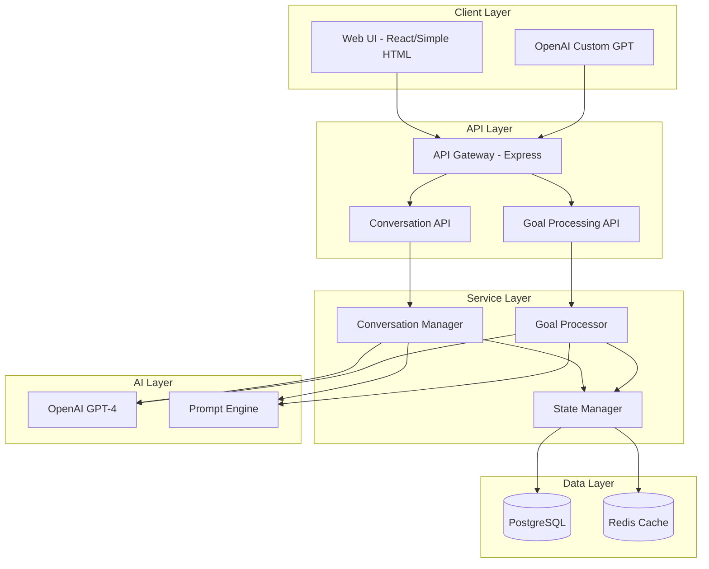

# Complete Conversational SMART Goal System Architecture

## Executive Summary

This architecture defines a simple, deployable system for transforming vague user goals into actionable SMART goals through natural conversation. The system supports both direct API integration and OpenAI Custom GPT deployment options.

## Core Design Principles

1. **Simplicity First**: Avoid over-engineering; use proven patterns
2. **Conversation-Centric**: Natural language interaction as primary interface
3. **Stateful Context**: Maintain conversation history across interactions
4. **Progressive Enhancement**: Start simple, add complexity as needed
5. **Testable by Design**: Built-in support for automated browser testing

## System Architecture

### High-Level Architecture



## API Design

### Conversation Endpoints

```yaml
# Start a new conversation
POST /api/v1/conversations/start
Request:
  message: string
  context?: {
    userId?: string
    sessionId?: string
  }
Response:
  conversationId: string
  message: string
  state: ConversationState

# Continue conversation
POST /api/v1/conversations/{id}/message
Request:
  message: string
Response:
  message: string
  state: ConversationState
  suggestions?: string[]

# Get conversation state
GET /api/v1/conversations/{id}
Response:
  state: ConversationState
  history: Message[]

# Complete and save goal
POST /api/v1/conversations/{id}/complete
Response:
  goalId: string
  finalGoal: SmartGoal
  nextSteps: string[]
```

## Conversation Flow Example

### Complete Interaction Flow

**Phase 1: Initial Contact**
```
User: "I want to get better at programming"
Assistant: "That is a great aspiration\! To help you create a clear plan, 
           could you tell me more about what aspect of programming you would 
           like to improve? For example, are you interested in a specific 
           language, framework, or type of development?"

User: "I guess I want to learn React for web development"

**Phase 2: Specificity Refinement**
Assistant: "Excellent choice\! React is very popular for building modern web apps.
           To make this goal more specific, what would you like to be able to 
           build with React? For instance, a personal website, a web app, or 
           contribute to open source?"

User: "I want to build a todo app that syncs across devices"

**Phase 3: Measurability Definition**
Assistant: "Building a syncing todo app is a concrete project\! Let us define 
           what success looks like. What features would your todo app need 
           to have for you to feel you have achieved your goal?"

User: "It should have user accounts, create/edit/delete todos, and sync in real-time"

**Phase 4: Achievability Check**
Assistant: "Those are solid features. To ensure this is achievable, could you 
           share your current programming experience? Have you worked with 
           JavaScript or any web development before?"

User: "I know basic JavaScript and HTML/CSS from online tutorials"

**Phase 5: Relevance Confirmation**
Assistant: "Perfect foundation\! Before we finalize, could you share why building 
           this React todo app is important to you? Understanding your motivation 
           helps ensure the goal stays relevant."

User: "I want to transition to a frontend developer role at my company"

**Phase 6: Time-Bound Setting**
Assistant: "That is a compelling reason\! Last question: when would you like to 
           have your React todo app completed and deployed?"

User: "In 3 months would be good"

**Phase 7: Goal Confirmation**
Assistant: "Based on our conversation, here is your SMART goal:

           **Build and deploy a React-based todo application with user authentication 
           and real-time synchronization within 3 months to demonstrate frontend 
           development skills for career advancement.**

           This goal is:
           - **Specific**: Build a React todo app with defined features
           - **Measurable**: Complete app with auth and sync functionality
           - **Achievable**: Builds on your JavaScript/HTML/CSS knowledge
           - **Relevant**: Directly supports your career transition
           - **Time-bound**: 3-month deadline

           Shall we break this down into milestones and create an action plan?"
```

## Database Schema

```sql
-- Conversations table
CREATE TABLE conversations (
  id UUID PRIMARY KEY DEFAULT gen_random_uuid(),
  user_id VARCHAR(255),
  started_at TIMESTAMP DEFAULT CURRENT_TIMESTAMP,
  completed_at TIMESTAMP,
  status VARCHAR(50) DEFAULT "active",
  final_goal_id UUID REFERENCES goals(id),
  metadata JSONB,
  created_at TIMESTAMP DEFAULT CURRENT_TIMESTAMP,
  updated_at TIMESTAMP DEFAULT CURRENT_TIMESTAMP
);

-- Conversation messages
CREATE TABLE conversation_messages (
  id UUID PRIMARY KEY DEFAULT gen_random_uuid(),
  conversation_id UUID REFERENCES conversations(id) ON DELETE CASCADE,
  role VARCHAR(50) NOT NULL CHECK (role IN ("user", "assistant")),
  content TEXT NOT NULL,
  phase VARCHAR(50),
  metadata JSONB,
  created_at TIMESTAMP DEFAULT CURRENT_TIMESTAMP
);

-- Goals table (simplified)
CREATE TABLE goals (
  id UUID PRIMARY KEY DEFAULT gen_random_uuid(),
  user_id VARCHAR(255),
  conversation_id UUID REFERENCES conversations(id),
  title VARCHAR(500) NOT NULL,
  description TEXT,
  raw_input TEXT,
  smart_criteria JSONB NOT NULL,
  confidence_score DECIMAL(3,2),
  status VARCHAR(50) DEFAULT "active",
  created_at TIMESTAMP DEFAULT CURRENT_TIMESTAMP,
  updated_at TIMESTAMP DEFAULT CURRENT_TIMESTAMP
);

-- Conversation state cache (Redis)
conversation:{id} = {
  phase: string,
  currentDraft: object,
  missingComponents: array,
  confidence: number,
  lastActivity: timestamp
}
```

## Implementation Details

### Conversation Manager

```typescript
class ConversationManager {
  private redis: RedisClient;
  private db: PrismaClient;
  private ai: OpenAIClient;

  async startConversation(message: string, userId?: string) {
    // Create conversation record
    const conversation = await this.db.conversation.create({
      data: { userId, status: "active" }
    });

    // Save initial message
    await this.saveMessage(conversation.id, "user", message);

    // Analyze initial intent
    const analysis = await this.ai.analyzeGoalIntent(message);
    
    // Generate response based on missing components
    const response = await this.generateResponse(analysis);
    
    // Save assistant response
    await this.saveMessage(conversation.id, "assistant", response);
    
    // Cache state
    await this.cacheState(conversation.id, {
      phase: "clarifying",
      currentDraft: analysis.draft,
      missingComponents: analysis.missing,
      confidence: analysis.confidence
    });

    return {
      conversationId: conversation.id,
      message: response,
      state: await this.getState(conversation.id)
    };
  }

  async continueConversation(conversationId: string, message: string) {
    // Get current state
    const state = await this.getState(conversationId);
    
    // Save user message
    await this.saveMessage(conversationId, "user", message);
    
    // Process based on current phase
    const result = await this.processPhase(state, message);
    
    // Update state
    await this.updateState(conversationId, result.newState);
    
    // Save assistant response
    await this.saveMessage(conversationId, "assistant", result.response);
    
    return {
      message: result.response,
      state: result.newState,
      suggestions: result.suggestions
    };
  }
}
```

### Prompt Engine

```typescript
class PromptEngine {
  generatePhasePrompt(phase: string, context: any): string {
    const prompts = {
      clarifying: `
        The user wants to: "${context.currentGoal}"
        Missing SMART components: ${context.missing.join(", ")}
        
        Generate a friendly, conversational question to clarify the 
        ${context.missing[0]} aspect of their goal. Be specific and 
        provide examples if helpful.
      `,
      
      refining: `
        Current goal draft: "${context.draft}"
        User response: "${context.userMessage}"
        
        Incorporate the user response to refine the goal. Focus on
        making it more ${context.targetComponent}.
      `,
      
      confirming: `
        Final SMART goal: "${context.finalGoal}"
        
        Present the goal back to the user in a clear, structured way.
        Highlight each SMART component and ask for confirmation.
      `
    };
    
    return prompts[phase] || prompts.clarifying;
  }
}
```

## Deployment Options

### Option 1: Standalone API Service

```yaml
# docker-compose.yml
version: "3.8"
services:
  api:
    build: ./services/goal-strategy
    ports:
      - "3001:3001"
    environment:
      - DATABASE_URL=postgresql://...
      - REDIS_URL=redis://redis:6379
      - OPENAI_API_KEY=${OPENAI_API_KEY}
    depends_on:
      - postgres
      - redis
  
  postgres:
    image: postgres:15
    environment:
      POSTGRES_DB: goals
      POSTGRES_USER: admin
      POSTGRES_PASSWORD: ${DB_PASSWORD}
    volumes:
      - postgres_data:/var/lib/postgresql/data
  
  redis:
    image: redis:7-alpine
    ports:
      - "6379:6379"

volumes:
  postgres_data:
```

### Option 2: OpenAI Custom GPT Configuration

```json
{
  "name": "SMART Goal Coach",
  "description": "Transform your ideas into actionable SMART goals",
  "instructions": "You are a SMART goal coach...",
  "conversation_starters": [
    "I want to improve my skills",
    "Help me set a career goal",
    "I need to get healthier",
    "I want to start a business"
  ],
  "actions": [
    {
      "type": "api",
      "name": "goal_conversation",
      "description": "Manage goal refinement conversations",
      "url": "https://api.personalea.com/v1/conversations",
      "operations": [
        {
          "method": "POST",
          "path": "/start",
          "description": "Start a new conversation"
        },
        {
          "method": "POST", 
          "path": "/{id}/message",
          "description": "Continue conversation"
        },
        {
          "method": "POST",
          "path": "/{id}/complete",
          "description": "Save final goal"
        }
      ]
    }
  ]
}
```

## Testing Strategy

### Unit Tests
```typescript
describe("ConversationManager", () => {
  it("should identify missing SMART components", async () => {
    const analysis = await manager.analyzeGoal("I want to lose weight");
    expect(analysis.missing).toContain("specific");
    expect(analysis.missing).toContain("measurable");
    expect(analysis.missing).toContain("time-bound");
  });
});
```

### Integration Tests
```typescript
describe("Conversation Flow", () => {
  it("should refine vague goal through conversation", async () => {
    // Start conversation
    const start = await api.post("/conversations/start", {
      message: "I want to learn programming"
    });
    
    expect(start.data.state.phase).toBe("clarifying");
    
    // Continue with clarifications
    const cont1 = await api.post(`/conversations/${start.data.conversationId}/message`, {
      message: "I want to build web applications"
    });
    
    // ... continue through all phases
    
    // Complete conversation
    const complete = await api.post(`/conversations/${start.data.conversationId}/complete`);
    
    expect(complete.data.finalGoal.smartCriteria).toHaveProperty("specific");
    expect(complete.data.finalGoal.confidence).toBeGreaterThan(0.8);
  });
});
```

### Browser Automation Tests
```typescript
describe("UI Conversation Flow", () => {
  it("should guide user through goal refinement", async () => {
    await page.goto("http://localhost:3000");
    
    // Start conversation
    await page.fill("#goal-input", "I want to get fit");
    await page.click("#start-conversation");
    
    // Answer clarifying questions
    await page.waitForSelector(".assistant-message");
    const question1 = await page.textContent(".assistant-message");
    expect(question1).toContain("specific");
    
    await page.fill("#response-input", "I want to run a 5K");
    await page.click("#send-response");
    
    // Continue through flow...
  });
});
```

## Performance Considerations

### Caching Strategy
- Cache conversation state in Redis (TTL: 24 hours)
- Cache common goal templates
- Cache AI responses for similar inputs

### Optimization Techniques
- Lazy load conversation history
- Paginate message retrieval
- Background job for goal analysis
- Connection pooling for database

## Security Considerations

### API Security
- Rate limiting per API key
- JWT authentication for user sessions
- Input validation and sanitization
- CORS configuration

### Data Privacy
- Encrypt sensitive conversation data
- Implement data retention policies
- User consent for AI processing
- Audit logging for compliance

## Monitoring & Observability

### Key Metrics
- Conversation completion rate
- Average messages per conversation
- Goal confidence scores
- AI response times
- API error rates

### Logging Strategy
```json
{
  "conversationId": "uuid",
  "userId": "user123",
  "phase": "clarifying",
  "action": "message_sent",
  "confidence": 0.65,
  "duration": 234,
  "timestamp": "2024-01-10T10:30:00Z"
}
```

## CI/CD Pipeline

### GitHub Actions Workflow
```yaml
name: Deploy Goal Service
on:
  push:
    branches: [main]
    
jobs:
  test:
    runs-on: ubuntu-latest
    steps:
      - uses: actions/checkout@v3
      - name: Run tests
        run:  < /dev/null | 
          npm test
          npm run test:integration
          
  deploy:
    needs: test
    runs-on: ubuntu-latest
    steps:
      - name: Deploy to staging
        run: |
          docker build -t goal-service .
          docker push registry/goal-service:$GITHUB_SHA
          kubectl set image deployment/goal-service goal-service=registry/goal-service:$GITHUB_SHA
```

## Future Enhancements

1. **Multi-language Support**: Conversation in multiple languages
2. **Voice Interface**: Speech-to-text for goal input
3. **Goal Templates**: Pre-built templates for common goals
4. **Progress Tracking**: Automated check-ins and adjustments
5. **Team Goals**: Collaborative goal setting
6. **AI Learning**: Improve suggestions based on success patterns

## Conclusion

This architecture provides a simple, scalable foundation for conversational SMART goal creation. The design prioritizes user experience through natural conversation while maintaining technical simplicity for rapid deployment and iteration.

