# Conversational SMART Goal System - Architecture Diagrams

## System Overview Diagram

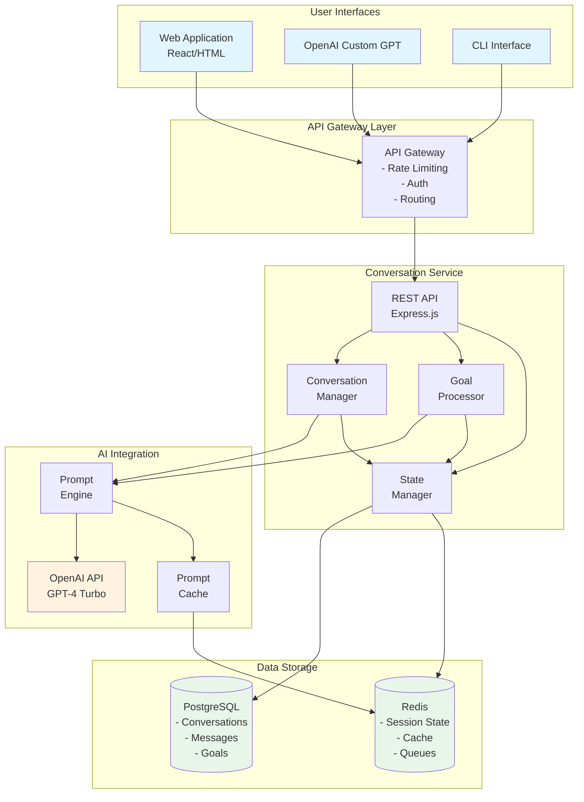

## Conversation Flow Sequence Diagram

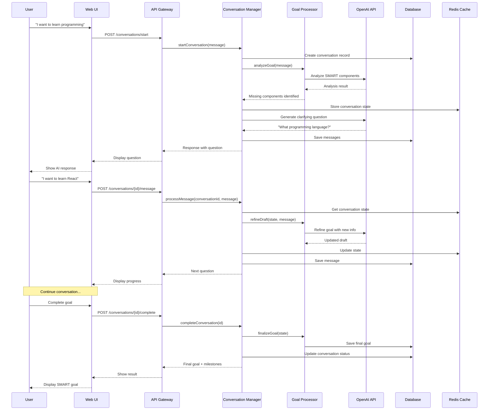

## State Management Flow

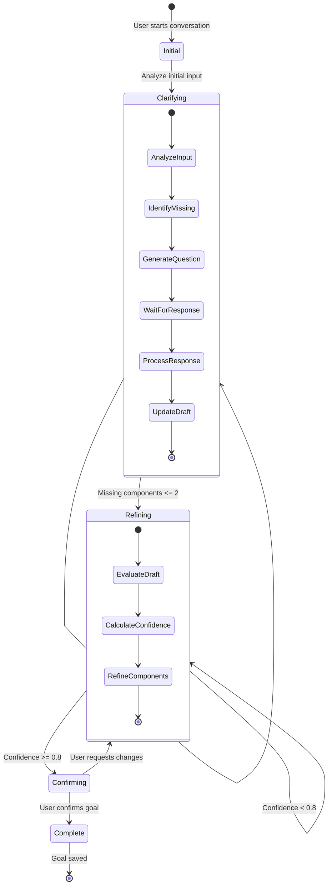

## Data Model Diagram

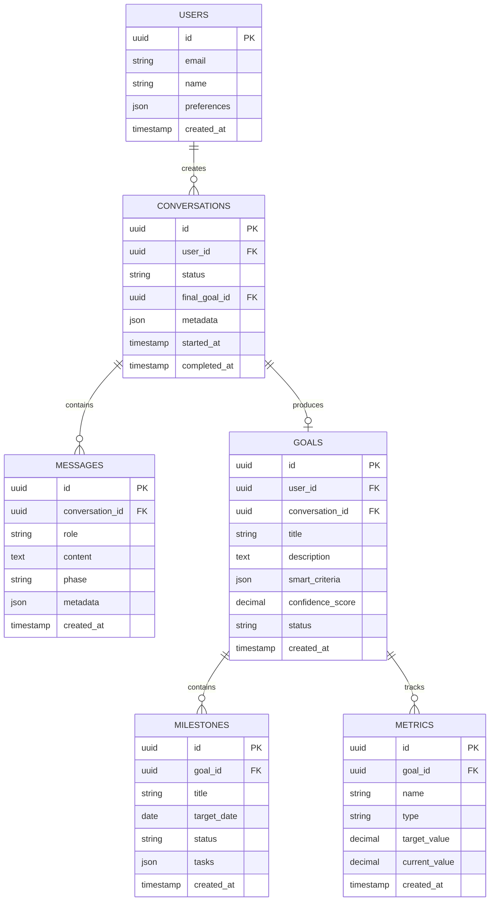

## Component Architecture

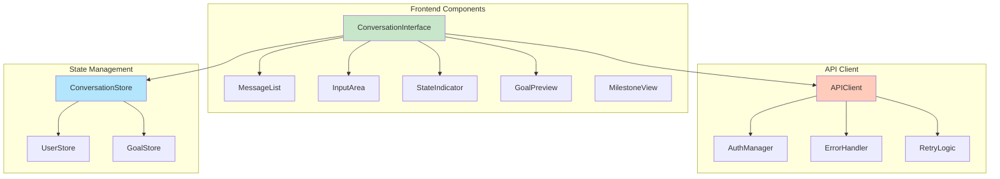

## Deployment Architecture

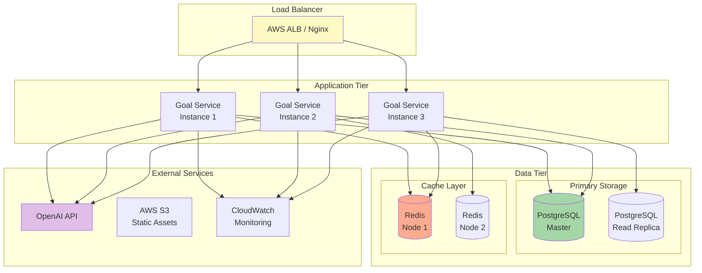

## API Request Flow

```mermaid
graph LR
    subgraph "Request Pipeline"
        REQ[Incoming Request]
        RL[Rate Limiter]
        AUTH[Authentication]
        VAL[Validation]
        LOG[Request Logger]
        ROUTE[Router]
    end
    
    subgraph "Processing"
        CTRL[Controller]
        SVC[Service Layer]
        CACHE{Cache Hit?}
        PROC[Process Request]
        AI[AI Processing]
    end
    
    subgraph "Response Pipeline"
        RESP[Build Response]
        ERR[Error Handler]
        TRANS[Transform]
        COMPRESS[Compression]
        RES[Send Response]
    end
    
    REQ --> RL
    RL --> AUTH
    AUTH --> VAL
    VAL --> LOG
    LOG --> ROUTE
    
    ROUTE --> CTRL
    CTRL --> SVC
    SVC --> CACHE
    CACHE -->|Yes| RESP
    CACHE -->|No| PROC
    PROC --> AI
    AI --> RESP
    
    RESP --> TRANS
    TRANS --> COMPRESS
    COMPRESS --> RES
    
    CTRL -.->|Error| ERR
    SVC -.->|Error| ERR
    AI -.->|Error| ERR
    ERR --> RES
    
    style REQ fill:#ffebee
    style RES fill:#e8f5e9
    style AI fill:#fff3e0
    style CACHE fill:#e3f2fd
```

## Conversation State Machine

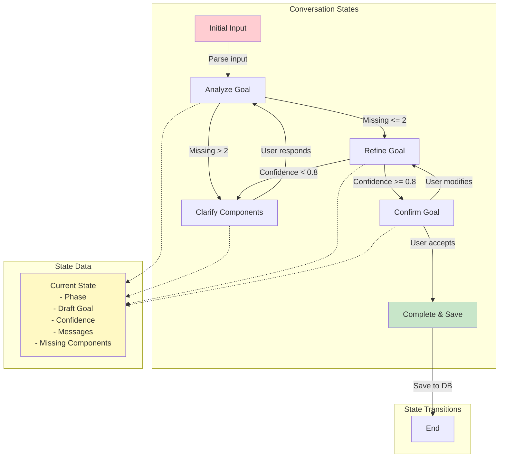

## Performance Monitoring Dashboard

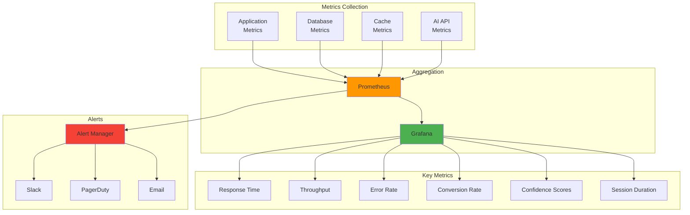

## Security Architecture

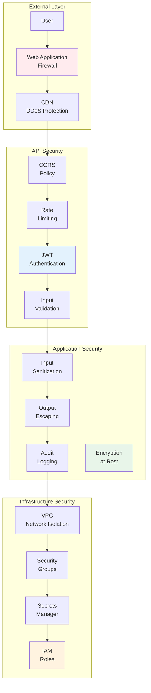

## Testing Strategy Overview

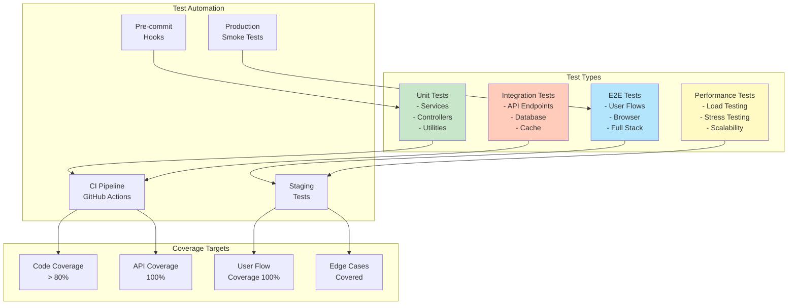

## Cost Optimization Strategy

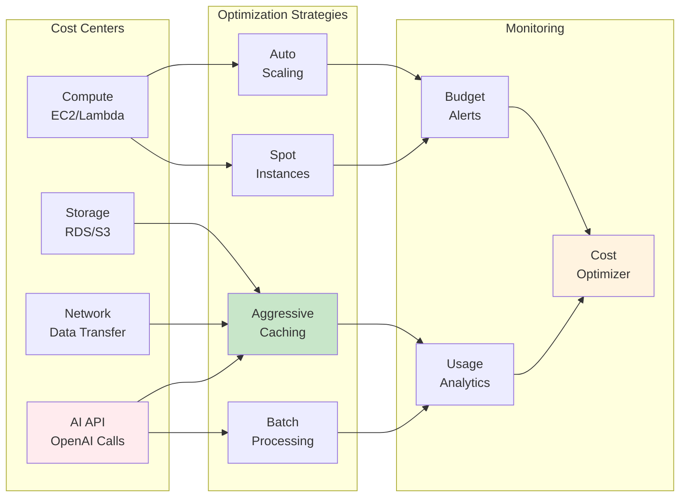

These diagrams provide a comprehensive visual representation of the conversational SMART goal system architecture, covering all major aspects from high-level system design to specific implementation details.