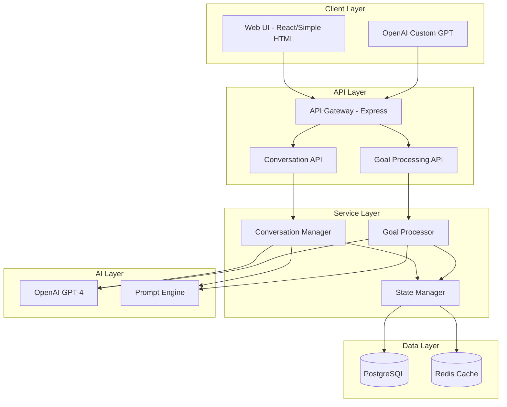

# Conversational SMART Goal System Architecture

## Overview

This document outlines a **simple, pragmatic architecture** for a conversational SMART goal system that prioritizes natural conversation flow, ease of deployment, and robust testing capabilities.

## Core Design Principles

1. **Simplicity First**: Avoid over-engineering; use proven patterns
2. **Conversation-Centric**: Natural language interaction as primary interface
3. **Stateful Context**: Maintain conversation history across interactions
4. **Progressive Enhancement**: Start simple, add complexity as needed
5. **Testable by Design**: Built-in support for automated browser testing

## System Architecture

### High-Level Architecture



## Component Design

### 1. Conversation API Layer

**Purpose**: Handle all conversational interactions with stateful context management.

```typescript
// API Endpoints
POST /api/v1/conversations/start
POST /api/v1/conversations/{id}/message
GET  /api/v1/conversations/{id}/state
POST /api/v1/conversations/{id}/complete

// Request/Response Format
interface ConversationRequest {
  message: string;
  context?: {
    userId?: string;
    sessionId?: string;
    metadata?: Record<string, any>;
  };
}

interface ConversationResponse {
  conversationId: string;
  message: string;
  state: {
    phase: 'greeting' | 'clarifying' | 'refining' | 'confirming' | 'complete';
    confidence: number;
    currentGoal?: SmartGoal;
    nextPrompts?: string[];
  };
}
```

### 2. Conversation State Management

**Purpose**: Maintain conversation context across multiple interactions.

```typescript
interface ConversationState {
  id: string;
  userId?: string;
  startedAt: Date;
  lastInteraction: Date;
  phase: ConversationPhase;
  messages: Message[];
  goalDraft: {
    raw: string;
    refined: string;
    smartCriteria: SmartCriteria;
    confidence: number;
  };
  context: {
    userPreferences?: any;
    previousGoals?: string[];
    domain?: string;
  };
}

interface Message {
  role: 'user' | 'assistant';
  content: string;
  timestamp: Date;
  metadata?: {
    confidence?: number;
    intent?: string;
    entities?: any[];
  };
}
```

### 3. Goal Processing Engine

**Purpose**: Transform conversational input into structured SMART goals.

```typescript
class GoalProcessor {
  async processConversation(state: ConversationState): Promise<ProcessedGoal> {
    // Extract goal intent from conversation
    const intent = await this.extractIntent(state.messages);
    
    // Identify missing SMART components
    const analysis = await this.analyzeSmartness(intent);
    
    // Generate clarifying questions if needed
    if (analysis.confidence < 0.8) {
      return {
        needsClarification: true,
        questions: await this.generateQuestions(analysis.missing),
        currentDraft: analysis.draft
      };
    }
    
    // Refine into final SMART goal
    return {
      needsClarification: false,
      finalGoal: await this.refineGoal(analysis.draft),
      confidence: analysis.confidence
    };
  }
}
```

### 4. Database Schema (Simple & Effective)

```sql
-- Core conversation tracking
CREATE TABLE conversations (
  id UUID PRIMARY KEY DEFAULT gen_random_uuid(),
  user_id VARCHAR(255),
  started_at TIMESTAMP DEFAULT CURRENT_TIMESTAMP,
  completed_at TIMESTAMP,
  final_goal_id UUID REFERENCES goals(id),
  metadata JSONB,
  created_at TIMESTAMP DEFAULT CURRENT_TIMESTAMP,
  updated_at TIMESTAMP DEFAULT CURRENT_TIMESTAMP
);

-- Message history
CREATE TABLE conversation_messages (
  id UUID PRIMARY KEY DEFAULT gen_random_uuid(),
  conversation_id UUID REFERENCES conversations(id) ON DELETE CASCADE,
  role VARCHAR(50) NOT NULL,
  content TEXT NOT NULL,
  metadata JSONB,
  created_at TIMESTAMP DEFAULT CURRENT_TIMESTAMP
);

-- Refined goals
CREATE TABLE goals (
  id UUID PRIMARY KEY DEFAULT gen_random_uuid(),
  user_id VARCHAR(255),
  conversation_id UUID REFERENCES conversations(id),
  title VARCHAR(500) NOT NULL,
  raw_input TEXT,
  smart_criteria JSONB NOT NULL,
  confidence_score DECIMAL(3,2),
  status VARCHAR(50) DEFAULT 'active',
  created_at TIMESTAMP DEFAULT CURRENT_TIMESTAMP,
  updated_at TIMESTAMP DEFAULT CURRENT_TIMESTAMP
);

-- Goal progress tracking
CREATE TABLE goal_milestones (
  id UUID PRIMARY KEY DEFAULT gen_random_uuid(),
  goal_id UUID REFERENCES goals(id) ON DELETE CASCADE,
  title VARCHAR(500) NOT NULL,
  target_date DATE,
  status VARCHAR(50) DEFAULT 'pending',
  created_at TIMESTAMP DEFAULT CURRENT_TIMESTAMP
);
```

## Implementation Approaches

### Option 1: Direct API Integration

**Best for**: Full control, custom UI, complex workflows

```javascript
// Simple client implementation
class SmartGoalClient {
  async startConversation(initialMessage) {
    const response = await fetch('/api/v1/conversations/start', {
      method: 'POST',
      headers: {
        'Content-Type': 'application/json',
        'X-API-Key': this.apiKey
      },
      body: JSON.stringify({ message: initialMessage })
    });
    
    const data = await response.json();
    this.conversationId = data.conversationId;
    return data;
  }
  
  async sendMessage(message) {
    return await fetch(`/api/v1/conversations/${this.conversationId}/message`, {
      method: 'POST',
      headers: {
        'Content-Type': 'application/json',
        'X-API-Key': this.apiKey
      },
      body: JSON.stringify({ message })
    });
  }
}
```

### Option 2: OpenAI Custom GPT Integration

**Best for**: Natural conversation, minimal setup, OpenAI ecosystem

```yaml
# Custom GPT Configuration
name: SMART Goal Coach
description: Helps users create actionable SMART goals through conversation
instructions: |
  You are a SMART goal coach. Your job is to help users transform their 
  vague aspirations into clear, actionable SMART goals through natural 
  conversation.
  
  Use the provided API to:
  1. Start a conversation session
  2. Track conversation state
  3. Save refined goals
  
actions:
  - name: start_conversation
    description: Begin a new goal refinement conversation
    endpoint: POST https://api.personalea.com/v1/conversations/start
    
  - name: continue_conversation
    description: Continue refining the goal
    endpoint: POST https://api.personalea.com/v1/conversations/{id}/message
    
  - name: save_goal
    description: Save the final SMART goal
    endpoint: POST https://api.personalea.com/v1/conversations/{id}/complete
```

## Conversation Flow Design

### Phase 1: Greeting & Context Gathering
```
Assistant: "Hi! I'm here to help you create a clear, actionable goal. 
           What would you like to achieve?"
           
User: "I want to get better at programming"