# Calendar Functionality Architecture & Implementation Plan

## 🎯 **Executive Summary**

This document outlines the comprehensive architecture and implementation plan for calendar functionality within the PersonalEA system. The plan follows the established microservices architecture, maintains the proven AI integration patterns, and implements calendar features through a phased approach that completes the Goal & Strategy Service first, then adds the Calendar Sync Service as a separate microservice.

## 📋 **Current State Analysis**

### ✅ **What's Working**
- **Goal & Strategy Service**: Phases 1-3 completed with sophisticated 8-step workflow
  - SMART Goal Translation with AI-powered conversation
  - Enhanced conversation system with domain expertise and conflict detection
  - Work Breakdown Structure (WBS) engine with recursive task decomposition
  - Dependency mapping and critical path calculation
  - Multi-method estimation engine with historical learning
- **Testing Infrastructure**: React + Vite harness with enhanced API server pattern
- **API Specifications**: Complete OpenAPI contracts for both Goal & Strategy and Calendar services
- **Staging Environment**: Architecture planned and ready for implementation
- **AI Integration**: External prompt system with provider independence

### 🔄 **What's Next**
- **Goal & Strategy Service**: Complete phases 4-6 (Calendar Integration, Capacity Management, Intelligence & Optimization)
- **Calendar Service**: Implement as separate microservice with Planner Service handling scheduling logic
- **AI Integration**: Selective use for human judgment tasks (suggestions, conflicts, UX)

## 🏗️ **Service Architecture**

### **High-Level Architecture**

```mermaid
graph TB
    subgraph "Client Layer"
        UI[React Testing Interface<br/>Port 5173<br/>✅ Implemented]
    end
    
    subgraph "API Layer"
        GS[Goal & Strategy Service<br/>Port 3000<br/>✅ Phases 1-3 Complete<br/>🔄 Phases 4-6 To Complete]
        CS[Calendar Sync Service<br/>Port 3003<br/>🔄 To Implement]
        PS[Planner Service<br/>Embedded in Goal Service<br/>🔄 To Implement]
    end
    
    subgraph "AI Layer"
        AI[AI Service<br/>External Prompts<br/>✅ Implemented]
    end
    
    subgraph "External APIs"
        GC[Google Calendar API]
        TC[TidyCal API]
    end
    
    subgraph "Data Layer"
        PG[(PostgreSQL<br/>Goal & Task Data<br/>✅ Implemented)]
        RD[(Redis<br/>Conversation History<br/>✅ Implemented)]
    end
    
    UI --> GS
    GS --> PS
    PS --> CS
    CS --> GC
    CS --> TC
    GS --> AI
    PS --> AI
    GS --> PG
    GS --> RD
    CS --> PG
```



### **AI Integration Strategy**

Following the established external prompt system architecture:


## 📅 **Implementation Roadmap**

### **Phase 4: Goal & Strategy Service Completion (Weeks 1-3)**

#### **Week 1: Calendar Integration Foundation**
- **Goal**: Complete Goal & Strategy Service Phase 4
- **Deliverables**:
  - Calendar integration endpoints in Goal Service
  - Planner Service module within Goal Service
  - Deterministic scheduling algorithms (slot scoring, task placement)
  - Calendar-related database schema extensions
  - Integration with existing WBS and estimation engines

#### **Week 2: Capacity Management**
- **Goal**: Complete Goal & Strategy Service Phase 5
- **Deliverables**:
  - Workload balancing algorithms
  - Resource allocation optimization
  - Capacity analysis endpoints
  - Team workload monitoring (single-user initially)
  - Performance analytics integration

#### **Week 3: Intelligence & Optimization**
- **Goal**: Complete Goal & Strategy Service Phase 6
- **Deliverables**:
  - AI-powered optimization features using external prompts
  - Learning system refinement for better estimations
  - Advanced analytics and reporting
  - System integration testing
  - Performance optimization

### **Phase 5: Calendar Sync Service Implementation (Weeks 4-6)**

#### **Week 4: Calendar Sync Service Foundation**
- **Goal**: Create standalone Calendar Sync microservice
- **Deliverables**:
  - Calendar Sync Service structure following existing service patterns
  - Google Calendar API integration with OAuth2
  - Basic CRUD operations for calendar events
  - Database schema for calendar data
  - Health checks and monitoring

#### **Week 5: Advanced Calendar Features**
- **Goal**: Complete calendar synchronization and conflict detection
- **Deliverables**:
  - Real-time calendar synchronization
  - Conflict detection algorithms
  - Availability analysis features
  - Webhook handling for calendar changes
  - TidyCal integration (if prioritized)

#### **Week 6: AI Integration & Testing**
- **Goal**: Integrate AI features and complete testing
- **Deliverables**:
  - AI-powered scheduling suggestions using external prompts
  - Conflict explanation features
  - Comprehensive test suite extension
  - End-to-end workflow validation
  - Performance benchmarking

## 🔧 **Technical Implementation Details**

### **Planner Service Architecture (Within Goal Service)**

```typescript
// services/goal-strategy/src/services/planner-service.ts
interface PlannerService {
  // Deterministic scheduling logic
  scoreSlots(tasks: Task[], availability: TimeSlot[]): ScoredSlot[];
  placeTasks(tasks: Task[], constraints: SchedulingConstraints): TaskPlacement[];
  resolveDependencies(tasks: Task[]): DependencyGraph;
  splitMultiDayTasks(tasks: Task[], maxBlockSize: Duration): Task[];
  
  // AI-powered suggestions (fallback to deterministic)
  suggestScheduleOptimizations(schedule: Schedule): Promise<ScheduleSuggestion[]>;
  explainConflicts(conflicts: ScheduleConflict[]): Promise<ConflictExplanation[]>;
  generateUserFriendlyMessages(context: any): Promise<string>;
  
  // Integration points
  syncWithCalendar(userId: string): Promise<SyncResult>;
  detectScheduleConflicts(schedule: Schedule): Promise<ConflictReport>;
}
```

### **Calendar Sync Service API Design**

```typescript
// services/calendar/src/types/calendar.ts
interface CalendarSyncService {
  // Core calendar operations
  syncCalendar(userId: string, provider: CalendarProvider): Promise<SyncResult>;
  getAvailability(userId: string, timeRange: TimeRange): Promise<Availability>;
  createEvent(event: CalendarEvent): Promise<CalendarEvent>;
  updateEvent(eventId: string, updates: Partial<CalendarEvent>): Promise<CalendarEvent>;
  deleteEvent(eventId: string): Promise<void>;
  
  // Batch operations for task scheduling
  batchCreateEvents(events: CalendarEvent[]): Promise<BatchResult>;
  batchUpdateEvents(updates: EventUpdate[]): Promise<BatchResult>;
  detectConflicts(events: CalendarEvent[]): Promise<ConflictReport>;
  
  // Webhook handling
  handleCalendarWebhook(payload: WebhookPayload): Promise<void>;
  subscribeToCalendarChanges(userId: string): Promise<Subscription>;
}
```

### **Task-to-Slot Algorithm Specification**

```typescript
// Core algorithm for placing tasks in calendar slots
interface TaskToSlotAlgorithm {
  // Primary constraints
  maxBlockSize: Duration; // ≤2 hours per block
  workingHours: WorkingHours; // User's available time
  dependencies: DependencyGraph; // Task dependencies
  
  // Scoring factors
  priorityWeight: number; // Task priority influence
  dependencyWeight: number; // Dependency urgency influence
  preferenceWeight: number; // User time preferences
  
  // Placement strategy
  placeTask(task: Task, availableSlots: TimeSlot[]): TaskPlacement;
  splitTask(task: Task, maxDuration: Duration): Task[];
  handleSpillover(unplacedTasks: Task[]): SpilloverStrategy;
}
```

### **AI Prompt Structure**

#### **Schedule Advice Prompt**
```markdown
# prompts/calendar/schedule_advice.md
You are a scheduling advisor helping users optimize their calendar.

## Context
- User has {{task_count}} tasks to schedule
- Available time slots: {{available_slots}}
- Current conflicts: {{conflicts}}
- User preferences: {{preferences}}
- Working hours: {{working_hours}}

## Your Role
Provide specific, actionable scheduling advice. If there are conflicts or trade-offs, explain them clearly and offer alternatives.

## Response Format
```json
{
  "suggestion": "Clear recommendation with specific actions",
  "reasoning": "Why this is the best option given constraints",
  "alternatives": [
    {
      "option": "Alternative approach",
      "trade_offs": "What user sacrifices with this option"
    }
  ],
  "urgency_warning": "Any deadline risks or urgent considerations"
}
```

## Examples
- "You'll miss the milestone unless you move task X or work Saturday—choose?"
- "I recommend scheduling the high-priority task first thing Monday to ensure completion before the Wednesday deadline"
```

#### **Conflict Explanation Prompt**
```markdown
# prompts/calendar/conflict_explain.md
You are a calendar conflict resolution expert.

## Context
- Conflicting events: {{conflicts}}
- User's goals: {{goals}}
- Task dependencies: {{dependencies}}
- Available alternatives: {{alternatives}}

## Your Role
Explain why conflicts occurred and propose specific solutions.

## Response Format
```json
{
  "conflict_summary": "Clear explanation of what's conflicting",
  "impact_analysis": "How this affects user's goals and deadlines",
  "proposed_solutions": [
    {
      "solution": "Specific action to resolve conflict",
      "effort_required": "What user needs to do",
      "impact": "How this affects other tasks/goals"
    }
  ],
  "recommended_action": "Best solution with reasoning"
}
```
```

### **Database Schema Extensions**

```sql
-- Calendar-related tables for Goal & Strategy Service
CREATE TABLE calendar_integrations (
  id UUID PRIMARY KEY DEFAULT gen_random_uuid(),
  user_id UUID NOT NULL REFERENCES users(id),
  provider VARCHAR(50) NOT NULL, -- 'google', 'tidycal'
  calendar_id VARCHAR(255) NOT NULL,
  access_token_encrypted TEXT NOT NULL,
  refresh_token_encrypted TEXT,
  sync_enabled BOOLEAN DEFAULT true,
  last_sync_at TIMESTAMP WITH TIME ZONE,
  created_at TIMESTAMP WITH TIME ZONE DEFAULT NOW(),
  updated_at TIMESTAMP WITH TIME ZONE DEFAULT NOW()
);

CREATE TABLE scheduled_tasks (
  id UUID PRIMARY KEY DEFAULT gen_random_uuid(),
  task_id UUID NOT NULL REFERENCES tasks(id),
  calendar_event_id VARCHAR(255),
  start_time TIMESTAMP WITH TIME ZONE NOT NULL,
  end_time TIMESTAMP WITH TIME ZONE NOT NULL,
  status VARCHAR(50) DEFAULT 'scheduled', -- 'scheduled', 'completed', 'cancelled'
  created_at TIMESTAMP WITH TIME ZONE DEFAULT NOW(),
  updated_at TIMESTAMP WITH TIME ZONE DEFAULT NOW()
);

CREATE TABLE schedule_conflicts (
  id UUID PRIMARY KEY DEFAULT gen_random_uuid(),
  user_id UUID NOT NULL REFERENCES users(id),
  conflict_type VARCHAR(50) NOT NULL, -- 'overlap', 'dependency', 'capacity'
  description TEXT NOT NULL,
  affected_tasks UUID[] NOT NULL,
  resolution_status VARCHAR(50) DEFAULT 'pending', -- 'pending', 'resolved', 'ignored'
  resolution_notes TEXT,
  created_at TIMESTAMP WITH TIME ZONE DEFAULT NOW(),
  resolved_at TIMESTAMP WITH TIME ZONE
);
```

## 🧪 **Comprehensive Testing Strategy**

### **Testing Infrastructure Extension**

Following the established React + Vite + enhanced API server pattern:

```typescript
// testing/goal-strategy-test/src/components/CalendarDemo.tsx
interface CalendarTestingInterface {
  // Existing goal testing features
  goalTranslation: GoalTranslationTest;
  smartGoalClarification: SMARTGoalTest;
  wbsGeneration: WBSTest;
  dependencyMapping: DependencyTest;
  taskEstimation: EstimationTest;
  
  // New calendar testing features
  calendarSync: CalendarSyncTest;
  taskScheduling: TaskSchedulingTest;
  conflictResolution: ConflictResolutionTest;
  scheduleOptimization: ScheduleOptimizationTest;
  aiSuggestions: AISuggestionTest;
}
```

### **Contract Testing (Dredd + Spectral)**

```bash
# Extend existing contract tests
spectral lint docs/calendar-service-api-v1.yaml
dredd docs/calendar-service-api-v1.yaml http://localhost:3003/api/v1

# Calendar-specific test scenarios
dredd --hookfiles=./tests/calendar-hooks.js \
  docs/calendar-service-api-v1.yaml \
  http://localhost:3003/api/v1 \
  --names="POST /calendar/sync,GET /calendar/availability,POST /calendar/events/batch"
```

### **Property-Based Testing (Schemathesis)**

```bash
# Calendar service property testing with specific scenarios
schemathesis run docs/calendar-service-api-v1.yaml \
  --checks all \
  --hypothesis-phases=explicit,reuse,generate,target,shrink \
  --stateful=links \
  --hypothesis-seed=42 \
  --hypothesis-max-examples=100 \
  --hypothesis-deadline=30000 \
  --base-url=http://localhost:3003/api/v1
```

### **Integration Testing Scenarios**

1. **Overlapping Events**: Test scheduling when calendar has conflicts
2. **Working Hours Outside User TZ**: Validate timezone handling across services
3. **10-Day Multi-Block Task**: Test task splitting across multiple days with dependencies
4. **Goal → Task → Calendar Flow**: End-to-end workflow validation
5. **AI Fallback**: Test deterministic fallback when LLM fails or times out
6. **Calendar Webhook Processing**: Test real-time calendar change handling
7. **Batch Task Scheduling**: Test scheduling multiple tasks simultaneously

### **Unit Testing (Vitest)**

```typescript
// services/goal-strategy/src/services/__tests__/planner-service.test.ts
describe('PlannerService', () => {
  describe('Slot Scoring', () => {
    it('should return deterministic top slot for given constraints', () => {
      const tasks = createTestTasks();
      const availability = createTestAvailability();
      const result = plannerService.scoreSlots(tasks, availability);
      expect(result[0].score).toBeGreaterThan(result[1].score);
    });
  });

  describe('Task Splitting', () => {
    it('should split tasks into ≤2h chunks and set parentTaskId', () => {
      const longTask = createTaskWithDuration(hours(6));
      const result = plannerService.splitMultiDayTasks([longTask], hours(2));
      expect(result).toHaveLength(3);
      expect(result.every(t => t.parentTaskId === longTask.id)).toBe(true);
    });
  });
});
```

### **E2E Testing with React Harness**

```typescript
// New Calendar Demo tab in testing interface
const CalendarDemo = () => {
  const [schedule, setSchedule] = useState(null);
  const [conflicts, setConflicts] = useState([]);

  return (
    <div className="calendar-demo">
      <div className="calendar-view">
        <GoogleCalendarIframe token={mockToken} />
        <ScheduleDiffView 
          oldSchedule={schedule?.previous} 
          newSchedule={schedule?.current} 
        />
      </div>
      
      <div className="controls">
        <button onClick={generateSchedule}>Generate Schedule</button>
        <button onClick={detectConflicts}>Check Conflicts</button>
        <button onClick={optimizeSchedule}>Optimize Schedule</button>
      </div>
      
      <div className="results">
        <ConflictList conflicts={conflicts} />
        <AISuggestionsList suggestions={schedule?.suggestions} />
      </div>
      
      <WebSocketListener 
        onScheduleChanged={handleScheduleChange}
        onConflictDetected={handleConflictDetected}
      />
    </div>
  );
};
```

## 🚀 **CI/CD Pipeline Extension**

```yaml
# .github/workflows/calendar-integration.yml
name: Calendar Integration Tests

on:
  push:
    paths:
      - 'services/goal-strategy/**'
      - 'services/calendar/**'
      - 'docs/calendar-service-api-v1.yaml'
      - 'testing/goal-strategy-test/**'

jobs:
  test:
    runs-on: ubuntu-latest
    
    steps:
      - uses: actions/checkout@v3
      
      - name: Setup Node.js
        uses: actions/setup-node@v3
        with:
          node-version: '18'
          cache: 'npm'
      
      - name: Install dependencies
        run: npm ci
      
      - name: Start staging environment
        run: |
          docker-compose -f docker-compose.staging.yml up -d
          ./scripts/wait-for-services.sh
      
      - name: Lint OpenAPI specifications
        run: |
          spectral lint docs/goal-strategy-service-api-v1.yaml
          spectral lint docs/calendar-service-api-v1.yaml
      
      - name: Contract testing
        run: |
          dredd docs/goal-strategy-service-api-v1.yaml http://localhost:3000/api/v1
          dredd docs/calendar-service-api-v1.yaml http://localhost:3003/api/v1
      
      - name: Property-based testing
        run: |
          schemathesis run docs/goal-strategy-service-api-v1.yaml --checks all
          schemathesis run docs/calendar-service-api-v1.yaml --checks all
      
      - name: Unit tests
        run: |
          cd services/goal-strategy && npm test
          cd services/calendar && npm test
      
      - name: Integration tests
        run: npm run test:integration:calendar
      
      - name: E2E tests
        run: npx playwright test --grep="calendar"
      
      - name: Performance tests
        run: npm run test:performance:calendar
      
      - name: Cleanup
        if: always()
        run: docker-compose -f docker-compose.staging.yml down -v
```

## 📊 **Success Metrics & Validation**

### **Technical Metrics**
- **Slot Scoring Performance**: < 100ms for 50 tasks with complex dependencies
- **Calendar Sync Speed**: < 5 seconds for 100 events with conflict detection
- **AI Response Time**: < 10 seconds with 30-second timeout and fallback
- **Fallback Reliability**: 100% fallback success rate when LLM fails
- **Test Coverage**: > 90% for all calendar functionality
- **API Response Time**: < 200ms for 95th percentile
- **Database Query Performance**: < 50ms for complex scheduling queries

### **User Experience Metrics**
- **Schedule Generation**: Complete workflow in < 30 seconds
- **Conflict Resolution**: Clear explanations with actionable alternatives
- **Visual Feedback**: Real-time diff view of schedule changes
- **Error Recovery**: Graceful handling of API failures with user-friendly messages
- **Interface Responsiveness**: < 3 seconds for all UI interactions

### **Integration Metrics**
- **Service Communication**: < 200ms inter-service calls
- **Data Consistency**: Zero data loss across service boundaries
- **Webhook Reliability**: 99.9% webhook delivery success
- **Calendar Provider Compatibility**: Google Calendar + TidyCal support
- **Concurrent User Support**: Handle 10+ simultaneous scheduling operations

### **Business Metrics**
- **Scheduling Accuracy**: > 95% successful task placement without conflicts
- **User Satisfaction**: Measured through testing interface feedback
- **Goal Achievement**: Track correlation between scheduling and goal completion
- **Time Savings**: Measure reduction in manual scheduling time

## 🎯 **Quick Wins for Calendar QA**

### **1. Golden Dataset**
Create a standardized test dataset:
```json
{
  "goals": [
    {
      "title": "Complete Q1 Product Launch",
      "deadline": "2024-03-31",
      "priority": "high"
    }
  ],
  "tasks": [
    // 11 tasks with various durations, dependencies, and priorities
  ],
  "calendar_events": [
    // Existing calendar events to test conflict detection
  ]
}
```

### **2. Mock Google Calendar**
Use Prism to replay OpenAPI stubs:
```bash
# Start mock Google Calendar API
prism mock google-calendar-api.yaml --port 8080

# Configure Calendar Sync Service to use mock
export GOOGLE_CALENDAR_API_URL=http://localhost:8080
```

### **3. Visual Diff Tool**
React component showing schedule changes:
```typescript
const ScheduleDiffView = ({ oldSchedule, newSchedule }) => {
  return (
    <div className="schedule-diff">
      {timeSlots.map(slot => (
        <TimeSlot 
          key={slot.id}
          className={getSlotDiffClass(slot, oldSchedule, newSchedule)}
          data={slot}
        />
      ))}
    </div>
  );
};
```

### **4. Automated Health Checks**
Service status dashboard:
```typescript
const ServiceHealthDashboard = () => {
  const [health, setHealth] = useState({});
  
  useEffect(() => {
    const checkHealth = async () => {
      const services = ['goal-strategy', 'calendar-sync', 'postgres', 'redis'];
      const results = await Promise.all(
        services.map(service => fetch(`http://localhost:${getPort(service)}/health`))
      );
      setHealth(Object.fromEntries(services.map((s, i) => [s, results[i].ok])));
    };
    
    checkHealth();
    const interval = setInterval(checkHealth, 30000);
    return () => clearInterval(interval);
  }, []);
  
  return (
    <div className="health-dashboard">
      {Object.entries(health).map(([service, isHealthy]) => (
        <ServiceStatus key={service} name={service} healthy={isHealthy} />
      ))}
    </div>
  );
};
```

### **5. Performance Benchmarks**
Baseline metrics for regression testing:
```typescript
// performance/calendar-benchmarks.ts
const benchmarks = {
  slotScoring: {
    baseline: 50, // ms for 50 tasks
    threshold: 100 // fail if > 100ms
  },
  calendarSync: {
    baseline: 3000, // ms for 100 events
    threshold: 5000
  },
  conflictDetection: {
    baseline: 200, // ms for complex schedule
    threshold: 500
  }
};
```

## 🔗 **Cross-References and Integration Points**

### **Related Documentation**
- [`docs/development-plan.md`](development-plan.md) - Overall development roadmap
- [`docs/personal-ea-prd.md`](personal-ea-prd.md) - Product requirements and vision
- [`docs/ai-integration-architecture.md`](ai-integration-architecture.md) - AI integration principles
- [`docs/staging-environment-plan.md`](staging-environment-plan.md) - Staging environment setup
- [`docs/goal-strategy-service-specification.md`](goal-strategy-service-specification.md) - Goal service specification
- [`testing/goal-strategy-test/ENHANCED_SMART_GOALS_IMPLEMENTATION_COMPLETE.md`](../testing/goal-strategy-test/ENHANCED_SMART_GOALS_IMPLEMENTATION_COMPLETE.md) - Current implementation status

### **API Specifications**
- [`docs/goal-strategy-service-api-v1.yaml`](goal-strategy-service-api-v1.yaml) - Goal service API contract
- [`docs/calendar-service-api-v1.yaml`](calendar-service-api-v1.yaml) - Calendar service API contract
- [`docs/components/common.yaml`](components/common.yaml) - Shared API components

### **Implementation Files**
- [`services/goal-strategy/`](../services/goal-strategy/) - Current Goal & Strategy Service implementation
- [`services/calendar/`](../services/calendar/) - Calendar Service (to be implemented)
- [`testing/goal-strategy-test/`](../testing/goal-strategy-test/) - Testing infrastructure

## 📝 **Next Steps**

1. **Review and Approve Plan**: Stakeholder review of this architecture plan
2. **Create Implementation Checklist**: Detailed task breakdown (see [`docs/calendar-implementation-checklist.md`](calendar-implementation-checklist.md))
3. **Set Up Staging Environment**: Implement Docker staging environment
4. **Begin Goal Service Phase 4**: Start calendar integration in Goal & Strategy Service
5. **Parallel Calendar Service Development**: Begin Calendar Sync Service implementation
6. **Continuous Testing**: Extend testing infrastructure throughout development

## 🏁 **Success Criteria**

The calendar functionality implementation will be considered successful when:

1. **Goal & Strategy Service Phases 4-6 Complete**: All planned features implemented and tested
2. **Calendar Sync Service Operational**: Standalone service with Google Calendar integration
3. **End-to-End Workflow Functional**: Goal → Task → Calendar flow works seamlessly
4. **AI Integration Effective**: Intelligent suggestions with reliable fallbacks
5. **Testing Infrastructure Extended**: Comprehensive test coverage for all new features
6. **Performance Targets Met**: All technical and user experience metrics achieved
7. **Documentation Complete**: All implementation details documented for future developers

---

**Document Status**: ✅ **ARCHITECTURE PLAN COMPLETE**  
**Next Action**: Create implementation checklist and begin development  
**Timeline**: 6-week implementation plan with weekly milestones  
**Dependencies**: Staging environment setup, AI prompt system extension