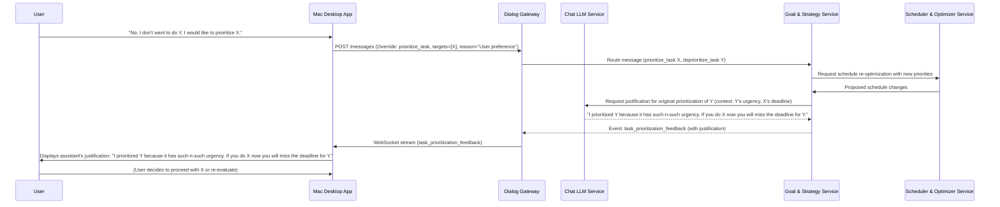

# Personal EA: Product Requirements Document (PRD) & Implementation Plan

## Table of Contents
1. [Product Requirements Document (PRD)](#1-product-requirements-document-prd)
2. [Implementation Plan](#2-implementation-plan)

---

## 1. Product Requirements Document (PRD)

### 1.1. Problem Statement

Knowledge workers frequently lose valuable time due to:
- **Manual Triage:** Sifting through emails, documents, and tasks to identify priorities.
- **Rescheduling:** Manually adjusting schedules and appointments, often leading to conflicts.
- **Context-Switching:** Constantly shifting focus between different applications and information sources (email, calendar, notes, TO-DOs) to gather necessary context for a task.

This leads to decreased productivity, increased stress, and a reactive rather than proactive approach to work.

### 1.2. Guiding Principles

- **"You-First" rule:** Data never leaves your control without encryption and explicit purpose.
- **Micro-service contract before code:** Every service publishes an API spec (OpenAPI/Proto) first.
- **Vertical slices > Big-bang:** Each milestone delivers a visible outcome you can demo.

### 1.3. North Star

"Give me the right work at the right time, automatically."

### 1.4. Vision & Scope

The Personal EA aims to be the ultimate personal assistant, intelligently managing a user's digital life to optimize their time, focus, and goal achievement. It will act as a proactive, secure, and highly modular system that integrates with various personal data sources to provide automated insights, scheduling, task prioritization, and information delivery.

The initial scope focuses on integrating with core personal data sources (email, calendar, knowledge base, goals/TO-DOs) and providing intelligent automation and proactive information delivery, primarily on Mac, with future consideration for iPhone.

### 1.5. Key Features

#### 1. Google Suite Email Integration
- **Description:** Securely consumes all user emails from Google Suite.
- **Functionality:**
  - Reads email content, attachments, and metadata.
  - Identifies actionable items, deadlines, and key information.
  - Categorizes emails (e.g., urgent, informational, follow-up).
  - Summarizes long email threads or daily digests.
- **User Story:** "As a knowledge worker, I want my EA to read my emails so I can quickly understand urgent tasks and key information without manually sifting through my inbox."

#### 2. Automated Calendar & Appointment Management
- **Description:** Integrates with TidyCal or Google Calendar to automatically manage appointments and optimize schedule.
- **Functionality:**
  - Reads existing calendar events.
  - Suggests optimal times for new appointments based on availability, priorities, and existing commitments.
  - Automatically schedules appointments upon user approval or based on predefined rules.
  - Identifies and flags potential scheduling conflicts.
- **User Story:** "As a busy professional, I want my EA to automatically schedule meetings based on my availability and priorities so I don't have to manually coordinate times."

#### 3. Unstructured Knowledge Base Access
- **Description:** Accesses and processes personal knowledge stored in Obsidian and Google Docs.
- **Functionality:**
  - Indexes and searches content within Obsidian vaults and Google Docs.
  - Extracts key concepts, entities, and relationships.
  - Answers questions based on the knowledge base.
  - Identifies relevant documents or notes for current tasks/goals.
- **User Story:** "As a researcher, I want my EA to access my Obsidian notes and Google Docs so I can quickly retrieve relevant information for my current project without manual searching."

#### 4. Cross-Platform Client Applications with Intelligent Interaction
- **Description:** Provides native client applications for Mac (and ideally iPhone) with a highly interactive and conversational interface.
- **Functionality:**
  - **Mac Desktop App:** Unified interface for interacting with the EA, viewing insights, managing tasks, and receiving proactive notifications.
  - **Bidirectional Conversation:** Allows users to express preferences, override suggestions, and ask for justifications.
  - **Intelligent Justification:** The assistant can explain its reasoning for prioritization, scheduling, or other suggestions (e.g., "I prioritized Y because it has such-n-such urgency. If you do X now you will miss the deadline" or "need to do Y by end of week.").
  - (Future) iPhone App: Mobile access to key EA functionalities, notifications, and quick actions.
- **User Story:** "As a user, I want to interact conversationally with my EA on my Mac, telling it to prioritize 'X' over 'Y', and have it intelligently explain its reasoning if it disagrees, so I can make informed decisions about my work."

#### 5. Personal Goal & TO-DO Strategy
- **Description:** Consumes personal goals and TO-DOs to create and optimize strategies for achievement.
- **Functionality:**
  - Ingests user-defined goals and TO-DO lists.
  - Breaks down large goals into actionable steps.
  - Suggests daily/weekly priorities based on goals, deadlines, and current context.
  - Tracks progress towards goals.
- **User Story:** "As someone with ambitious goals, I want my EA to help me strategize and prioritize my TO-DOs so I can consistently work towards my objectives."

#### 6. Schedule Optimization for Goals
- **Description:** Manages and optimizes the user's schedule to align with and advance personal goals.
- **Functionality:**
  - Allocates dedicated time blocks for specific goal-related work.
  - Suggests re-prioritization of tasks or events based on goal impact.
  - Identifies "focus time" and protects it from interruptions.
  - Provides insights into how current schedule aligns with long-term goals.
- **User Story:** "As a goal-oriented individual, I want my EA to optimize my schedule by blocking out time for my most important tasks so I can make consistent progress."

#### 7. Robust Security & Privacy
- **Description:** Ensures the EA cannot be hacked by outsiders, adhering strictly to the "You-First" rule.
- **Functionality:**
  - End-to-end encryption for all data at rest and in transit.
  - Strong authentication (JWT, mTLS as per Dialog Gateway).
  - Fine-grained access control for each microservice.
  - Regular security audits and penetration testing.
  - Local-first data processing where possible, minimizing cloud exposure.
- **User Story:** "As a privacy-conscious user, I want my EA to be highly secure so I can trust it with my personal data without fear of breaches."

#### 8. Proactive Research & Information Delivery
- **Description:** Explores and researches topics relevant to user goals, proactively presenting updates.
- **Functionality:**
  - Monitors specified news sources, academic papers, or industry trends.
  - Summarizes key findings and highlights relevant information.
  - Delivers proactive digests or alerts based on user preferences and goals.
  - Identifies emerging topics related to user's interests.
- **User Story:** "As a professional, I want my EA to proactively research topics relevant to my goals so I can stay informed without spending hours on manual research."

### 1.6. Non-Functional Requirements

- **Performance:** Sub-second response times for interactive operations (e.g., chat, quick actions). Background processing for heavy tasks (email indexing, research).
- **Scalability:** Modular microservices architecture to allow independent scaling of components.
- **Reliability:** High availability for core services; robust error handling and retry mechanisms.
- **Maintainability:** Clean code, comprehensive tests, clear documentation, adherence to coding standards.
- **User Experience:** Intuitive and responsive client applications with natural language interaction.
- **Modularity:** Strict adherence to microservice principles, enabling independent development and deployment.

---

## 2. Implementation Plan

### 2.1. Architecture Overview

The system will be built upon a highly modular microservices architecture, with the Dialog Gateway serving as the central communication hub.

```mermaid
graph TD
    subgraph Clients
        A[Mac Desktop App] -- WebSocket/HTTPS --> G
        B[iPhone App (Future)] -- HTTPS --> G
    end

    subgraph Core Services
        G[Dialog Gateway]
        G -- HTTP/2 + mTLS --> Auth[Auth Service]
        G -- HTTP/2 + mTLS --> Chat[Chat LLM Service]
        G -- HTTP/2 + mTLS --> Task[Task Management Service]
        G -- HTTP/2 + mTLS --> Email[Email Processing Service]
        G -- HTTP/2 + mTLS --> KB[Knowledge Base Service]
        G -- HTTP/2 + mTLS --> Cal[Calendar Service]
        G -- HTTP/2 + mTLS --> Goal[Goal & Strategy Service]
        G -- HTTP/2 + mTLS --> Scheduler[Scheduler & Optimizer Service]
        G -- HTTP/2 + mTLS --> Research[Research & Intelligence Service]
        G -- HTTP/2 + mTLS --> Config[Config Store]
    end

    subgraph External Integrations
        Email -- Google Suite API --> GoogleMail[Google Mail]
        Cal -- Google Calendar API --> GoogleCal[Google Calendar]
        Cal -- TidyCal API --> TidyCal[TidyCal]
        KB -- Google Docs API --> GoogleDocs[Google Docs]
        KB -- Obsidian Sync/Local --> Obsidian[Obsidian]
        Research -- Various APIs/Scrapers --> Internet[Internet Data Sources]
    end

    style G fill:#f7b32b,stroke:#333,stroke-width:2px
```

### 2.2. Data Flow Diagram (Illustrating Interactive Prioritization)



### 2.3. Service Breakdown & Responsibilities

- **Dialog Gateway:** (Existing) Central communication hub, authentication, message routing, real-time streaming (WebSocket), rate limiting, health checks, metrics.
- **Auth Service:** (Existing, implied) Manages user authentication, JWT issuance, and validation.
- **Chat LLM Service:** (Existing, implied) Handles conversational AI interactions. **Will be enhanced to generate intelligent justifications and engage in negotiation based on context provided by other services.**
- **Task Management Service:** (Existing, implied) Manages tasks, plans, and their versions. Will be extended to support goal-related tasks and track urgency/deadlines.
- **Email Processing Service (NEW):**
  - **Responsibility:** Connects to Google Suite API, fetches emails, parses content, identifies actionable items, summarizes threads, categorizes.
  - **API Contract:** Defines endpoints for `fetch_emails`, `summarize_email`, `categorize_email`.
- **Calendar Service (NEW):**
  - **Responsibility:** Integrates with Google Calendar and TidyCal, manages events, checks availability, creates/modifies appointments.
  - **API Contract:** Defines endpoints for `get_availability`, `suggest_appointment_times`, `create_event`, `update_event`.
- **Knowledge Base Service (NEW):**
  - **Responsibility:** Connects to Obsidian (via local sync or API) and Google Docs, indexes content, performs semantic search, extracts entities.
  - **API Contract:** Defines endpoints for `index_document`, `search_knowledge_base`, `extract_entities`.
- **Goal & Strategy Service (NEW):**
  - **Responsibility:** Stores user goals and TO-DOs, breaks down goals, suggests strategies, tracks progress, prioritizes tasks based on goals. **Crucially, it will provide context (urgency, deadlines, dependencies) to the Chat LLM Service for justification generation.**
  - **API Contract:** Defines endpoints for `set_goal`, `get_goals`, `suggest_tasks_for_goal`, `update_goal_progress`, `get_task_context`.
- **Scheduler & Optimizer Service (NEW):**
  - **Responsibility:** Takes input from Goal Service and Calendar Service to optimize schedule, block focus time, resolve conflicts.
  - **API Contract:** Defines endpoints for `optimize_schedule`, `block_focus_time`, `resolve_conflict`.
- **Research & Intelligence Service (NEW):**
  - **Responsibility:** Proactively researches topics, monitors feeds, summarizes information, identifies trends.
  - **API Contract:** Defines endpoints for `add_research_topic`, `get_research_summary`, `get_proactive_insights`.
- **Config Store:** (Existing, implied) Centralized configuration management for all services.
- **Client Applications (Mac Desktop, iPhone):**
  - **Responsibility:** User interface, interaction with Dialog Gateway (HTTP/WebSocket), local data caching, notifications. **Key responsibility: Presenting assistant's justifications and allowing for user overrides/negotiation.**

### 2.4. API Contracts (OpenAPI/Proto)

Adhering to the "Micro-service contract before code" principle, each new service will have a clearly defined API specification (OpenAPI for REST, Proto for gRPC if needed for high-performance internal communication). This will ensure interoperability and independent development.

#### Example: Email Processing Service API

```yaml
# email-service-api-v1.yaml
openapi: 3.1.0
info:
  title: Email Processing Service API
  version: 1.0.0
  description: API for fetching, parsing, and summarizing user emails.

servers:
  - url: http://email-service:8084

paths:
  /emails/sync:
    post:
      summary: Initiates a sync of user emails from Google Suite.
      requestBody:
        required: true
        content:
          application/json:
            schema:
              type: object
              properties:
                user_id:
                  type: string
                  format: uuid
                access_token:
                  type: string
                  description: Google OAuth access token
      responses:
        '202':
          description: Sync initiated.
  /emails/{email_id}/summary:
    get:
      summary: Get a summary of a specific email.
      parameters:
        - in: path
          name: email_id
          required: true
          schema:
            type: string
      responses:
        '200':
          description: Email summary.
          content:
            application/json:
              schema:
                type: object
                properties:
                  email_id:
                    type: string
                  summary:
                    type: string
                  action_items:
                    type: array
                    items:
                      type: string
```

#### Example: Goal & Strategy Service API (with justification context)

```yaml
# goal-strategy-service-api-v1.yaml
openapi: 3.1.0
info:
  title: Goal & Strategy Service API
  version: 1.0.0
  description: API for managing user goals, TO-DOs, and strategic prioritization.

servers:
  - url: http://goal-service:8085

paths:
  /goals/{goal_id}/tasks/{task_id}/context:
    get:
      summary: Get detailed context for a specific task for justification.
      parameters:
        - in: path
          name: goal_id
          required: true
          schema:
            type: string
        - in: path
          name: task_id
          required: true
          schema:
            type: string
      responses:
        '200':
          description: Contextual details for task justification.
          content:
            application/json:
              schema:
                type: object
                properties:
                  task_id:
                    type: string
                  name:
                    type: string
                  priority:
                    type: string
                    enum: [low, normal, high, urgent]
                  deadline:
                    type: string
                    format: date-time
                  dependencies:
                    type: array
                    items:
                      type: string
                  reason_for_priority:
                    type: string
                    description: A brief explanation of why this task was prioritized.
```

### 2.5. Technology Stack

- **Backend Services:** Node.js/TypeScript (for consistency with Dialog Gateway), potentially Rust for performance-critical components (e.g., knowledge base indexing).
- **Inter-service Communication:** HTTP/2 with mTLS (as per existing Gateway), potentially gRPC for high-performance internal communication.
- **Databases:**
  - **Goal & Strategy Service:** PostgreSQL or similar relational DB for structured goal data.
  - **Knowledge Base Service:** Elasticsearch/OpenSearch for full-text search and indexing.
  - **Email/Calendar Service:** May primarily interact with external APIs, but could cache metadata in a local DB.
- **Authentication:** JWT for client-to-gateway, mTLS for gateway-to-service.
- **Client Applications:**
  - **Mac Desktop:** Electron (for cross-platform potential and web tech stack) or Swift/SwiftUI for native experience. **Emphasis on rich, conversational UI.**
  - **iPhone:** Swift/SwiftUI.

### 2.6. Phased Rollout / Vertical Slices

Adhering to "Vertical slices > Big-bang," we will prioritize demonstrable milestones.

#### Phase 1: Core Integrations & Basic Automation (MVP)

**Milestone 1.1: Email Ingestion & Summarization**
- Implement Email Processing Service (Google Suite integration).
- Gateway routes email sync requests.
- Basic email summarization (e.g., using a simple LLM call or rule-based extraction).
- Mac App displays a list of summarized urgent emails.
- **Demo:** User connects Google account, sees a daily digest of urgent emails summarized in the Mac app.

**Milestone 1.2: Calendar Availability & Basic Scheduling**
- Implement Calendar Service (Google Calendar integration).
- Gateway routes availability checks.
- Mac App can query user's availability.
- **Demo:** User asks Mac App "Am I free tomorrow at 2 PM?", and the app responds based on calendar data.

**Milestone 1.3: Goal Ingestion & Basic Prioritization**
- Implement Goal & Strategy Service (manual input of goals/TO-DOs).
- Mac App allows user to input goals and TO-DOs.
- Basic prioritization of TO-DOs based on deadlines.
- **Demo:** User inputs goals, sees a prioritized TO-DO list in the Mac app.

#### Phase 2: Advanced Automation & Knowledge Integration

**Milestone 2.1: Automated Appointment Scheduling**
- Enhance Calendar Service to suggest and automatically book appointments.
- Integrate TidyCal.
- **Demo:** User asks "Schedule a 30-min meeting with John next week," and the EA proposes and books a time.

**Milestone 2.2: Knowledge Base Search & Contextual Retrieval**
- Implement Knowledge Base Service (Obsidian & Google Docs integration).
- Mac App allows searching the knowledge base.
- **Demo:** User asks "What are my notes on Project Alpha?" and the app retrieves relevant Obsidian notes/Google Docs.

**Milestone 2.3: Schedule Optimization for Goals**
- Integrate Goal Service with Scheduler Service.
- EA suggests and blocks focus time for high-priority goals.
- **Demo:** EA proactively suggests "Block 2 hours for Project X tomorrow morning to meet your goal deadline."

#### Phase 3: Proactive Intelligence & Interactive Negotiation

**Milestone 3.1: Intelligent Prioritization & Justification**
- Enhance Chat LLM Service to generate justifications for prioritization/scheduling.
- Enhance Goal & Strategy Service to provide necessary context for justifications.
- Mac App implements the bidirectional conversational flow, allowing users to override and receive explanations.
- **Demo:** User tells EA to prioritize X over Y, and the EA responds with a reasoned explanation for its original suggestion for Y.

**Milestone 3.2: Proactive Research & Insights**
- Implement Research & Intelligence Service.
- EA proactively delivers summaries of relevant news/articles based on user goals.
- **Demo:** User receives a notification with a summary of a new article relevant to their "AI Trends" goal.

**Milestone 3.3: Cross-Service Workflow Orchestration**
- Refine inter-service communication for complex workflows (e.g., "Process this email, extract action items, add to TO-DO list, and schedule follow-up").

**Milestone 3.4: iPhone App Alpha (if prioritized)**
- Basic iPhone app for notifications and quick actions.

### 2.7. Security Considerations

- **Data Encryption:** All sensitive data (emails, calendar entries, knowledge base content) must be encrypted at rest and in transit.
- **Access Control:** Implement OAuth2/OpenID Connect for user authentication. Use JWTs with granular scopes for service authorization.
- **mTLS:** Enforce mutual TLS between the Dialog Gateway and all internal microservices to ensure secure internal communication.
- **Least Privilege:** Each service should only have access to the data and resources it absolutely needs.
- **Input Validation:** Strict validation of all incoming messages and API requests to prevent injection attacks.
- **Regular Audits:** Conduct security audits and penetration testing at key milestones.
- **Secrets Management:** Use a secure secrets management solution (e.g., Kubernetes Secrets, HashiCorp Vault) for API keys and sensitive configurations.

### 2.8. Testing Strategy

- **Unit Tests:** Vitest (existing) for individual functions and components.
- **Integration Tests:** Supertest + Nock (existing) for service-to-service communication and API endpoints.
- **Contract Tests:** Pact (existing) to ensure API compatibility between services (crucial for modularity).
- **End-to-End (E2E) Tests:** Playwright (existing) for client application flows and full system interactions.
- **Security Tests:** OWASP ZAP baseline (existing) and manual penetration testing.
- **Performance Tests:** k6 scripts (existing) for load and stress testing.

---

## Summary

This PRD and Implementation Plan provides a comprehensive roadmap for developing the Personal EA with:

1. **Test-Driven Development (TDD) Support:** Comprehensive testing strategy with contract-first development
2. **Microservices Architecture:** 9 distinct services with clear responsibilities and API contracts
3. **Frequent Demonstrable Milestones:** 11 specific milestones across 3 phases, each with concrete demos

The plan balances ambitious functionality with practical implementation, ensuring security, modularity, and user-centric design throughout the development process.