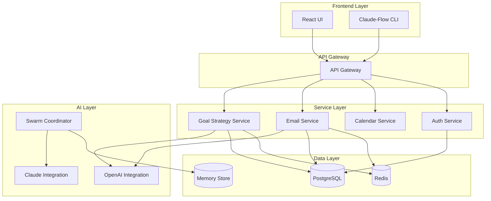

# PersonalEA System Architecture Overview

## Architecture Principles

PersonalEA follows these core architectural principles:

1. **Microservices Architecture**: Loosely coupled services for scalability
2. **AI-First Design**: LLM integration at the core of all intelligent features
3. **Event-Driven Communication**: Asynchronous processing for reliability
4. **Memory Persistence**: Continuous learning across sessions
5. **Swarm Orchestration**: Multi-agent coordination for complex tasks

## System Components

### Core Services



### Service Descriptions

#### Goal Strategy Service
- **Purpose**: 8-phase intelligent goal processing
- **Key Features**:
  - SMART goal validation
  - Milestone generation
  - Work breakdown structure
  - Resource allocation
  - Progress tracking
- **Technology**: Node.js, Express, Prisma, PostgreSQL

#### Email Processing Service
- **Purpose**: AI-powered email management
- **Key Features**:
  - Email synchronization
  - Intelligent summarization
  - Action item extraction
  - Priority classification
- **Technology**: Node.js, IMAP, OpenAI API

#### Calendar Service (Planned)
- **Purpose**: Intelligent scheduling and time management
- **Key Features**:
  - Availability optimization
  - Meeting scheduling
  - Task time blocking
  - Calendar integration
- **Technology**: Node.js, CalDAV, Google Calendar API

#### Authentication Service
- **Purpose**: Secure user authentication and authorization
- **Key Features**:
  - JWT token management
  - Role-based access control
  - OAuth integration
  - Session management
- **Technology**: Node.js, JWT, bcrypt

### AI Integration Layer

#### OpenAI Integration
- **Model**: GPT-4 Turbo
- **Use Cases**:
  - Goal refinement and clarification
  - Email summarization
  - Task decomposition
  - Natural language understanding

#### Claude Integration
- **Model**: Claude Opus 4
- **Use Cases**:
  - Code generation
  - Complex reasoning
  - Swarm coordination
  - Architecture decisions

#### Swarm Coordinator
- **Purpose**: Multi-agent task orchestration
- **Strategies**:
  - Research swarms
  - Development swarms
  - Analysis swarms
  - Testing swarms
- **Coordination Modes**: Centralized, distributed, hierarchical, mesh

### Data Architecture

#### PostgreSQL Database
- **Purpose**: Primary data storage
- **Schemas**:
  - Users and authentication
  - Goals and milestones
  - Tasks and progress
  - Email metadata

#### Redis Cache
- **Purpose**: Performance optimization
- **Use Cases**:
  - Session storage
  - API response caching
  - Job queue management
  - Real-time updates

#### Memory Store
- **Purpose**: Persistent AI memory
- **Features**:
  - Cross-session context
  - Learning accumulation
  - Pattern recognition
  - Knowledge base

## Communication Patterns

### Synchronous Communication
- REST APIs for client-server communication
- GraphQL for complex data queries (planned)
- WebSockets for real-time updates

### Asynchronous Communication
- Redis pub/sub for event broadcasting
- Job queues for background processing
- Webhook notifications

### Inter-Service Communication
```yaml
patterns:
  - request-response: Direct API calls
  - event-driven: Redis pub/sub
  - message-queue: Bull/Redis queues
  - shared-database: PostgreSQL (anti-pattern, being refactored)
```

## Deployment Architecture

### Development Environment
```yaml
services:
  - goal-strategy: localhost:3001
  - email-service: localhost:3002
  - frontend: localhost:3000
  - database: localhost:5432
  - redis: localhost:6379
```

### Production Environment
```yaml
infrastructure:
  - platform: AWS/GCP/Azure
  - container: Docker + Kubernetes
  - database: Managed PostgreSQL
  - cache: Managed Redis
  - cdn: CloudFront/Cloudflare
```

## Security Architecture

### Authentication Flow
1. User credentials → Auth Service
2. JWT generation with refresh tokens
3. Token validation on each request
4. Role-based access control

### Data Security
- Encryption at rest (database)
- Encryption in transit (TLS)
- API key management
- Secret rotation

## Scalability Considerations

### Horizontal Scaling
- Stateless services for easy scaling
- Load balancing with health checks
- Database read replicas
- Redis clustering

### Performance Optimization
- Response caching
- Query optimization
- Lazy loading
- CDN for static assets

## Monitoring and Observability

### Metrics Collection
- Prometheus for metrics
- Grafana for visualization
- Custom dashboards

### Logging
- Structured logging (JSON)
- Centralized log aggregation
- Log levels and filtering

### Tracing
- Distributed tracing
- Request correlation IDs
- Performance profiling

## Future Architecture Plans

### Planned Enhancements
1. **GraphQL Gateway**: Unified data access
2. **Event Sourcing**: Complete audit trail
3. **CQRS Pattern**: Separate read/write models
4. **Service Mesh**: Advanced traffic management
5. **ML Pipeline**: Custom model training

### Migration Strategy
- Gradual service extraction
- Feature flag deployment
- Blue-green deployments
- Database migration tools

## Architecture Decision Records (ADRs)

Key architectural decisions:

1. **ADR-001**: Microservices over Monolith
2. **ADR-002**: PostgreSQL for primary storage
3. **ADR-003**: Redis for caching and queues
4. **ADR-004**: JWT for authentication
5. **ADR-005**: OpenAI GPT-4 for NLP tasks
6. **ADR-006**: React for frontend framework
7. **ADR-007**: Docker for containerization
8. **ADR-008**: TypeScript for type safety

## Getting Started

To understand specific components in detail:
- [Goal Strategy API](../api-endpoints/goal-strategy-api.md)
- [Service Interactions](service-interactions.md)
- [Data Flow Diagrams](data-flow-diagrams.md)