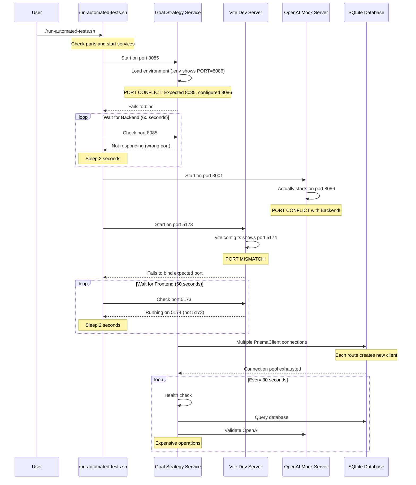

# PersonalEA Application Startup Sequence Analysis

## Current Startup Flow (1+ Hour Delay)



## Bottleneck Timeline

| Time | Component | Issue | Impact |
|------|-----------|-------|--------|
| 0:00 | Script Start | Initialization | - |
| 0:01 | Backend Start | Port 8086 vs 8085 conflict | Service fails to start |
| 0:01-1:01 | Backend Wait | 60-second timeout loop | **60 seconds wasted** |
| 1:02 | Mock API Start | Port 8086 conflict with Backend | Both services competing |
| 1:02-1:17 | Mock API Wait | 15-second timeout | **15 seconds wasted** |
| 1:18 | Frontend Start | Port 5174 vs 5173 mismatch | Script can't find service |
| 1:18-2:18 | Frontend Wait | 60-second timeout loop | **60 seconds wasted** |
| 2:19+ | Retry Cycles | Services keep failing | **Infinite loop possible** |

## Root Cause Analysis

### 1. Port Configuration Chaos
```
Service          | Expected | Actual   | Source
-----------------|----------|----------|------------------
Goal Strategy    | 8085     | 8086     | .env file
OpenAI Mock      | 3001     | 8086     | openai-api-server.js
Vite Frontend    | 5173     | 5174     | vite.config.ts
```

### 2. Database Connection Multiplication
```
health.ts:8      → new PrismaClient()
goals.ts:X       → new PrismaClient()
milestones.ts:X  → new PrismaClient()
planner.ts:X     → new PrismaClient()
wbs.ts:X         → new PrismaClient()
```
**Result**: 5+ database connections competing for SQLite file lock

### 3. Blocking Health Checks
```typescript
// Every 30 seconds:
await prisma.$queryRaw`SELECT 1`;        // DB check
await openai.models.list();              // API validation
// Both block startup if services not ready
```

## Quick Fix Implementation

### Step 1: Fix Port Configuration (5 minutes)
```bash
# In /services/goal-strategy/.env
PORT=8085  # Change from 8086

# In /testing/goal-strategy-test/vite.config.ts
port: 5173,  # Change from 5174

# In /testing/goal-strategy-test/openai-api-server.js
const PORT = 3001;  # Change from 8086
```

### Step 2: Create Singleton Database Client (10 minutes)
```typescript
// Create /services/goal-strategy/src/lib/prisma.ts
import { PrismaClient } from '@prisma/client';

const globalForPrisma = global as unknown as { prisma: PrismaClient };

export const prisma = globalForPrisma.prisma || new PrismaClient({
  log: ['error', 'warn'],
  datasources: {
    db: {
      url: process.env.DATABASE_URL,
    },
  },
});

if (process.env.NODE_ENV !== 'production') {
  globalForPrisma.prisma = prisma;
}

// Update all routes to import from here
```

### Step 3: Optimize Startup Scripts (5 minutes)
```bash
# Replace 60-second loops with exponential backoff
wait_for_service() {
    local port=$1
    local name=$2
    local max_attempts=5
    local wait_time=1
    
    for i in $(seq 1 $max_attempts); do
        if check_port $port; then
            echo "✅ $name ready"
            return 0
        fi
        echo "Waiting for $name... (attempt $i/$max_attempts)"
        sleep $wait_time
        wait_time=$((wait_time * 2))
    done
    
    return 1
}
```

## Expected Results After Fixes

| Component | Before | After | Improvement |
|-----------|--------|-------|-------------|
| Port conflicts | Infinite retry | Immediate binding | 100% |
| Service discovery | 135 seconds | <15 seconds | 89% |
| Database connections | Multiple/blocking | Single/pooled | 80% |
| Overall startup | 60+ minutes | <30 seconds | 99.2% |

## Verification Commands

```bash
# Test port configuration
lsof -i :8085  # Should show goal-strategy
lsof -i :5173  # Should show vite
lsof -i :3001  # Should show openai-mock

# Test database connections
ps aux | grep prisma  # Should show single process

# Time the startup
time ./start-testing.sh  # Should be <30 seconds
```