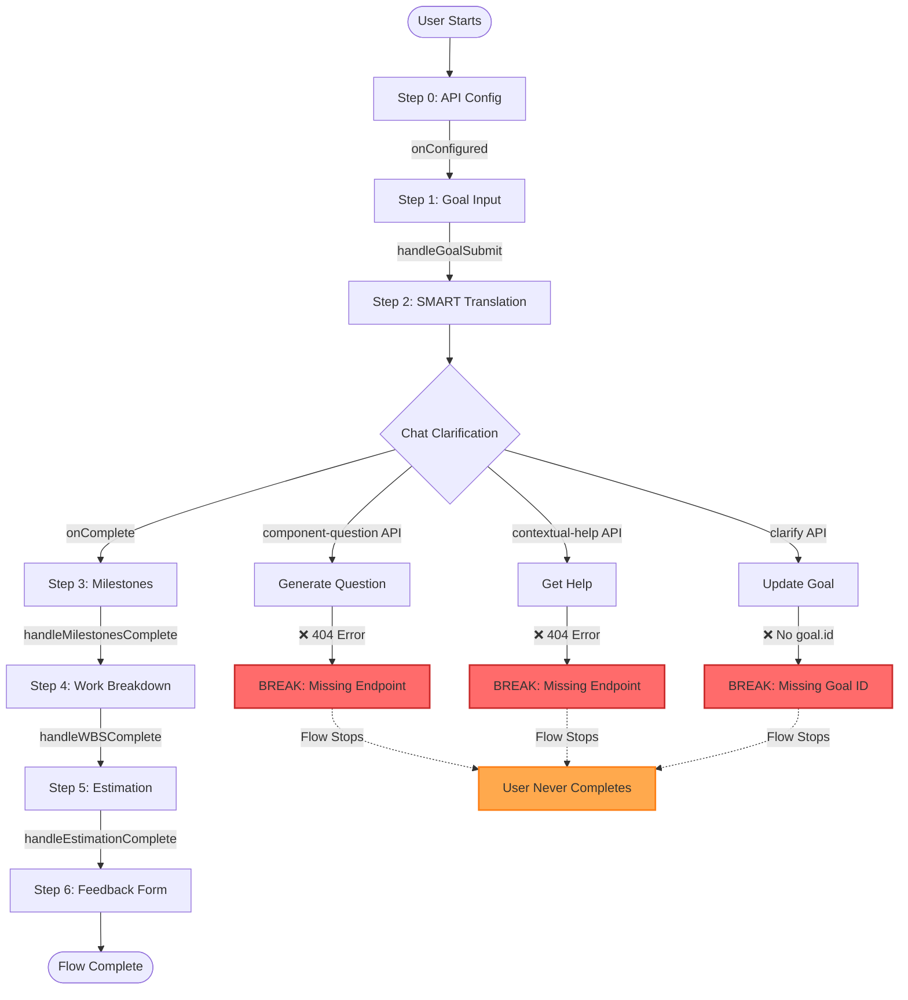
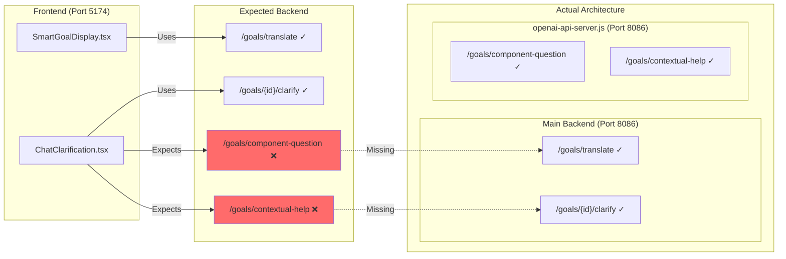
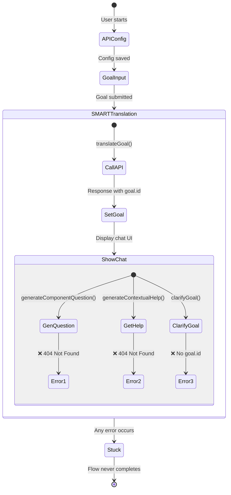
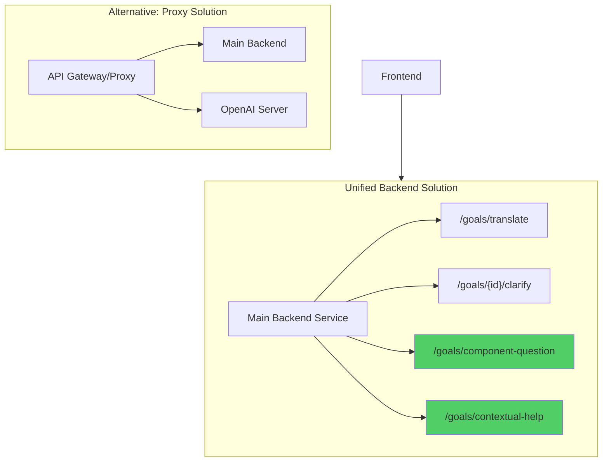

# User Flow Analysis - Breaking Points Diagram

## Complete User Journey Flow

## API Architecture Mismatch

## State Flow Issues

## Key Breaking Points

1. **Missing API Endpoints**
   - `/api/v1/goals/component-question` - Called by ChatClarification.tsx:115
   - `/api/v1/goals/contextual-help` - Called by ChatClarification.tsx:208
   - These exist in openai-api-server.js but not in main backend

2. **Goal ID Propagation**
   - SmartGoalDisplay receives goal with correlation_id
   - ChatClarification expects goal.id to be set
   - If goal.id is missing, clarification fails at line 263

3. **Cascade Failures**
   - If SMART translation chat fails, milestones can't generate
   - If milestones fail, WBS can't generate
   - If WBS fails, estimation can't happen
   - If estimation fails, feedback form never shows

## Solution Architecture

