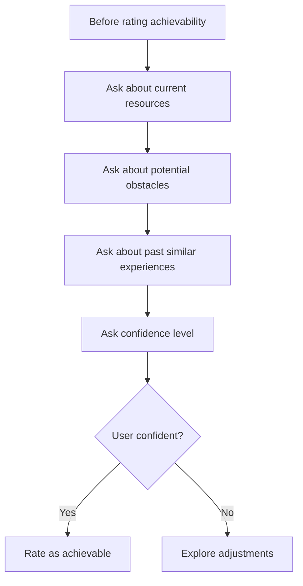
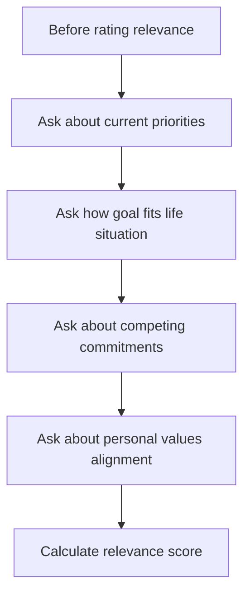

# Goal-Setting System Solution Architecture

## Executive Summary

This solution architecture redesigns the goal-setting system to be user-centric and interactive, eliminating automatic assumptions about timeframes, achievability, and relevance. The new system guides users through a conversational flow that gathers necessary information before making any assessments.

## Core Design Principles

1. **User-Driven Process**: No automatic transformations without user input
2. **Interactive Verification**: Ask questions before making assessments
3. **Context-Aware**: Understand user's life situation before rating relevance
4. **Flexible Timeframes**: Never assume deadlines; always ask the user
5. **Progressive Enhancement**: Build SMART criteria through conversation

## System Architecture Overview

### 1. Processing Modes

```typescript
enum GoalProcessingMode {
  INTERACTIVE = 'interactive',      // Default: Conversational flow
  GUIDED = 'guided',               // Step-by-step with validation
  ANALYSIS_ONLY = 'analysis_only'  // Show current state without transformation
}
```

### 2. Goal State Management

```typescript
interface GoalSession {
  sessionId: string;
  userId: string;
  mode: GoalProcessingMode;
  currentStage: GoalStage;
  goalData: {
    raw: string;
    refined: string;
    smartCriteria: SMARTCriteria;
    userContext: UserContext;
    verificationAnswers: VerificationAnswer[];
  };
  history: ConversationHistory[];
  metadata: {
    startedAt: Date;
    lastUpdatedAt: Date;
    completionStatus: CompletionStatus;
  };
}
```

### 3. Enhanced Data Models

```typescript
interface UserContext {
  timeframePreferences?: {
    preferredDuration?: string;
    constraints?: string[];
    flexibility?: 'fixed' | 'flexible' | 'open';
  };
  lifeAlignment?: {
    currentPriorities: string[];
    values: string[];
    obligations: string[];
    availableTime: number; // hours per week
  };
  resources?: {
    budget?: number;
    skills: string[];
    support: string[];
    tools: string[];
  };
}

interface VerificationAnswer {
  questionId: string;
  questionType: VerificationQuestionType;
  question: string;
  answer: string;
  smartCriterion: keyof SMARTCriteria;
  timestamp: Date;
}

enum VerificationQuestionType {
  TIMEFRAME_CLARIFICATION = 'timeframe_clarification',
  ACHIEVABILITY_CHECK = 'achievability_check',
  LIFE_ALIGNMENT = 'life_alignment',
  RESOURCE_ASSESSMENT = 'resource_assessment',
  MOTIVATION_VALIDATION = 'motivation_validation'
}
```

## API Specifications

### 1. Session Management Endpoints

```typescript
// Initialize goal-setting session
POST /api/v1/goals/sessions
Request: {
  mode: GoalProcessingMode;
  initialGoal?: string;
}
Response: {
  sessionId: string;
  nextStep: InteractionStep;
  prompt: string;
}

// Get session state
GET /api/v1/goals/sessions/:sessionId
Response: {
  session: GoalSession;
  currentPrompt: string;
  availableActions: string[];
}

// Update session with user response
POST /api/v1/goals/sessions/:sessionId/respond
Request: {
  response: string;
  responseType: 'text' | 'selection' | 'numeric';
}
Response: {
  updatedSession: GoalSession;
  nextStep: InteractionStep;
  prompt: string;
}
```

### 2. Interactive Analysis Endpoints

```typescript
// Analyze goal without transformation
POST /api/v1/goals/analyze
Request: {
  goal: string;
  includeQuestions: boolean;
}
Response: {
  currentState: {
    strengths: string[];
    gaps: string[];
    clarity: number; // 0-1
  };
  questions: VerificationQuestion[];
}

// Process verification answers
POST /api/v1/goals/verify
Request: {
  sessionId: string;
  answers: VerificationAnswer[];
}
Response: {
  updatedCriteria: SMARTCriteria;
  additionalQuestions?: VerificationQuestion[];
  readyForFinalization: boolean;
}
```

### 3. Context Gathering Endpoints

```typescript
// Get user context questions
GET /api/v1/goals/context-questions
Query: {
  criterionType: keyof SMARTCriteria;
  existingContext?: string;
}
Response: {
  questions: ContextQuestion[];
}

// Submit user context
POST /api/v1/goals/context
Request: {
  sessionId: string;
  context: UserContext;
}
Response: {
  contextValidation: {
    complete: boolean;
    missingAreas: string[];
  };
}
```

## User Interaction Flow

### Stage 1: Initial Capture (No Assumptions)
```mermaid
graph TD
    A[User enters raw goal] --> B{Analyze goal structure}
    B --> C[Present current state analysis]
    C --> D[Ask: "Would you like help refining this?"]
    D -->|Yes| E[Begin interactive flow]
    D -->|No| F[Save as-is with analysis]
```

### Stage 2: Timeframe Discovery (Never Assume)
```mermaid
graph TD
    A[Goal captured] --> B[Ask: "What timeframe works for you?"]
    B --> C{User provides timeframe?}
    C -->|Yes| D[Ask: "Is this deadline flexible?"]
    C -->|No| E[Ask: "Do you have any time constraints?"]
    D --> F[Store timeframe preferences]
    E --> F
```

### Stage 3: Achievability Verification


### Stage 4: Life Alignment Check


## Implementation Components

### 1. Smart Goal Processor v2

```typescript
class InteractiveSMARTProcessor {
  async startSession(
    goal: string, 
    mode: GoalProcessingMode
  ): Promise<GoalSession> {
    // Initialize session without any assumptions
    // Return first interaction prompt
  }

  async processUserResponse(
    sessionId: string,
    response: string
  ): Promise<InteractionResult> {
    // Update session based on response
    // Determine next question/action
    // Never make assumptions
  }

  async generateVerificationQuestions(
    criterion: keyof SMARTCriteria,
    currentContext: UserContext
  ): Promise<VerificationQuestion[]> {
    // Generate contextual questions
    // No automatic ratings
  }
}
```

### 2. Conversation Manager

```typescript
class ConversationManager {
  private questionBank: QuestionBank;
  private validator: ResponseValidator;
  
  async getNextPrompt(
    session: GoalSession
  ): Promise<ConversationPrompt> {
    // Determine appropriate next question
    // Based on current state and gaps
  }

  async validateResponse(
    response: string,
    expectedType: ResponseType
  ): Promise<ValidationResult> {
    // Validate user input
    // Request clarification if needed
  }
}
```

### 3. Context Analyzer

```typescript
class ContextAnalyzer {
  async assessTimeframeRealism(
    goal: string,
    timeframe: string,
    resources: UserContext['resources']
  ): Promise<TimeframeAssessment> {
    // Analyze only after getting user input
    // Provide feedback, not assumptions
  }

  async checkLifeAlignment(
    goal: string,
    lifeContext: UserContext['lifeAlignment']
  ): Promise<AlignmentScore> {
    // Calculate alignment score
    // Based on user-provided context
  }
}
```

## Database Schema Updates

```sql
-- New tables for interactive flow
CREATE TABLE goal_sessions (
  id UUID PRIMARY KEY,
  user_id UUID REFERENCES users(id),
  mode VARCHAR(20) NOT NULL,
  current_stage VARCHAR(50) NOT NULL,
  started_at TIMESTAMP NOT NULL,
  last_updated_at TIMESTAMP NOT NULL,
  completion_status VARCHAR(20) NOT NULL,
  goal_data JSONB NOT NULL,
  conversation_history JSONB NOT NULL
);

CREATE TABLE verification_responses (
  id UUID PRIMARY KEY,
  session_id UUID REFERENCES goal_sessions(id),
  question_id VARCHAR(100) NOT NULL,
  question_type VARCHAR(50) NOT NULL,
  question_text TEXT NOT NULL,
  answer_text TEXT NOT NULL,
  smart_criterion VARCHAR(20) NOT NULL,
  created_at TIMESTAMP NOT NULL
);

CREATE TABLE user_contexts (
  id UUID PRIMARY KEY,
  user_id UUID REFERENCES users(id),
  session_id UUID REFERENCES goal_sessions(id),
  timeframe_preferences JSONB,
  life_alignment JSONB,
  resources JSONB,
  created_at TIMESTAMP NOT NULL,
  updated_at TIMESTAMP NOT NULL
);

-- Update goals table
ALTER TABLE goals 
ADD COLUMN processing_mode VARCHAR(20) DEFAULT 'interactive',
ADD COLUMN session_id UUID REFERENCES goal_sessions(id),
ADD COLUMN verification_complete BOOLEAN DEFAULT false;
```

## Frontend Integration

### 1. Component Structure

```typescript
// Main conversation component
<GoalConversation
  mode={ProcessingMode.INTERACTIVE}
  onComplete={(goal) => handleGoalCreated(goal)}
>
  <ConversationStage />
  <ProgressIndicator />
  <ActionButtons />
</GoalConversation>

// Verification flow component  
<VerificationFlow
  criterion={currentCriterion}
  questions={verificationQuestions}
  onAnswersSubmit={(answers) => processAnswers(answers)}
/>

// Context gathering component
<ContextGathering
  contextType={contextType}
  existingContext={userContext}
  onContextUpdate={(context) => updateContext(context)}
/>
```

### 2. State Management

```typescript
interface GoalCreationState {
  session: GoalSession | null;
  currentStage: GoalStage;
  isLoading: boolean;
  error: Error | null;
  prompts: ConversationPrompt[];
  responses: UserResponse[];
  verificationStatus: {
    [K in keyof SMARTCriteria]: boolean;
  };
}
```

## Migration Strategy

### Phase 1: Parallel Implementation
- Implement new interactive endpoints alongside existing ones
- Add feature flag for interactive mode
- Default new users to interactive mode

### Phase 2: Gradual Migration
- Migrate existing goals to include session data
- Update frontend to use new components
- Monitor usage and gather feedback

### Phase 3: Deprecation
- Phase out automatic transformation
- Remove old endpoints
- Full transition to interactive mode

## Success Metrics

1. **User Engagement**
   - Session completion rate > 80%
   - Average questions answered per session
   - Time to complete goal creation

2. **Goal Quality**
   - Reduction in goal modifications post-creation
   - Increase in goal achievement rates
   - Higher user satisfaction scores

3. **System Performance**
   - API response time < 200ms
   - Session recovery success rate > 95%
   - Concurrent session capacity

## Security Considerations

1. **Session Management**
   - Implement session timeouts (30 minutes)
   - Secure session storage
   - Rate limiting per user

2. **Data Privacy**
   - Encrypt sensitive context data
   - Allow users to delete session history
   - Implement data retention policies

3. **API Security**
   - Validate all inputs
   - Implement CSRF protection
   - Use secure session tokens