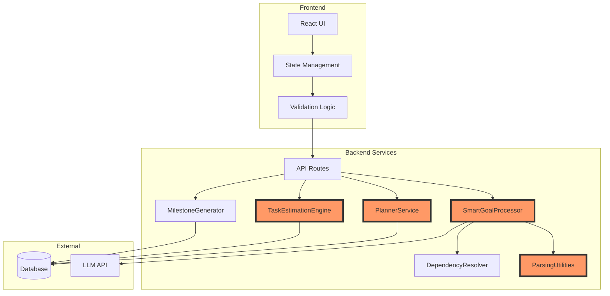
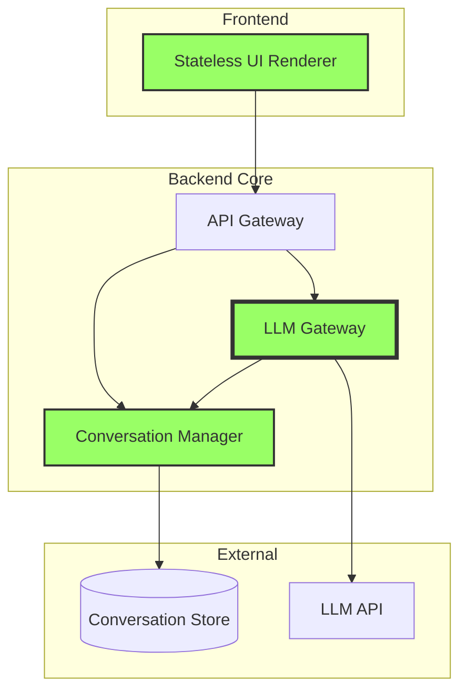
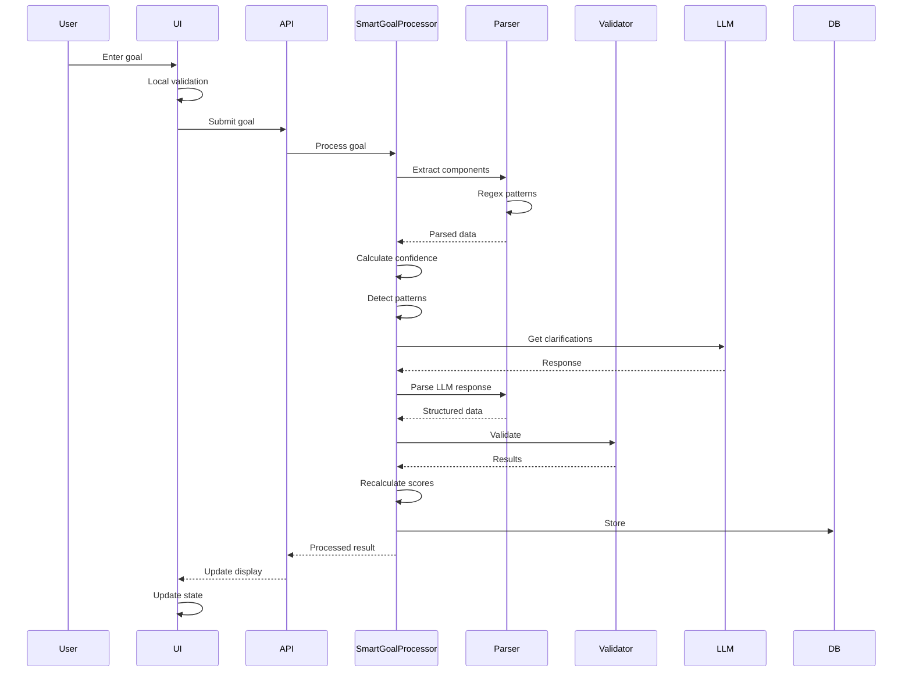
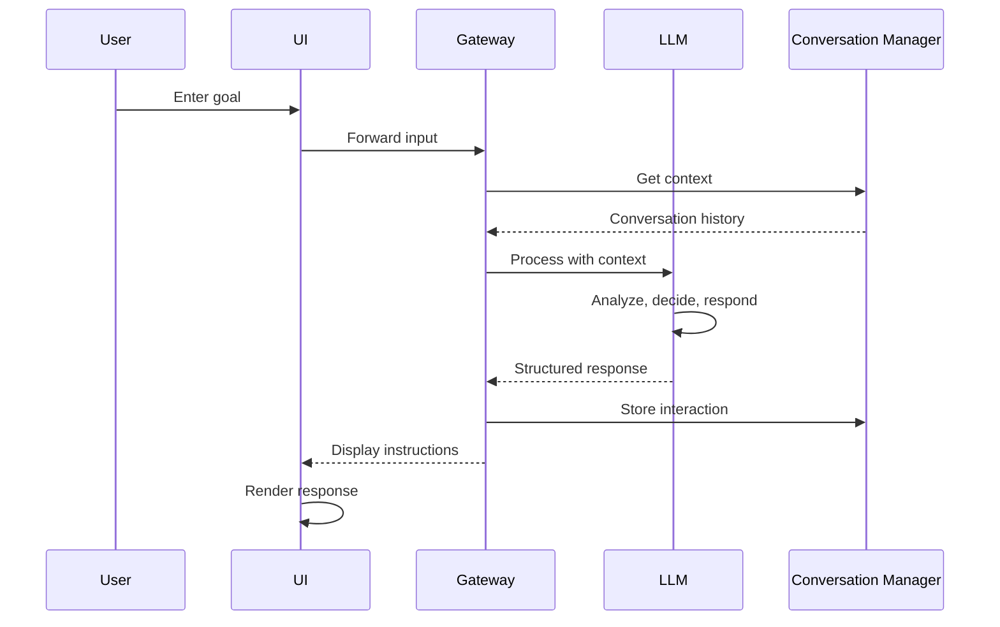
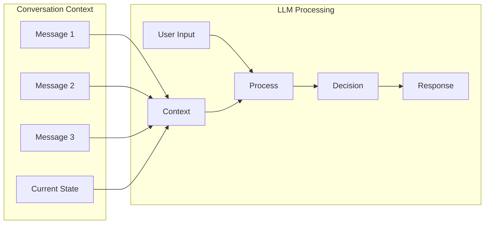
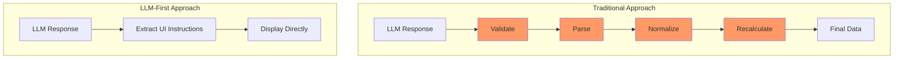
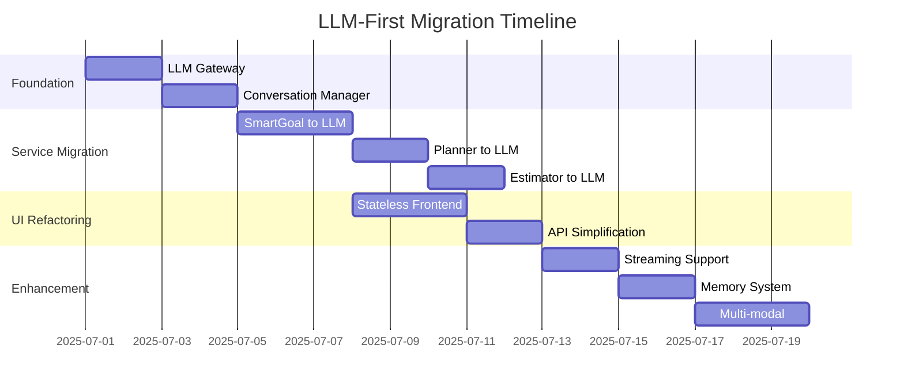
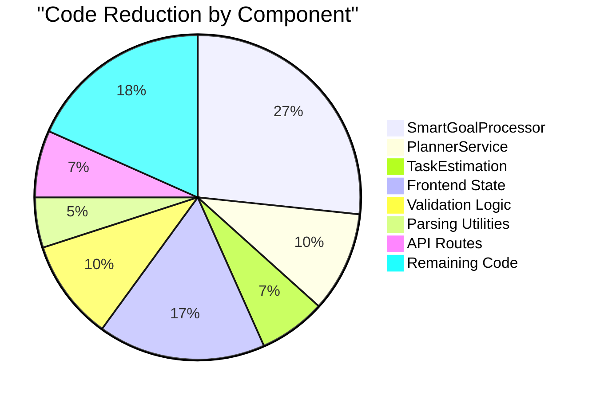
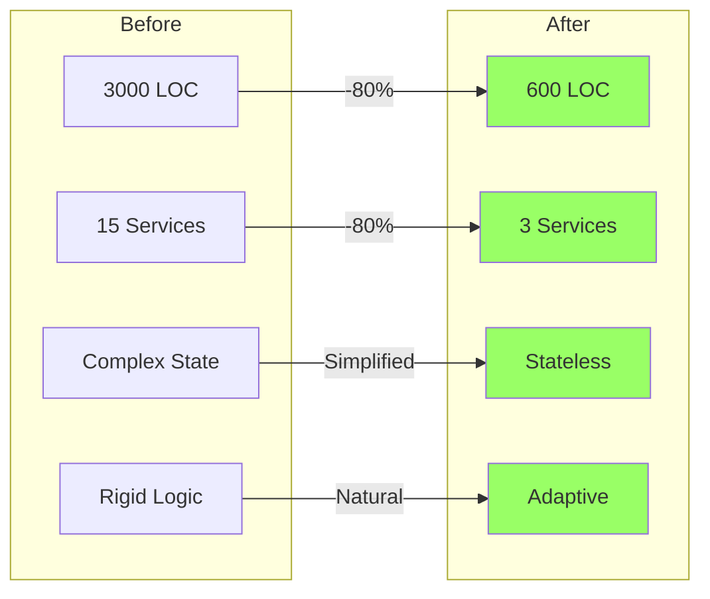

# PersonalEA LLM-First Architecture Diagrams

## Current Architecture (Complex, Deterministic)



## Target Architecture (LLM-First, Simple)



## Data Flow Comparison

### Before: Complex Multi-Step Processing



### After: Streamlined LLM-First Flow



## Component Transformation Examples

### 1. SmartGoalProcessor Transformation

**Before (937 lines):**
```
├── SmartGoalProcessor
│   ├── processGoal()
│   ├── detectTimeframe()
│   ├── detectMetrics()
│   ├── detectSpecifics()
│   ├── checkAchievability()
│   ├── assessRelevance()
│   ├── calculateConfidenceScores()
│   ├── generateClarificationQuestions()
│   ├── parseResponses()
│   ├── updateGoalComponents()
│   └── finalizeSmartGoal()
```

**After (50 lines):**
```
├── LLMGoalAnalyzer
│   ├── analyze(input, context)
│   └── processResponse(llmOutput)
```

### 2. PlannerService Transformation

**Before (287 lines):**
```
├── PlannerService
│   ├── scheduleTask()
│   ├── calculateSlotScore()
│   ├── resolveConflicts()
│   ├── optimizeSchedule()
│   ├── buildDependencyGraph()
│   └── findCriticalPath()
```

**After (30 lines):**
```
├── LLMScheduler
│   ├── suggestSchedule(tasks, constraints, context)
│   └── refineSchedule(feedback, context)
```

## LLM Interaction Patterns

### Pattern 1: Stateful Conversation



### Pattern 2: Trust-Based Processing



## Prompt Architecture

### Master Prompt Structure

```yaml
System Context:
  role: "PersonalEA Assistant"
  capabilities:
    - SMART goal analysis
    - Task scheduling
    - Time estimation
    - Milestone planning
  
Conversation Management:
  maintain:
    - Full conversation history
    - Current goal state
    - User preferences
    - Progress tracking
  
Response Format:
  structure:
    action: enum[analyze, clarify, suggest, complete]
    state: object
    display: array[UIElement]
    metadata: object
```

## Migration Path Visualization



## Code Reduction Impact



## Key Architecture Principles

1. **LLM as the Brain**: All intelligence resides in the LLM
2. **Code as Infrastructure**: Application code only provides plumbing
3. **Trust Over Validation**: Trust LLM outputs rather than validating
4. **Context is King**: Maintain rich context for better decisions
5. **Flexibility First**: Allow natural, adaptive interactions
6. **Prompt Over Code**: Behavior changes through prompts, not code

## Success Metrics Dashboard

