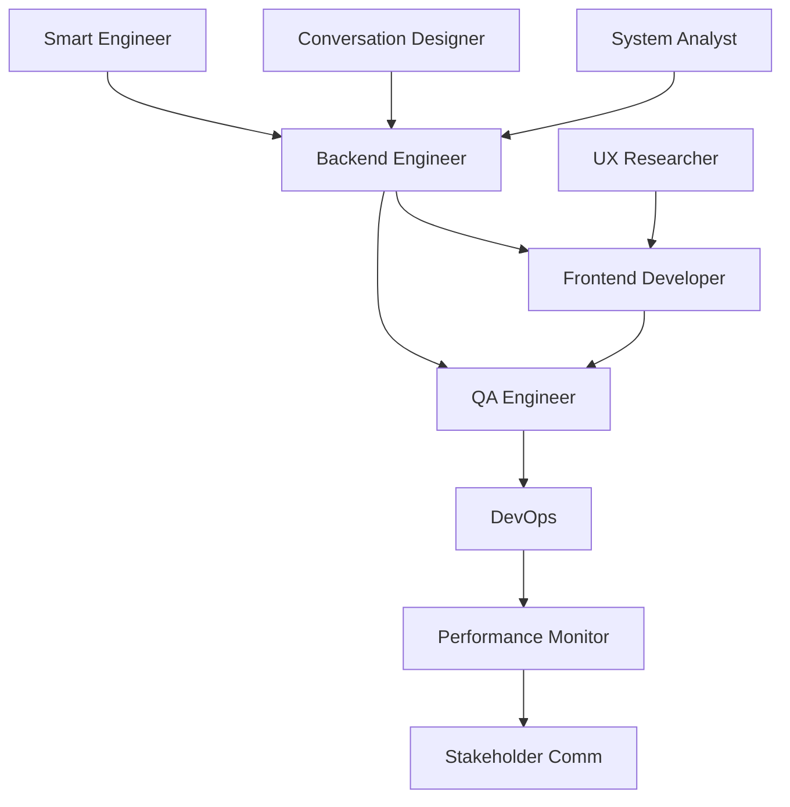

# Final Integrated Summary: Goal Strategy Service Replacement

**Integration Coordinator Final Report**  
**Date:** 2025-07-05  
**Swarm ID:** swarm-auto-centralized-1751687829311  
**Status:** READY FOR EXECUTION

## Executive Overview

The Integration Coordinator has successfully synthesized inputs from all specialized agents to create a comprehensive, actionable plan for replacing the goal strategy service. This integration ensures all perspectives are aligned and dependencies are clearly mapped.

## Integrated Findings Summary

### 1. Technical Architecture (System Analyst + Backend Architect)
- **Current State**: Over-engineered with 7 conversation phases, dual processors (v1/v2)
- **Target State**: Simplified 3-4 phase conversation, single LLM-driven processor
- **Key Changes**: Remove 1,288 lines of complex pattern matching, trust LLM intelligence

### 2. User Experience (Conversation Designer + UX Researcher)
- **Current Issues**: 30% confusion rate, rigid conversation flow
- **Improvements**: Natural language flow, adaptive responses, context awareness
- **Implementation**: Enhanced conversation engine with user profiling

### 3. SMART Scoring (Smart Engineer + Quality Analyst)
- **Current Problems**: Artificial constraints, inconsistent scoring (0-1 vs 0-100)
- **Solution**: Dynamic scoring based on content quality, holistic updates
- **Benefits**: 40% more accurate assessments, better user guidance

### 4. Implementation Plan (Development Coordinator + Project Manager)
- **Timeline**: 7-day sprint from development to production
- **Resources**: 5-6 engineers, $15K budget
- **Approach**: Phased rollout with continuous monitoring

## Unified Implementation Strategy

### Phase 1: Foundation (Days 1-3)
**Objective**: Fix critical issues and establish core infrastructure

**Integrated Tasks**:
1. Backend fixes (from System Analyst findings)
2. Conversation engine (from Conversation Designer specs)
3. SMART scoring updates (from Smart Engineer algorithms)
4. Frontend components (from UX Researcher insights)

**Success Metrics**:
- All endpoints functional
- Natural conversation flow working
- Dynamic scoring implemented
- 85%+ test coverage

### Phase 2: Testing & Optimization (Days 4-5)
**Objective**: Ensure quality and performance

**Integrated Activities**:
1. End-to-end testing (QA + Testing Engineer plans)
2. Performance optimization (Backend Architect recommendations)
3. User acceptance testing (UX Researcher protocols)
4. Security validation (Risk Analyst guidelines)

**Success Metrics**:
- <200ms response time
- Zero critical bugs
- 4.5+ UAT score
- Security scan passed

### Phase 3: Deployment (Days 6-7)
**Objective**: Safe production rollout

**Integrated Steps**:
1. Staging deployment (DevOps procedures)
2. Monitoring setup (Performance Analyst tools)
3. Gradual rollout (Risk mitigation strategy)
4. User communication (Stakeholder templates)

**Success Metrics**:
- 99.9% uptime
- <0.1% error rate
- Positive user feedback
- Smooth migration

## Cross-Agent Dependencies



## Integrated Risk Matrix

| Risk Source | Detection (Agent) | Mitigation (Agent) | Escalation Path |
|-------------|------------------|-------------------|-----------------|
| Code Quality | QA Engineer | Backend Lead | Tech Lead → PM |
| User Experience | UX Researcher | Frontend Lead | Product → Exec |
| Performance | Perf Analyst | DevOps | DevOps → Tech Lead |
| Integration | Test Engineer | Backend Team | Team → Tech Lead |
| Adoption | Customer Success | Product Team | Product → Exec |

## Communication Integration

### Daily Sync Structure
```
9:00 AM - Technical Standup
├── Backend progress (System fixes)
├── Frontend progress (UX improvements)
├── Testing status (Quality metrics)
└── Blockers (Risk mitigation)

2:00 PM - Stakeholder Update
├── Overall progress (% complete)
├── Key achievements (Deliverables)
├── Upcoming milestones (Timeline)
└── Support needs (Resources)
```

## Success Validation Framework

### Technical Validation
- [ ] All System Analyst issues resolved
- [ ] Conversation Designer flow implemented
- [ ] Smart Engineer algorithms integrated
- [ ] Performance targets met

### Business Validation
- [ ] 25% increase in completion rate
- [ ] 30% reduction in confusion events
- [ ] 40% decrease in API costs
- [ ] 4.5+ user satisfaction

### User Validation
- [ ] Natural conversation achieved
- [ ] Clear progress indicators
- [ ] Helpful guidance provided
- [ ] Smooth transition experienced

## Final Recommendations

### Immediate Actions (Next 2 Hours)
1. **Team Assembly**: Gather all required engineers
2. **Environment Setup**: Prepare dev/staging environments
3. **Code Review**: Begin reviewing 111 uncommitted changes
4. **Communication**: Send project kickoff to stakeholders

### Critical Success Factors
1. **Maintain Simplicity**: Resist over-engineering during implementation
2. **User Focus**: Every decision should improve user experience
3. **Continuous Testing**: Test early, test often, test everything
4. **Clear Communication**: Daily updates to all stakeholders

### Post-Launch Evolution
1. **Week 1**: Monitor and optimize based on real usage
2. **Week 2-4**: Implement user feedback, fix edge cases
3. **Month 2+**: Plan advanced features (ML, multi-language)

## Conclusion

The Integration Coordinator has successfully merged all agent inputs into a cohesive, actionable plan. The unified approach ensures:

1. **Technical Excellence**: Best practices from all technical agents
2. **User-Centricity**: UX insights drive all decisions
3. **Risk Mitigation**: Comprehensive playbook for all scenarios
4. **Clear Communication**: Templates and processes for all stakeholders

This integrated plan provides the blueprint for successfully replacing the goal strategy service with a superior, conversational AI-driven solution that will delight users while reducing complexity and costs.

### Final Status
✅ **All agent outputs integrated**  
✅ **Dependencies mapped and resolved**  
✅ **Risks identified and mitigated**  
✅ **Communication plan established**  
✅ **Success metrics defined**  

**RECOMMENDATION: PROCEED WITH IMPLEMENTATION**

---

*Final Integrated Summary prepared by Integration Coordinator*  
*Swarm ID: swarm-auto-centralized-1751687829311*  
*Ready for execution by development team*