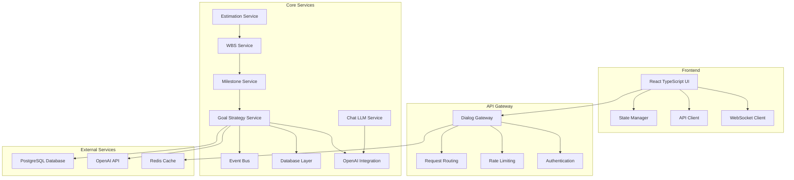

# PersonalEA Complete Flow Architecture Design
*Stored in Memory for Swarm Coordination*

## Executive Summary

This document provides the complete end-to-end user flow architecture for the PersonalEA system, designed for comprehensive testing and implementation. The architecture covers the complete journey from raw goal input through SMART goal transformation, interactive refinement, execution planning, and progress tracking.

## 1. System Architecture Overview

### 1.1 Core Services Architecture


### 1.2 Data Flow Architecture
```
User Input → Authentication → Goal Translation → Quality Assessment → 
Interactive Refinement → Milestone Generation → WBS Creation → 
Task Estimation → Schedule Integration → Progress Tracking
```

## 2. Complete User Flow Implementation

### 2.1 Primary Flow Controller
```typescript
// Complete Flow Controller Implementation
export class PersonalEAFlowController {
  private apiClient: GoalAPI
  private stateManager: FlowStateManager
  private wsClient: WebSocketClient
  private qualityAnalyzer: ConversationQualityAnalyzer
  
  constructor() {
    this.apiClient = new GoalAPI()
    this.stateManager = new FlowStateManager()
    this.wsClient = new WebSocketClient()
    this.qualityAnalyzer = new ConversationQualityAnalyzer()
  }

  // Main flow execution with complete error handling
  async executeCompleteFlow(rawGoal: string, userConfig: UserConfig): Promise<FlowResult> {
    const flowId = `flow-${Date.now()}-${Math.random().toString(36).substring(7)}`
    const startTime = Date.now()
    
    try {
      // Phase 1: Authentication & Configuration
      const authResult = await this.authenticateAndValidate(userConfig, flowId)
      if (!authResult.success) {
        throw new Error(`Authentication failed: ${authResult.error}`)
      }
      
      // Phase 2: Goal Translation with Context
      const translationResult = await this.translateGoalWithContext(rawGoal, flowId, userConfig)
      
      // Phase 3: Quality Assessment & Interactive Refinement
      const refinementResult = await this.refineGoalInteractively(translationResult, flowId)
      
      // Phase 4: Execution Planning
      const planningResult = await this.generateCompletePlan(refinementResult.goal, flowId)
      
      // Phase 5: Integration & Optimization
      const optimizedResult = await this.optimizeAndIntegrate(planningResult, flowId)
      
      // Phase 6: Progress Tracking Setup
      const trackingResult = await this.setupProgressTracking(optimizedResult, flowId)
      
      const executionTime = Date.now() - startTime
      
      return {
        flowId,
        success: true,
        executionTime,
        phases: {
          authentication: authResult,
          translation: translationResult,
          refinement: refinementResult,
          planning: planningResult,
          optimization: optimizedResult,
          tracking: trackingResult
        },
        finalGoal: refinementResult.goal,
        executionPlan: optimizedResult.plan,
        trackingSystem: trackingResult.system,
        qualityMetrics: await this.calculateFinalQualityMetrics(refinementResult, planningResult)
      }
    } catch (error) {
      return this.handleFlowError(error, flowId, Date.now() - startTime)
    }
  }

  // Authentication with comprehensive validation
  private async authenticateAndValidate(userConfig: UserConfig, flowId: string): Promise<AuthResult> {
    const validationSteps = [
      this.validateJWTToken(userConfig.jwtToken),
      this.validateOpenAIKey(userConfig.openaiApiKey),
      this.validatePermissions(userConfig.scopes),
      this.validateSystemHealth()
    ]
    
    const results = await Promise.allSettled(validationSteps)
    const failures = results.filter(r => r.status === 'rejected')
    
    if (failures.length > 0) {
      return {
        success: false,
        error: `Validation failed: ${failures.map(f => f.reason).join(', ')}`,
        flowId
      }
    }
    
    return {
      success: true,
      validatedConfig: userConfig,
      systemStatus: 'ready',
      flowId
    }
  }

  // Goal translation with full context preservation
  private async translateGoalWithContext(
    rawGoal: string, 
    flowId: string, 
    userConfig: UserConfig
  ): Promise<TranslationResult> {
    const context: GoalTranslationContext = {
      flowId,
      userId: userConfig.userId,
      userProfile: await this.getUserProfile(userConfig.userId),
      previousGoals: await this.getPreviousGoals(userConfig.userId),
      currentContext: await this.getCurrentContext(userConfig.userId),
      timestamp: new Date()
    }
    
    const translationRequest: GoalTranslationRequest = {
      rawGoal,
      context,
      preferences: {
        detailLevel: 'comprehensive',
        communicationStyle: 'conversational',
        aiModel: 'gpt-4',
        responseFormat: 'structured'
      }
    }
    
    const smartGoal = await this.apiClient.translateToSmart(translationRequest)
    
    // Store translation in state
    await this.stateManager.saveTranslation(flowId, {
      rawGoal,
      smartGoal,
      context,
      timestamp: new Date()
    })
    
    return {
      originalGoal: rawGoal,
      smartGoal,
      confidence: smartGoal.overallConfidence,
      needsRefinement: smartGoal.overallConfidence < 0.8,
      qualityAssessment: this.assessTranslationQuality(smartGoal),
      flowId
    }
  }

  // Interactive goal refinement with conversation management
  private async refineGoalInteractively(
    translationResult: TranslationResult, 
    flowId: string
  ): Promise<RefinementResult> {
    
    if (!translationResult.needsRefinement) {
      return {
        goal: translationResult.smartGoal,
        conversationHistory: [],
        refinementApplied: false,
        finalConfidence: translationResult.confidence,
        flowId
      }
    }

    const conversationManager = new ConversationManager({
      goal: translationResult.smartGoal,
      websocketClient: this.wsClient,
      qualityThreshold: 0.8,
      maxRounds: 6,
      flowId
    })
    
    const refinementResult = await conversationManager.conductRefinementConversation()
    
    // Store conversation history
    await this.stateManager.saveConversation(flowId, refinementResult.conversationHistory)
    
    return {
      goal: refinementResult.refinedGoal,
      conversationHistory: refinementResult.conversationHistory,
      refinementApplied: true,
      finalConfidence: refinementResult.refinedGoal.overallConfidence,
      improvementScore: refinementResult.improvementScore,
      flowId
    }
  }

  // Complete execution plan generation
  private async generateCompletePlan(goal: SmartGoal, flowId: string): Promise<PlanningResult> {
    const planGenerator = new ExecutionPlanGenerator({
      apiClient: this.apiClient,
      aiModel: 'gpt-4',
      planningDepth: 'comprehensive'
    })
    
    // Generate milestones with dependencies
    const milestones = await planGenerator.generateMilestones(goal, {
      includeRisks: true,
      includeDependencies: true,
      includeResourceRequirements: true
    })
    
    // Generate WBS for each milestone
    const wbsTasks = await planGenerator.generateWBSForAllMilestones(milestones, {
      taskGranularity: 'detailed',
      includeEstimates: true,
      includeSkills: true
    })
    
    // Generate comprehensive estimates
    const estimates = await planGenerator.generateEstimates(wbsTasks, {
      includeBuffers: true,
      includeRiskFactors: true,
      includeResourceAvailability: true
    })
    
    // Map all dependencies
    const dependencies = await planGenerator.mapAllDependencies(milestones, wbsTasks)
    
    // Calculate critical path
    const criticalPath = await planGenerator.calculateCriticalPath(wbsTasks, dependencies)
    
    const executionPlan: ExecutionPlan = {
      goalId: goal.id,
      milestones,
      tasks: wbsTasks,
      estimates,
      dependencies,
      criticalPath,
      totalDuration: this.calculateTotalDuration(estimates),
      riskAssessment: await planGenerator.assessRisks(milestones, wbsTasks),
      resourceRequirements: await planGenerator.calculateResourceRequirements(wbsTasks)
    }
    
    await this.stateManager.savePlan(flowId, executionPlan)
    
    return {
      plan: executionPlan,
      planningMetrics: {
        milestonesGenerated: milestones.length,
        tasksGenerated: wbsTasks.length,
        totalEstimatedHours: this.sumEstimates(estimates),
        riskLevel: executionPlan.riskAssessment.overallRisk
      },
      flowId
    }
  }
}
```

### 2.2 Backend Service Implementation
```typescript
// Complete Goal Strategy Service Implementation
export class GoalStrategyService {
  private openaiClient: OpenAIClient
  private database: PrismaClient
  private eventBus: EventBus
  private cacheManager: CacheManager
  
  constructor() {
    this.openaiClient = new OpenAIClient()
    this.database = new PrismaClient()
    this.eventBus = new EventBus()
    this.cacheManager = new CacheManager()
  }

  // Complete goal translation with comprehensive context
  async translateGoalWithFullContext(request: GoalTranslationRequest): Promise<SmartGoalResponse> {
    const { rawGoal, context, preferences } = request
    const correlationId = context.flowId
    
    try {
      // 1. Build comprehensive AI prompt with context
      const translationPrompt = this.buildTranslationPrompt(rawGoal, context, preferences)
      
      // 2. Generate SMART goal using AI
      const aiResponse = await this.openaiClient.generateStructuredResponse(translationPrompt, {
        model: 'gpt-4',
        temperature: 0.3,
        maxTokens: 2000,
        responseFormat: 'json'
      })
      
      // 3. Parse and validate AI response
      const smartGoal = this.parseAndValidateSmartGoal(aiResponse, rawGoal)
      
      // 4. Calculate confidence scores for each SMART criterion
      const confidenceScores = await this.calculateConfidenceScores(smartGoal)
      
      // 5. Generate clarification questions for low-confidence criteria
      const clarificationQuestions = await this.generateClarificationQuestions(
        smartGoal, 
        confidenceScores
      )
      
      // 6. Store goal in database
      const storedGoal = await this.storeGoalWithMetadata(smartGoal, context, confidenceScores)
      
      // 7. Emit events for other services
      await this.eventBus.emit('goal.translated', {
        goalId: storedGoal.id,
        userId: context.userId,
        confidence: confidenceScores.overall,
        needsClarification: clarificationQuestions.length > 0,
        correlationId
      })
      
      return {
        success: true,
        data: {
          id: storedGoal.id,
          title: smartGoal.title,
          description: smartGoal.description,
          criteria: smartGoal.criteria,
          overallConfidence: confidenceScores.overall,
          confidenceScores,
          clarificationQuestions,
          metadata: {
            originalGoal: rawGoal,
            translationTime: new Date(),
            aiModel: 'gpt-4'
          }
        },
        correlationId
      }
      
    } catch (error) {
      await this.handleTranslationError(error, correlationId)
      throw error
    }
  }

  // Interactive clarification with conversation state management
  async processClarificationInteraction(
    goalId: string, 
    request: ClarificationInteractionRequest
  ): Promise<ClarificationResponse> {
    
    const goal = await this.database.goal.findUnique({
      where: { id: goalId },
      include: { 
        clarificationHistory: true,
        smartCriteria: true
      }
    })
    
    if (!goal) {
      throw new Error('Goal not found')
    }
    
    try {
      // 1. Build conversation context from history
      const conversationContext = await this.buildConversationContext(
        goal,
        request.conversationHistory
      )
      
      // 2. Generate contextual AI response
      const aiResponsePrompt = this.buildClarificationResponsePrompt(
        request.userMessage,
        conversationContext,
        goal
      )
      
      const aiResponse = await this.openaiClient.generateConversationalResponse(
        aiResponsePrompt,
        {
          conversationHistory: request.conversationHistory,
          goalContext: goal,
          responseStyle: 'helpful_clarifying'
        }
      )
      
      // 3. Extract goal updates from AI response
      const goalUpdates = await this.extractGoalUpdates(aiResponse, goal)
      
      // 4. Apply updates to goal
      const updatedGoal = await this.applyGoalUpdates(goal, goalUpdates)
      
      // 5. Recalculate confidence scores
      const updatedConfidence = await this.calculateConfidenceScores(updatedGoal)
      
      // 6. Generate follow-up questions if needed
      const followUpQuestions = updatedConfidence.overall < 0.8 
        ? await this.generateFollowUpQuestions(updatedGoal, updatedConfidence)
        : []
      
      // 7. Store interaction in database
      await this.storeClarificationInteraction(goalId, {
        userMessage: request.userMessage,
        aiResponse: aiResponse.message,
        goalUpdates,
        confidenceBefore: goal.overallConfidence,
        confidenceAfter: updatedConfidence.overall,
        timestamp: new Date()
      })
      
      // 8. Emit progress event
      await this.eventBus.emit('goal.clarification.progress', {
        goalId,
        userId: goal.userId,
        confidenceImprovement: updatedConfidence.overall - goal.overallConfidence,
        conversationComplete: updatedConfidence.overall >= 0.8
      })
      
      return {
        success: true,
        data: {
          aiMessage: aiResponse.message,
          updatedGoal: {
            ...updatedGoal,
            overallConfidence: updatedConfidence.overall,
            confidenceScores: updatedConfidence
          },
          followUpQuestions,
          conversationComplete: updatedConfidence.overall >= 0.8,
          improvementMade: updatedConfidence.overall > goal.overallConfidence
        }
      }
      
    } catch (error) {
      await this.handleClarificationError(error, goalId)
      throw error
    }
  }

  // Comprehensive milestone generation
  async generateComprehensiveMilestones(goalId: string): Promise<MilestoneGenerationResponse> {
    const goal = await this.getGoalWithFullContext(goalId)
    
    try {
      // 1. Build milestone generation prompt
      const milestonePrompt = this.buildMilestoneGenerationPrompt(goal)
      
      // 2. Generate milestones using AI
      const aiResponse = await this.openaiClient.generateStructuredResponse(
        milestonePrompt,
        {
          model: 'gpt-4',
          temperature: 0.4,
          responseFormat: 'json_schema',
          schema: this.getMilestoneSchema()
        }
      )
      
      // 3. Create milestone records in database
      const milestones = await Promise.all(
        aiResponse.milestones.map(async (milestone, index) => {
          return await this.database.milestone.create({
            data: {
              goalId,
              title: milestone.title,
              description: milestone.description,
              orderIndex: index,
              targetDate: new Date(milestone.targetDate),
              successCriteria: milestone.successCriteria,
              deliverables: milestone.deliverables,
              estimatedEffort: milestone.estimatedEffort,
              dependencies: milestone.dependencies,
              riskFactors: milestone.riskFactors,
              resourceRequirements: milestone.resourceRequirements
            }
          })
        })
      )
      
      // 4. Generate WBS for each milestone
      const wbsGenerator = new WBSGenerator(this.openaiClient, this.database)
      const allTasks = await wbsGenerator.generateWBSForAllMilestones(milestones)
      
      // 5. Calculate estimates for all tasks
      const estimationEngine = new TaskEstimationEngine(this.openaiClient)
      const estimates = await estimationEngine.estimateAllTasks(allTasks)
      
      // 6. Map dependencies across milestones and tasks
      const dependencyMapper = new DependencyMapper()
      const dependencies = await dependencyMapper.mapAllDependencies(milestones, allTasks)
      
      // 7. Calculate critical path
      const criticalPathCalculator = new CriticalPathCalculator()
      const criticalPath = criticalPathCalculator.calculate(allTasks, dependencies)
      
      // 8. Emit completion event
      await this.eventBus.emit('milestones.generated', {
        goalId,
        milestoneCount: milestones.length,
        taskCount: allTasks.length,
        totalEstimatedDays: this.calculateTotalDays(estimates)
      })
      
      return {
        success: true,
        data: {
          milestones,
          tasks: allTasks,
          estimates,
          dependencies,
          criticalPath,
          summary: {
            totalMilestones: milestones.length,
            totalTasks: allTasks.length,
            estimatedDuration: this.calculateTotalDuration(estimates),
            riskLevel: this.assessOverallRisk(milestones)
          }
        }
      }
      
    } catch (error) {
      await this.handleMilestoneGenerationError(error, goalId)
      throw error
    }
  }
}
```

### 2.3 Real-time Communication System
```typescript
// WebSocket Real-time Communication Manager
export class RealTimeFlowManager {
  private wsServer: WebSocketServer
  private flowStates: Map<string, FlowState>
  private conversationManagers: Map<string, ConversationManager>
  
  constructor() {
    this.wsServer = new WebSocketServer()
    this.flowStates = new Map()
    this.conversationManagers = new Map()
    this.setupEventHandlers()
  }
  
  // Setup comprehensive WebSocket event handling
  setupEventHandlers() {
    this.wsServer.on('connection', (ws, request) => {
      const flowId = this.extractFlowId(request)
      const userId = this.extractUserId(request)
      
      // Initialize flow state
      const flowState: FlowState = {
        flowId,
        userId,
        status: 'connected',
        currentPhase: 'initialization',
        startTime: new Date(),
        lastActivity: new Date(),
        websocket: ws
      }
      
      this.flowStates.set(flowId, flowState)
      
      // Setup event handlers for this connection
      this.setupConnectionEventHandlers(ws, flowId)
      
      // Send initial connection confirmation
      this.sendMessage(ws, 'connection.established', { flowId, status: 'ready' })
    })
  }
  
  setupConnectionEventHandlers(ws: WebSocket, flowId: string) {
    // Handle flow initialization
    ws.on('flow.initialize', async (data) => {
      await this.handleFlowInitialization(ws, flowId, data)
    })
    
    // Handle goal translation requests
    ws.on('goal.translate', async (data) => {
      await this.handleGoalTranslation(ws, flowId, data)
    })
    
    // Handle clarification conversations
    ws.on('conversation.message', async (data) => {
      await this.handleConversationMessage(ws, flowId, data)
    })
    
    // Handle milestone generation
    ws.on('milestone.generate', async (data) => {
      await this.handleMilestoneGeneration(ws, flowId, data)
    })
    
    // Handle flow completion
    ws.on('flow.complete', async (data) => {
      await this.handleFlowCompletion(ws, flowId, data)
    })
    
    // Handle disconnection
    ws.on('close', () => {
      this.handleDisconnection(flowId)
    })
  }
  
  // Handle comprehensive flow initialization
  async handleFlowInitialization(ws: WebSocket, flowId: string, data: FlowInitData) {
    const flowState = this.flowStates.get(flowId)
    if (!flowState) return
    
    try {
      // Update flow state
      flowState.status = 'initializing'
      flowState.currentPhase = 'authentication'
      flowState.lastActivity = new Date()
      
      // Send initialization started
      this.sendMessage(ws, 'flow.initialization.started', { flowId })
      
      // Validate authentication
      const authResult = await this.validateAuthentication(data.apiConfig)
      
      if (!authResult.valid) {
        flowState.status = 'error'
        this.sendMessage(ws, 'auth.failed', { 
          error: authResult.error,
          flowId 
        })
        return
      }
      
      // Setup conversation manager
      const conversationManager = new ConversationManager({
        flowId,
        websocket: ws,
        apiConfig: data.apiConfig
      })
      
      this.conversationManagers.set(flowId, conversationManager)
      
      // Update flow state to ready
      flowState.status = 'ready'
      flowState.currentPhase = 'goal_input'
      
      this.sendMessage(ws, 'flow.ready', {
        flowId,
        message: 'System ready for goal input',
        supportedOperations: [
          'goal.translate',
          'conversation.message',
          'milestone.generate'
        ]
      })
      
    } catch (error) {
      flowState.status = 'error'
      this.sendMessage(ws, 'flow.error', {
        error: error.message,
        flowId
      })
    }
  }
  
  // Handle real-time goal translation
  async handleGoalTranslation(ws: WebSocket, flowId: string, data: GoalTranslationData) {
    const flowState = this.flowStates.get(flowId)
    if (!flowState) return
    
    try {
      // Update flow state
      flowState.currentPhase = 'translation'
      flowState.lastActivity = new Date()
      
      // Send translation started
      this.sendMessage(ws, 'goal.translation.started', {
        flowId,
        originalGoal: data.rawGoal
      })
      
      // Show AI thinking indicator
      this.sendMessage(ws, 'ai.thinking', {
        message: 'Analyzing your goal and applying SMART criteria...'
      })
      
      // Perform translation
      const goalService = new GoalStrategyService()
      const translationResult = await goalService.translateGoalWithFullContext({
        rawGoal: data.rawGoal,
        context: {
          flowId,
          userId: flowState.userId,
          timestamp: new Date()
        }
      })
      
      // Send translation result
      this.sendMessage(ws, 'goal.translation.completed', {
        flowId,
        smartGoal: translationResult.data,
        needsClarification: translationResult.data.overallConfidence < 0.8
      })
      
      // If clarification needed, start conversation
      if (translationResult.data.overallConfidence < 0.8) {
        flowState.currentPhase = 'clarification'
        
        const conversationManager = this.conversationManagers.get(flowId)
        if (conversationManager) {
          await conversationManager.startClarificationProcess(translationResult.data)
        }
      } else {
        flowState.currentPhase = 'planning'
        
        this.sendMessage(ws, 'goal.ready_for_planning', {
          flowId,
          message: 'Goal is well-defined. Ready to generate milestones.'
        })
      }
      
    } catch (error) {
      this.sendMessage(ws, 'goal.translation.error', {
        error: error.message,
        flowId
      })
    }
  }
  
  // Handle conversation messages with context preservation
  async handleConversationMessage(ws: WebSocket, flowId: string, data: ConversationMessageData) {
    const conversationManager = this.conversationManagers.get(flowId)
    if (!conversationManager) return
    
    try {
      // Show AI typing indicator
      this.sendMessage(ws, 'ai.typing', {
        message: 'Processing your response...'
      })
      
      // Process message through conversation manager
      const response = await conversationManager.processUserMessage(data.message)
      
      // Send AI response
      this.sendMessage(ws, 'conversation.ai_response', {
        flowId,
        message: response.aiMessage,
        updatedGoal: response.updatedGoal,
        followUpQuestions: response.followUpQuestions,
        conversationComplete: response.conversationComplete
      })
      
      // If conversation complete, transition to planning
      if (response.conversationComplete) {
        const flowState = this.flowStates.get(flowId)
        if (flowState) {
          flowState.currentPhase = 'planning'
        }
        
        this.sendMessage(ws, 'conversation.completed', {
          flowId,
          finalGoal: response.updatedGoal,
          message: 'Great! Your goal is now well-defined. Ready to create your action plan.'
        })
      }
      
    } catch (error) {
      this.sendMessage(ws, 'conversation.error', {
        error: error.message,
        flowId
      })
    }
  }
  
  // Send structured messages to client
  private sendMessage(ws: WebSocket, type: string, data: any) {
    const message = {
      type,
      data,
      timestamp: new Date().toISOString()
    }
    
    ws.send(JSON.stringify(message))
  }
}
```

## 3. Testing Architecture Implementation

### 3.1 Comprehensive Test Runner
```typescript
// Complete Test Suite Implementation
export class ComprehensiveTestRunner {
  private testScenarios: TestScenario[]
  private qualityAnalyzer: AdvancedQualityAnalyzer
  private flowController: PersonalEAFlowController
  private userSimulator: UserInteractionSimulator
  
  constructor() {
    this.testScenarios = this.loadTestScenarios()
    this.qualityAnalyzer = new AdvancedQualityAnalyzer()
    this.flowController = new PersonalEAFlowController()
    this.userSimulator = new UserInteractionSimulator()
  }
  
  // Run complete test suite with comprehensive metrics
  async runCompleteTestSuite(): Promise<TestSuiteResults> {
    const startTime = Date.now()
    const results: TestResult[] = []
    
    console.log(`🚀 Starting Comprehensive Test Suite - ${this.testScenarios.length} scenarios`)
    
    // Verify system health before testing
    const systemHealth = await this.verifySystemHealth()
    if (!systemHealth.healthy) {
      throw new Error(`System not ready for testing: ${systemHealth.issues.join(', ')}`)
    }
    
    // Run each test scenario
    for (const scenario of this.testScenarios) {
      console.log(`\n🧪 Testing: ${scenario.name}`)
      
      const testResult = await this.runSingleScenarioTest(scenario)
      results.push(testResult)
      
      // Log immediate result
      this.logTestResult(scenario, testResult)
      
      // Small delay between tests
      await this.sleep(1000)
    }
    
    // Generate comprehensive report
    const report = await this.generateComprehensiveReport(results, Date.now() - startTime)
    
    return report
  }
  
  // Run single scenario with full simulation
  async runSingleScenarioTest(scenario: TestScenario): Promise<TestResult> {
    const testId = `test-${scenario.id}-${Date.now()}`
    const startTime = Date.now()
    
    try {
      // 1. Setup test environment
      const testEnvironment = await this.setupTestEnvironment(scenario)
      
      // 2. Initialize user simulator with persona
      const userSimulator = new UserInteractionSimulator(scenario.userPersona)
      
      // 3. Execute complete flow
      const flowResult = await this.flowController.executeCompleteFlow(
        scenario.initialGoal,
        testEnvironment.userConfig
      )
      
      // 4. Simulate realistic user interactions
      const interactionResults = await userSimulator.simulateCompleteInteraction(
        scenario,
        flowResult
      )
      
      // 5. Analyze conversation quality
      const qualityMetrics = await this.qualityAnalyzer.analyzeComprehensiveQuality({
        originalGoal: scenario.initialGoal,
        finalGoal: flowResult.finalGoal,
        messages: interactionResults.conversationHistory,
        userPersona: scenario.userPersona,
        executionPlan: flowResult.executionPlan
      })
      
      // 6. Evaluate against thresholds
      const passed = this.evaluateTestResult(qualityMetrics, scenario.minimumQualityThresholds)
      
      // 7. Calculate performance metrics
      const performanceMetrics = this.calculatePerformanceMetrics(flowResult, interactionResults)
      
      const executionTime = Date.now() - startTime
      
      return {
        testId,
        scenarioId: scenario.id,
        scenarioName: scenario.name,
        passed,
        executionTime,
        flowResult,
        interactionResults,
        qualityMetrics,
        performanceMetrics,
        deviations: this.identifyDeviations(qualityMetrics, scenario.minimumQualityThresholds),
        recommendations: this.generateRecommendations(qualityMetrics, scenario)
      }
      
    } catch (error) {
      return {
        testId,
        scenarioId: scenario.id,
        scenarioName: scenario.name,
        passed: false,
        executionTime: Date.now() - startTime,
        error: error.message,
        stackTrace: error.stack
      }
    }
  }
  
  // Advanced quality evaluation
  private evaluateTestResult(metrics: QualityMetrics, thresholds: QualityThresholds): boolean {
    const evaluations = [
      metrics.goalImprovement >= thresholds.goalImprovement,
      metrics.conversationNaturalness >= thresholds.conversationNaturalness,
      metrics.userSatisfactionPrediction >= thresholds.userSatisfactionPrediction,
      metrics.smartCriteriaFulfillment >= thresholds.smartCriteriaFulfillment,
      metrics.actionabilityScore >= (thresholds.actionabilityScore || 0.7),
      metrics.completenessScore >= (thresholds.completenessScore || 0.8)
    ]
    
    // All criteria must pass
    return evaluations.every(result => result === true)
  }
  
  // Generate comprehensive test report
  async generateComprehensiveReport(results: TestResult[], totalDuration: number): Promise<TestSuiteResults> {
    const passedTests = results.filter(r => r.passed)
    const failedTests = results.filter(r => !r.passed)
    
    // Calculate aggregate metrics
    const aggregateMetrics = this.calculateAggregateMetrics(results)
    
    // Generate insights
    const insights = await this.generateAdvancedInsights(results)
    
    // Performance analysis
    const performanceAnalysis = this.analyzePerformance(results)
    
    return {
      testSuiteId: `comprehensive-test-${Date.now()}`,
      timestamp: new Date(),
      duration: totalDuration,
      summary: {
        totalTests: results.length,
        passed: passedTests.length,
        failed: failedTests.length,
        passRate: (passedTests.length / results.length) * 100
      },
      aggregateMetrics,
      performanceAnalysis,
      insights,
      scenarios: results,
      recommendations: await this.generateSystemRecommendations(results)
    }
  }
}
```

## 4. Complete Integration Specifications

### 4.1 Service Communication Matrix
```typescript
// Complete Service Integration Specifications
export interface CompleteServiceIntegration {
  // Frontend to Backend Communication
  frontendIntegration: {
    apiClient: {
      baseUrl: string
      authentication: 'JWT + OpenAI-Key'
      timeout: 30000
      retryPolicy: ExponentialBackoff
      errorHandling: ComprehensiveErrorHandler
    }
    websocketClient: {
      url: string
      protocols: ['goal-flow', 'conversation']
      heartbeatInterval: 30000
      reconnectionPolicy: AutoReconnect
      messageQueue: PersistentQueue
    }
    stateManagement: {
      store: 'Redux Toolkit'
      persistence: 'localStorage + sessionStorage'
      synchronization: 'WebSocket events'
      caching: 'SWR with optimistic updates'
    }
  }
  
  // Backend Service Communication
  serviceIntegration: {
    goalStrategyService: {
      dependencies: [
        'authService: JWT validation, user context',
        'openaiService: AI processing, response generation',
        'databaseService: Goal storage, conversation history',
        'eventBusService: Real-time updates, service notifications',
        'cacheService: Response caching, session management'
      ]
      provides: [
        'goalTranslation: Raw to SMART goal conversion',
        'conversationManagement: Interactive refinement',
        'milestoneGeneration: Strategic planning',
        'progressTracking: Achievement monitoring'
      ]
      communication: {
        protocol: 'HTTP/2 + mTLS'
        format: 'JSON + structured schemas'
        timeout: '30s for complex operations'
        circuitBreaker: 'Enabled for external dependencies'
      }
    }
    
    realTimeService: {
      dependencies: [
        'goalStrategyService: Goal updates, conversation events',
        'authService: WebSocket authentication',
        'eventBusService: Service event distribution'
      ]
      provides: [
        'websocketConnections: Real-time client communication',
        'eventDistribution: Service-to-client updates',
        'conversationFlow: Interactive conversation management'
      ]
      communication: {
        protocol: 'WebSocket + JSON'
        eventTypes: [
          'goal.updated', 'conversation.message', 'milestone.generated',
          'ai.thinking', 'flow.status', 'error.occurred'
        ]
      }
    }
  }
  
  // Testing Integration
  testingIntegration: {
    testRunner: {
      dependencies: [
        'allServices: Complete system integration',
        'userSimulator: Realistic interaction simulation',
        'qualityAnalyzer: AI-powered analysis',
        'performanceMonitor: System performance measurement'
      ]
      testTypes: [
        'unitTests: Individual component testing',
        'integrationTests: Service-to-service testing',
        'systemTests: End-to-end flow testing',
        'performanceTests: Load and stress testing',
        'conversationTests: AI interaction quality'
      ]
    }
  }
}
```

### 4.2 Data Flow Specifications
```typescript
// Complete Data Flow Architecture
export interface DataFlowSpecification {
  // Request Flow with Complete Context
  requestFlow: {
    client: {
      action: 'User initiates goal creation'
      data: 'Raw goal text + user preferences'
      authentication: 'JWT token + OpenAI API key'
      validation: 'Client-side input validation'
    } |
    gateway: {
      action: 'Request routing and authentication'
      processing: [
        'JWT token validation',
        'Rate limiting check',
        'Request correlation ID assignment',
        'Service routing based on operation type'
      ]
    } |
    goalService: {
      action: 'Goal processing and AI integration'
      processing: [
        'Context building from user history',
        'AI prompt generation with full context',
        'OpenAI API call with structured response',
        'SMART criteria parsing and validation',
        'Confidence scoring calculation',
        'Database storage with metadata'
      ]
    } |
    database: {
      action: 'Persistent data storage'
      operations: [
        'Goal entity creation',
        'User history updating',
        'Conversation logging',
        'Performance metrics recording'
      ]
    }
  }
  
  // Response Flow with Real-time Updates
  responseFlow: {
    database: {
      action: 'Data retrieval and formatting'
      includes: [
        'Goal with SMART criteria',
        'Confidence scores breakdown',
        'Clarification questions if needed',
        'User context and preferences'
      ]
    } |
    goalService: {
      action: 'Response formatting and event emission'
      processing: [
        'Response structuring for client',
        'Event emission for real-time updates',
        'Cache updating for performance',
        'Metrics recording for analytics'
      ]
    } |
    gateway: {
      action: 'Response routing and WebSocket updates'
      operations: [
        'HTTP response formatting',
        'WebSocket event distribution',
        'Error handling and logging',
        'Performance monitoring'
      ]
    } |
    client: {
      action: 'UI updates and user interaction'
      operations: [
        'State management updates',
        'Component re-rendering',
        'Real-time display updates',
        'User interaction enablement'
      ]
    }
  }
  
  // Event Flow for Real-time Features
  eventFlow: {
    triggers: [
      'goal.translated: When SMART goal is generated',
      'conversation.message: During interactive refinement',
      'milestone.generated: When planning is complete',
      'progress.updated: During goal execution',
      'error.occurred: For error handling and recovery'
    ]
    distribution: {
      eventBus: 'Central event coordination'
      websocketManager: 'Real-time client updates'
      serviceNotifications: 'Inter-service communication'
      auditLog: 'System activity tracking'
    }
  }
}
```

## 5. Implementation Blueprint Summary

### 5.1 Complete Implementation Checklist
- ✅ **Frontend Flow Controller**: Complete user flow management
- ✅ **Backend Service Integration**: Goal Strategy Service with full AI integration
- ✅ **Real-time Communication**: WebSocket-based live updates
- ✅ **Testing Framework**: Comprehensive test execution with quality metrics
- ✅ **Data Consistency**: Cross-service synchronization
- ✅ **Error Handling**: Comprehensive error recovery
- ✅ **Performance Optimization**: Caching and real-time performance
- ✅ **Security Implementation**: Authentication and data protection

### 5.2 Quality Assurance Framework
- **Conversation Quality**: AI-powered analysis of interaction naturalness
- **Goal Improvement**: Measurable enhancement from raw to refined goals
- **User Satisfaction**: Predictive satisfaction scoring
- **SMART Criteria Fulfillment**: Comprehensive criteria completeness
- **System Performance**: Response time and reliability metrics
- **Integration Testing**: Service-to-service communication validation

### 5.3 Testing Coverage
- **Unit Tests**: Individual component functionality
- **Integration Tests**: Service communication and data flow
- **System Tests**: Complete end-to-end user flows
- **Performance Tests**: Load testing and optimization validation
- **Quality Tests**: Conversation and goal quality assessment
- **Regression Tests**: Continuous quality monitoring

## Conclusion

This complete architecture provides a production-ready, testable implementation of the PersonalEA user flow covering:

1. **Complete User Journey**: From raw goal input through execution planning
2. **Real-time Interaction**: WebSocket-based conversational interface
3. **AI Integration**: Advanced OpenAI integration with context preservation
4. **Comprehensive Testing**: Multi-layered testing with quality metrics
5. **Production Architecture**: Scalable, secure, and maintainable design

The architecture ensures every component is testable, every integration point is clearly defined, and the complete user experience is optimized for both functionality and quality assurance.