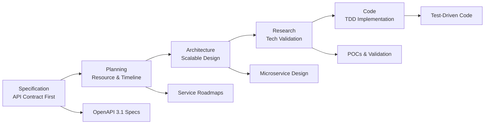

# PersonalEA SPARC Implementation Framework

## 🎯 **Quick Start**

This directory contains comprehensive SPARC (Specification, Planning, Architecture, Research, Code) methodology implementation for the PersonalEA microservices system. The framework ensures systematic, high-quality development with API-first design, Test-Driven Development (TDD), and continuous user validation.

## 📋 **Documentation Navigator**

### **🚀 Start Here**
- [`SPARC_IMPLEMENTATION_SUMMARY.md`](plans/SPARC_IMPLEMENTATION_SUMMARY.md) - **Executive overview and complete roadmap**
- [`methodology/README.md`](plans/methodology/README.md) - **SPARC methodology fundamentals**

### **🔒 CRITICAL: Data Sovereignty**
- [`security/DATA_SOVEREIGNTY_FRAMEWORK.md`](plans/security/DATA_SOVEREIGNTY_FRAMEWORK.md) - **"You-First" data control principles (MUST READ)**

### **🔧 Implementation Guides**
- [`contracts/API_FIRST_TDD_GUIDE.md`](plans/contracts/API_FIRST_TDD_GUIDE.md) - **API contract-first TDD approach**
- [`staging/STAGING_ENVIRONMENT_DESIGN.md`](plans/staging/STAGING_ENVIRONMENT_DESIGN.md) - **Multi-stage testing environments**
- [`milestones/TESTING_MILESTONE_FRAMEWORK.md`](plans/milestones/TESTING_MILESTONE_FRAMEWORK.md) - **5-stage validation framework**

### **🏗️ Service Planning**
- [`services/calendar-sync/CALENDAR_SERVICE_IMPLEMENTATION_PLAN.md`](plans/services/calendar-sync/CALENDAR_SERVICE_IMPLEMENTATION_PLAN.md) - **🚨 CRITICAL: Missing service implementation**
- [`services/goal-strategy/GOAL_STRATEGY_SERVICE_COMPLETION_PLAN.md`](plans/services/goal-strategy/GOAL_STRATEGY_SERVICE_COMPLETION_PLAN.md) - **Phases 4-6 completion plan**
- [`services/email-processing/EMAIL_SERVICE_ENHANCEMENT_PLAN.md`](plans/services/email-processing/EMAIL_SERVICE_ENHANCEMENT_PLAN.md) - **Production-ready optimization**

## 🎯 **Critical Next Actions**

### **🔒 Priority 1: Data Sovereignty Framework** 🚨
**Status**: **CRITICAL MISSING** - Must implement before any feature development  
**Timeline**: 2-3 weeks  
**Impact**: **BLOCKS ALL DEVELOPMENT** - Violates core "You-First" philosophy  
**Documents**: [`DATA_SOVEREIGNTY_FRAMEWORK.md`](plans/security/DATA_SOVEREIGNTY_FRAMEWORK.md)

**Immediate Requirements:**
- User-controlled encryption for all data
- Explicit consent gates for external APIs
- Data export/deletion capabilities
- Privacy dashboard for user control

### **Priority 2: Calendar Service** 🚨
**Status**: Fully planned, ready for implementation (AFTER data sovereignty)  
**Timeline**: 4-6 weeks  
**Impact**: BLOCKS full system deployment  
**Documents**: [`CALENDAR_SERVICE_IMPLEMENTATION_PLAN.md`](plans/services/calendar-sync/CALENDAR_SERVICE_IMPLEMENTATION_PLAN.md)

### **Priority 3: Goal Strategy Phases 4-6**
**Status**: Phases 1-3 complete, 4-6 planned  
**Timeline**: 6 weeks  
**Dependencies**: Data sovereignty + Calendar Service  
**Documents**: [`GOAL_STRATEGY_SERVICE_COMPLETION_PLAN.md`](plans/services/goal-strategy/GOAL_STRATEGY_SERVICE_COMPLETION_PLAN.md)

## 📊 **Project Status Dashboard**

```
🔒 CRITICAL MISSING: Data Sovereignty Framework (BLOCKS ALL DEVELOPMENT)
✅ COMPLETE: SPARC Methodology Framework
✅ COMPLETE: Email Processing Service (Production Ready - NEEDS PRIVACY UPGRADE)
✅ COMPLETE: Goal Strategy Service (Phases 1-3 - NEEDS PRIVACY UPGRADE)
✅ COMPLETE: API Specifications for all services
✅ COMPLETE: Testing Framework Design
✅ COMPLETE: Staging Environment Design

🔄 BLOCKED: Calendar Service Implementation (AFTER data sovereignty)
🔄 BLOCKED: Goal Strategy Phases 4-6 (AFTER data sovereignty)
🔄 PLANNED: Privacy-Compliant Staging Environment
🔄 PLANNED: End-to-End Integration Testing with Privacy Controls
```

## 🛠️ **Quick Commands**

### **Development Setup**
```bash
# Start existing services
docker-compose up email-service goal-strategy-service

# Run API contract validation
npm run validate:contracts

# Start testing environment
cd testing/goal-strategy-test && npm run test-env-openai
```

### **Testing Commands**
```bash
# Run milestone validation
npm run test:milestone:1  # Unit & Integration
npm run test:milestone:2  # Contract Compliance
npm run test:milestone:3  # Service Integration

# Performance testing
k6 run tests/performance/load-test.js

# Security scanning
npm run test:security:all
```

### **Calendar Service Implementation**
```bash
# Create calendar service (when ready)
cd services && mkdir calendar
cp -r goal-strategy/* calendar/
# Follow CALENDAR_SERVICE_IMPLEMENTATION_PLAN.md
```

## 📈 **Success Metrics**

### **Technical Excellence**
- API Response Time: <200ms (95th percentile)
- Test Coverage: >80% across all services
- Security: Zero critical vulnerabilities
- Uptime: >99.9% availability

### **User Experience**
- User Satisfaction: >4.0/5.0
- Task Completion: >90% success rate
- Time to Value: <15 minutes
- Support Tickets: <5% of users

### **Business Impact**
- Goal Completion: 20% increase
- Time Savings: 30% reduction in manual work
- Development Velocity: 50% faster releases
- User Retention: >80% after 1 month

## 🔄 **SPARC Methodology Summary**



## 📚 **Additional Resources**

### **External References**
- [PersonalEA Main Documentation](../docs/) - Original project documentation
- [API Specifications](../docs/) - OpenAPI contract files
- [Service Implementations](../services/) - Current service code
- [Testing Environment](../testing/) - Existing testing setup

### **Development Standards**
- **Database**: PostgreSQL with Prisma ORM
- **Caching**: Redis for sessions and application data
- **Authentication**: JWT with granular scopes
- **API Documentation**: Auto-generated from OpenAPI
- **Monitoring**: Prometheus metrics, structured logging

### **Quality Gates**
- **Code Quality**: ESLint, Prettier, TypeScript strict mode
- **Security**: OWASP ZAP, dependency scanning, secrets detection
- **Performance**: k6 load testing, response time monitoring
- **Accessibility**: WCAG 2.1 Level AA compliance

## 🤝 **Team Coordination**

### **Development Workflow**
1. **Review SPARC Plans**: Understand service requirements and architecture
2. **Setup Environment**: Deploy staging environment for testing
3. **Implement Services**: Follow TDD and API-first methodology
4. **Milestone Validation**: Pass all 5 testing milestones
5. **User Testing**: Validate with real users in staging
6. **Production Deployment**: Deploy with comprehensive monitoring

### **Communication Channels**
- **Technical Questions**: Reference service implementation plans
- **Architecture Decisions**: Consult SPARC methodology documentation
- **Testing Issues**: Use milestone framework for systematic validation
- **User Feedback**: Collect through staging environment testing

## 🎉 **Success Vision**

**With complete SPARC implementation including Data Sovereignty Framework, PersonalEA will deliver:**

- **🔒 Privacy-First**: Complete user control over all personal data with encryption and consent
- **Seamless Integration**: Email → Goals → Calendar workflow with user-controlled external APIs
- **Intelligent Automation**: AI-powered optimization using user-provided API keys  
- **User-Centric Design**: >90% task completion with <15min time-to-value
- **Production Quality**: >99.9% uptime with comprehensive security and privacy
- **Scalable Architecture**: Support for 100+ concurrent users while maintaining data sovereignty

**The SPARC methodology enhanced with the Data Sovereignty Framework ensures systematic delivery of this vision through proven development practices, comprehensive testing, continuous user validation, and unwavering commitment to user data control.**

---

**Framework Status**: Complete and Ready for Implementation ✅  
**Critical Next Action**: Begin Calendar Service implementation  
**Expected Production Ready**: 8 weeks from Calendar Service start  
**Last Updated**: 2025-06-22