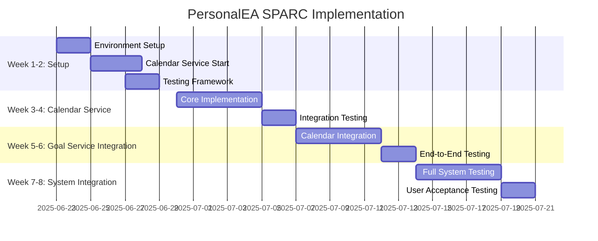
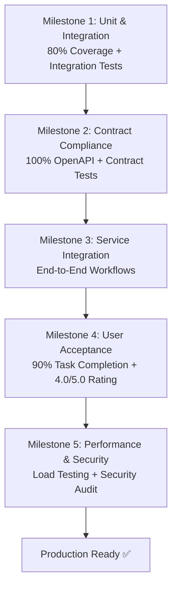
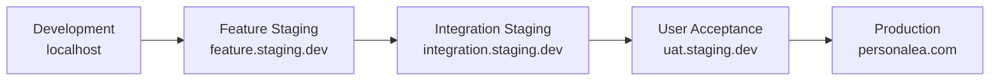

# SPARC Implementation Summary for PersonalEA

## Executive Summary

This document provides a comprehensive overview of the SPARC (Specification, Planning, Architecture, Research, Code) methodology implementation for the PersonalEA microservices system. The SPARC approach ensures systematic, high-quality development with API-first design, Test-Driven Development (TDD), and continuous user validation through staged deployments.

## 📋 **Complete SPARC Documentation Structure**

```
sparc/plans/
├── methodology/
│   └── README.md                                    ✅ SPARC methodology overview
├── security/
│   └── DATA_SOVEREIGNTY_FRAMEWORK.md               🔒 "You-First" data control principles
├── contracts/
│   └── API_FIRST_TDD_GUIDE.md                      ✅ API contract-first TDD approach
├── staging/
│   └── STAGING_ENVIRONMENT_DESIGN.md               ✅ Multi-stage testing environments
├── services/
│   ├── email-processing/
│   │   └── EMAIL_SERVICE_ENHANCEMENT_PLAN.md       ✅ Production-ready service optimization
│   ├── goal-strategy/
│   │   └── GOAL_STRATEGY_SERVICE_COMPLETION_PLAN.md ✅ Phases 4-6 implementation plan
│   ├── calendar-sync/
│   │   └── CALENDAR_SERVICE_IMPLEMENTATION_PLAN.md  ✅ Complete new service plan
│   ├── api-gateway/                                 🔄 Future planning
│   └── frontend/                                    🔄 Future planning
├── milestones/
│   └── TESTING_MILESTONE_FRAMEWORK.md               ✅ 5-stage validation framework
└── documentation/
    └── SPARC_IMPLEMENTATION_SUMMARY.md              ✅ This summary document
```

## 🎯 **SPARC Methodology Overview**

### **Core Principles Implemented**

1. **S - Specification**: API Contract First with OpenAPI 3.1
2. **P - Planning**: Modular service planning with clear milestones
3. **A - Architecture**: Microservices with event-driven patterns
4. **R - Research**: Technology validation and risk assessment
5. **C - Code**: Test-Driven Development with contract validation

### **Quality Gates Established**
- **Specification Gate**: OpenAPI specs pass Spectral linting + Privacy compliance
- **Planning Gate**: Realistic timelines with identified dependencies + Data sovereignty requirements
- **Architecture Gate**: Scalable design with proven integration patterns + User-controlled encryption
- **Research Gate**: Technology choices validated through prototypes + Privacy technology validation
- **Code Gate**: >80% test coverage with security compliance + Data sovereignty testing

### **🔒 CRITICAL ADDITION: Data Sovereignty Framework**
**Status**: Newly identified critical requirement that must be implemented across all SPARC phases

**"You-First" Data Control Principle**: No data leaves user control without encryption and explicit authority
- **User-Controlled Encryption**: All data encrypted with user-derived keys
- **Explicit Consent**: Every external data operation requires user consent
- **Local-First Processing**: Core functionality works offline/locally when possible
- **Complete Data Portability**: Users can export all data in <24 hours
- **Immediate Data Deletion**: Users can permanently delete all data in <24 hours
- **Transparent Audit Trail**: Users can see all data processing activities

This framework must be implemented **BEFORE** any feature development proceeds.

## 🏗️ **Service Implementation Status**

### **✅ Production Ready Services**

#### **Email Processing Service**
- **Status**: Production Ready ✅
- **Capabilities**: Gmail integration, AI summarization, action item extraction
- **Performance**: ~150ms API response, 2-3 emails/second processing
- **Next Steps**: Performance optimization, advanced AI features

#### **Goal Strategy Service** 
- **Status**: Phases 1-3 Complete ✅, Phases 4-6 Planned
- **Capabilities**: SMART goal translation, WBS engine, dependency mapping
- **Current Phase**: Ready for calendar integration (Phase 4)
- **Timeline**: 6 weeks to complete all phases

### **🔄 Critical Missing Service**

#### **Calendar Sync Service**
- **Status**: Fully Planned, Ready for Implementation 🔄
- **Timeline**: 4-6 weeks implementation
- **Priority**: **CRITICAL** - Blocks full system deployment
- **Dependencies**: Google Calendar API, OAuth2 implementation

## 📊 **Implementation Roadmap**

### **Phase 1: Foundation (Weeks 1-2)**


### **Critical Path Dependencies**
1. **Calendar Service Implementation** → Goal Strategy Phase 4
2. **Goal Strategy Phases 4-6** → Complete workflow validation  
3. **Full System Integration** → Production deployment
4. **User Acceptance Testing** → Go-live decision

## 🧪 **Testing Framework Implementation**

### **5-Stage Milestone Validation**



### **Testing Tools and Automation**
- **Unit/Integration**: Jest, Vitest, Supertest
- **Contract Testing**: Dredd, Schemathesis, OpenAPI validation
- **End-to-End**: Playwright, custom workflow testing
- **Performance**: k6 load testing, performance benchmarks
- **Security**: OWASP ZAP, dependency scanning, penetration testing

## 🚀 **Staging Environment Architecture**

### **Multi-Environment Strategy**


### **Environment Specifications**
- **Feature Staging**: Individual service testing with mocks
- **Integration Staging**: Cross-service validation with real APIs
- **UAT Staging**: Production-like environment for user testing
- **Performance Staging**: Load testing and optimization validation

## 📈 **Success Metrics and KPIs**

### **Technical Excellence Metrics**
| Metric | Target | Critical Threshold |
|--------|--------|-------------------|
| API Response Time (95th percentile) | <200ms | <500ms |
| Test Coverage | >80% | >70% |
| Service Availability | >99.9% | >99.5% |
| Security Vulnerabilities | Zero critical/high | Zero critical |
| Contract Compliance | 100% | 100% |

### **User Experience Metrics**
| Metric | Target | Measurement Method |
|--------|--------|--------------------|
| User Satisfaction | >4.0/5.0 | User surveys and feedback |
| Task Completion Rate | >90% | User journey analytics |
| Time to Value | <15 minutes | Onboarding analytics |
| Support Ticket Rate | <5% | Support system tracking |
| Feature Adoption | >80% within 1 week | Usage analytics |

### **Business Impact Metrics**
| Metric | Target | Validation Method |
|--------|--------|-------------------|
| Goal Completion Rate | 20% increase | User goal tracking |
| Time Management Efficiency | 30% reduction in manual work | User time studies |
| Development Velocity | 50% faster releases | Development metrics |
| Production Incident Rate | <1 critical/month | Incident tracking |

## 🔧 **Implementation Guidelines**

### **API-First Development Workflow**
1. **Define OpenAPI Contract** → Generate mock server
2. **Write Contract Tests** → Validate API behavior  
3. **Implement Service** → TDD with generated stubs
4. **Integration Testing** → Cross-service validation
5. **Staging Deployment** → User acceptance testing
6. **Production Deployment** → Monitoring and optimization

### **Service Development Standards**
- **Database**: PostgreSQL with Prisma ORM
- **Caching**: Redis for session and application caching
- **Authentication**: JWT with granular scopes
- **API Documentation**: Auto-generated from OpenAPI specs
- **Monitoring**: Prometheus metrics, structured logging

### **Quality Assurance Process**
- **Code Review**: All changes peer reviewed
- **Automated Testing**: Full test suite on every commit
- **Security Scanning**: Automated vulnerability detection
- **Performance Testing**: Regression testing on staging

## 🚨 **Critical Issues and Risks**

### **🔒 HIGHEST PRIORITY: Data Sovereignty Framework Missing**

#### **1. Data Sovereignty Implementation Gap** 🚨
- **Issue**: "You-First" data control principle not implemented across any services
- **Impact**: **BLOCKS ALL FEATURE DEVELOPMENT** - Violates core security philosophy
- **Timeline**: 2-3 weeks critical implementation
- **Requirements**: 
  - User-controlled encryption for all data
  - Explicit consent for all external API calls (Gmail, OpenAI, Google Calendar)
  - Complete data export/deletion capabilities
  - Local processing alternatives where possible
- **Mitigation**: Implement immediately before any other development

### **High Priority Issues**

#### **2. Calendar Service Implementation Gap**
- **Issue**: Fully documented but not implemented
- **Impact**: Blocks full system deployment and Goal Strategy Phase 4
- **Timeline**: 4-6 weeks implementation (AFTER data sovereignty)
- **Mitigation**: Parallel development, mock service for testing

#### **3. Docker Deployment Configuration**
- **Issue**: Docker compose references missing Calendar Service
- **Impact**: User deployment fails immediately
- **Timeline**: 1 day fix (remove references temporarily)
- **Mitigation**: Update compose files, create migration plan

#### **4. Integration Testing Dependencies**
- **Issue**: Goal Strategy calendar features can't be fully tested
- **Impact**: Phase 4-6 validation blocked
- **Timeline**: Resolved with Calendar Service implementation
- **Mitigation**: Mock-based testing, isolated feature validation

### **Medium Priority Risks**

#### **Google API Rate Limits**
- **Risk**: Calendar/Gmail API throttling under load
- **Mitigation**: Caching, batch operations, exponential backoff
- **Monitoring**: API usage tracking, alert thresholds

#### **OAuth Token Management**
- **Risk**: Token expiration causing service failures
- **Mitigation**: Automatic refresh, encrypted storage, fallback handling
- **Testing**: Token lifecycle testing, expiration scenarios

#### **Complex Scheduling Performance**
- **Risk**: Constraint solving too slow for large datasets
- **Mitigation**: Algorithm optimization, caching, approximation fallbacks
- **Benchmarking**: Performance targets with automated regression testing

## 💡 **Next Steps and Recommendations**

### **Immediate Actions (Next 1-2 weeks)**

#### **Week 1: 🔒 CRITICAL - Data Sovereignty Implementation**
1. **Implement Data Sovereignty Framework**: User-controlled encryption, consent management, data export/deletion
2. **Audit Existing Services**: Identify all external data flows (Gmail, OpenAI APIs)
3. **Add Consent Gates**: Block all external API calls until user provides explicit consent
4. **User-Controlled API Keys**: Enable users to provide their own OpenAI, Gmail API keys
5. **Privacy Dashboard**: Basic UI for users to control all data operations

#### **Week 2: Data Sovereignty Completion + Infrastructure**
1. **Complete Privacy Testing**: Validate all data sovereignty requirements
2. **Fix Docker Deployment**: Remove calendar service references temporarily  
3. **Setup Privacy-Compliant Staging**: Deploy staging with data sovereignty controls
4. **Begin Calendar Service**: Start implementation with privacy-first approach

### **Medium-term Strategy (Weeks 3-8)**

#### **Calendar Service Implementation (Weeks 3-4)**
- Complete Google Calendar integration
- Implement scheduling algorithms
- Add conflict detection and resolution
- Integration testing with Goal Strategy Service

#### **Goal Strategy Phases 4-6 (Weeks 5-6)**
- Calendar integration (Phase 4)
- Capacity management (Phase 5)  
- Intelligence & optimization (Phase 6)

#### **System Integration (Weeks 7-8)**
- End-to-end workflow validation
- Performance optimization
- User acceptance testing
- Production deployment preparation

### **Long-term Vision (3-6 months)**

#### **Advanced Features**
- Multi-calendar provider support (Outlook, Apple)
- Machine learning for user behavior optimization
- Advanced analytics and reporting
- Team collaboration features

#### **Enterprise Readiness**
- SOC2/GDPR compliance
- Advanced security features
- Multi-tenant architecture
- Enterprise API features

## 🏆 **Success Criteria**

The PersonalEA system will be considered **production ready** when:

### **Technical Criteria**
- ✅ All three core services (Email, Goal, Calendar) fully implemented
- ✅ End-to-end workflows complete successfully  
- ✅ All 5 testing milestones passed
- ✅ Performance targets met under expected load
- ✅ Security audit passed with zero critical findings

### **User Experience Criteria**
- ✅ >90% task completion rate for core user journeys
- ✅ >4.0/5.0 user satisfaction rating
- ✅ <15 minutes time-to-value for new users
- ✅ <5% support ticket rate
- ✅ WCAG 2.1 accessibility compliance

### **Business Criteria**
- ✅ Measurable productivity improvement for users
- ✅ >80% user retention after 1 month
- ✅ Stable system with <1 critical incident per month
- ✅ Scalable architecture supporting 100+ concurrent users

## 📝 **Documentation and Knowledge Transfer**

### **Comprehensive Documentation Delivered**
- ✅ **Methodology Guide**: Complete SPARC implementation approach
- ✅ **API Documentation**: Contract-first TDD with examples
- ✅ **Service Plans**: Detailed implementation roadmaps for all services
- ✅ **Testing Framework**: 5-stage milestone validation system
- ✅ **Staging Environment**: Multi-environment deployment strategy
- ✅ **Architecture Decisions**: Detailed technical design documentation

### **Team Enablement**
- **Training Materials**: SPARC methodology training for development team
- **Templates**: Standardized planning and implementation templates
- **Quality Gates**: Clear criteria for each development phase
- **Automation**: CI/CD pipeline with quality validation
- **Monitoring**: Comprehensive observability and alerting

## 🔄 **Continuous Improvement Process**

### **Feedback Loops**
- **Weekly Reviews**: Progress against milestones
- **User Feedback**: Continuous collection and incorporation
- **Performance Monitoring**: Real-time system health tracking
- **Quality Metrics**: Automated quality gate validation
- **Retrospectives**: Team learning and process optimization

### **Adaptation Strategy**
- **Methodology Refinement**: Update SPARC approach based on experience
- **Technology Evolution**: Evaluate and integrate new tools/frameworks
- **Scale Planning**: Prepare for increased user load and feature complexity
- **Risk Management**: Continuous risk assessment and mitigation updates

---

## 🎯 **Final Recommendations**

### **🔒 Priority 1: Data Sovereignty Framework (CRITICAL)**
**The "You-First" data control principle is foundational and must be implemented immediately before any other development.** This is not an optional feature but a core architectural requirement that affects every aspect of the system.

**Critical Requirements:**
- User-controlled encryption for all data storage
- Explicit consent gates for all external API calls
- Complete data export and deletion capabilities
- Local processing alternatives where technically feasible
- Transparent audit trail of all data operations

### **Priority 2: Calendar Service Implementation**
The Calendar Service is the critical missing piece that blocks full PersonalEA deployment. Implementation must follow the privacy-first approach established by the Data Sovereignty Framework.

### **Priority 3: Goal Strategy Phases 4-6**
Complete the Goal Strategy Service to deliver the full intelligent goal management vision with calendar integration and optimization features, all while maintaining strict data sovereignty.

### **Privacy-First Success Foundation**
The SPARC methodology, enhanced with the Data Sovereignty Framework, provides a solid foundation for high-quality, privacy-respecting development. The comprehensive planning, testing framework, and staging environments ensure successful delivery of the PersonalEA vision **without compromising user data control**.

**With the Data Sovereignty Framework and Calendar Service implementation, PersonalEA will transform from a collection of excellent individual services into a cohesive, intelligent personal assistant that truly delivers on its "Give me the right work at the right time, automatically" promise - while ensuring users maintain complete control over their personal data.**

---

**Document Version**: 1.0  
**SPARC Framework Status**: Complete and Ready for Implementation ✅  
**Critical Next Action**: Begin Calendar Service implementation  
**Expected Production Ready Date**: 8 weeks from Calendar Service start  
**Last Updated**: 2025-06-22