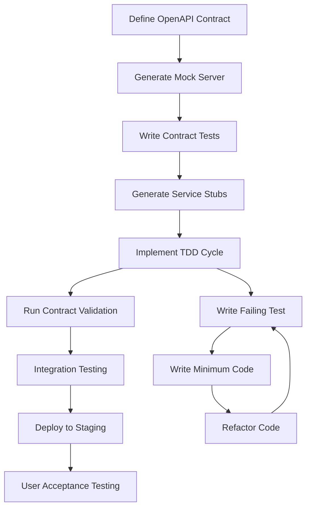

# API Contract-First Test-Driven Development Guide

## Overview

This guide implements API Contract-First Test-Driven Development (TDD) for PersonalEA microservices. This approach ensures that API contracts drive implementation, tests validate contracts, and services remain loosely coupled.

## API-First TDD Methodology

### Core Principles

1. **Contract Defines Interface**: OpenAPI specification is the single source of truth
2. **Tests Validate Contract**: All tests derive from the API specification
3. **Implementation Follows Tests**: Code is written to pass contract-derived tests
4. **Contracts Enable Integration**: Services integrate through validated contracts

### Development Workflow



## Implementation Steps

### Step 1: OpenAPI Contract Definition

**Objective**: Create comprehensive API specification before any code

**Deliverables**:
- OpenAPI 3.1 specification file
- Example request/response payloads
- Error response schemas
- Authentication and authorization specifications

**Quality Criteria**:
- Passes Spectral linting with zero errors
- All endpoints have examples
- All error cases documented
- Security schemes properly defined

**Template Structure**:
```yaml
openapi: 3.1.0
info:
  title: ServiceName API
  version: 1.0.0
  description: Service description with clear purpose

servers:
  - url: http://localhost:{port}/api/v1
    variables:
      port:
        default: '3000'

security:
  - BearerAuth: [read, write]

paths:
  /resource:
    post:
      summary: Create resource
      operationId: createResource
      requestBody:
        required: true
        content:
          application/json:
            schema:
              $ref: '#/components/schemas/CreateResourceRequest'
            examples:
              valid_request:
                summary: Valid resource creation
                value:
                  name: "Example Resource"
                  description: "Resource description"
      responses:
        '201':
          description: Resource created successfully
          content:
            application/json:
              schema:
                $ref: '#/components/schemas/Resource'
        '400':
          $ref: '#/components/responses/BadRequest'
        '401':
          $ref: '#/components/responses/Unauthorized'

components:
  schemas:
    CreateResourceRequest:
      type: object
      required: [name]
      properties:
        name:
          type: string
          minLength: 1
          maxLength: 100
        description:
          type: string
          maxLength: 500
          
    Resource:
      type: object
      properties:
        id:
          type: string
          format: uuid
        name:
          type: string
        description:
          type: string
        created_at:
          type: string
          format: date-time
        updated_at:
          type: string
          format: date-time
          
  responses:
    BadRequest:
      description: Invalid request
      content:
        application/json:
          schema:
            $ref: '#/components/schemas/Error'
            
    Unauthorized:
      description: Authentication required
      content:
        application/json:
          schema:
            $ref: '#/components/schemas/Error'
            
    Error:
      type: object
      properties:
        error:
          type: string
        message:
          type: string
        correlation_id:
          type: string
          format: uuid
```

### Step 2: Mock Server Generation

**Objective**: Create working API mock for immediate testing

**Commands**:
```bash
# Generate Prism mock server
prism mock docs/service-api-v1.yaml --port 8080 --dynamic

# Validate mock responses
curl -X GET http://localhost:8080/api/v1/resource
```

**Validation**:
- Mock server responds to all defined endpoints
- Response schemas match OpenAPI specification
- Examples are realistic and useful for development

### Step 3: Contract Testing Implementation

**Objective**: Create tests that validate API contract compliance

**Framework**: Dredd + Schemathesis + Custom Contract Tests

#### Dredd Configuration
```yaml
# dredd.yml
reporter: apiary
custom:
  apiaryApiKey: your-api-key
dry-run: false
hookfiles: ./tests/hooks.js
language: nodejs
server: http://localhost:3000
server-wait: 3
init: false
names: false
only: []
output: []
options:
  method: []
  header: []
  parameter: []
  body: []
blueprint: docs/service-api-v1.yaml
endpoint: http://localhost:3000
```

#### Schemathesis Property Testing
```bash
# Run property-based testing against OpenAPI spec
schemathesis run docs/service-api-v1.yaml \
  --checks all \
  --hypothesis-phases=explicit,reuse,generate,target,shrink \
  --stateful=links \
  --base-url=http://localhost:3000/api/v1
```

#### Custom Contract Tests
```typescript
// tests/contract/service.contract.test.ts
import { OpenAPIValidator } from 'express-openapi-validator';
import { Application } from 'express';
import supertest from 'supertest';

describe('Service Contract Tests', () => {
  let app: Application;
  let request: supertest.SuperTest<supertest.Test>;

  beforeAll(async () => {
    // Setup app with OpenAPI validator
    app = createApp();
    app.use(OpenAPIValidator.middleware({
      apiSpec: './docs/service-api-v1.yaml',
      validateRequests: true,
      validateResponses: true,
    }));
    
    request = supertest(app);
  });

  describe('POST /api/v1/resource', () => {
    it('should accept valid request and return valid response', async () => {
      const validPayload = {
        name: "Test Resource",
        description: "Test description"
      };

      const response = await request
        .post('/api/v1/resource')
        .send(validPayload)
        .expect(201);

      // Response validation happens automatically via OpenAPI validator
      expect(response.body).toHaveProperty('id');
      expect(response.body.name).toBe(validPayload.name);
    });

    it('should reject invalid request with 400', async () => {
      const invalidPayload = {
        // Missing required 'name' field
        description: "Test description"
      };

      await request
        .post('/api/v1/resource')
        .send(invalidPayload)
        .expect(400);
    });
  });
});
```

### Step 4: TDD Implementation Cycle

**Objective**: Implement service following strict TDD principles

#### Red-Green-Refactor Cycle

**Red Phase**: Write failing test
```typescript
// tests/unit/resource.service.test.ts
describe('ResourceService', () => {
  describe('createResource', () => {
    it('should create resource with valid data', async () => {
      const resourceData = { name: 'Test', description: 'Test desc' };
      
      const result = await resourceService.createResource(resourceData);
      
      expect(result).toHaveProperty('id');
      expect(result.name).toBe(resourceData.name);
    });
  });
});
```

**Green Phase**: Write minimum code to pass
```typescript
// src/services/resource.service.ts
export class ResourceService {
  async createResource(data: CreateResourceRequest): Promise<Resource> {
    // Minimum implementation to pass test
    const resource: Resource = {
      id: generateUUID(),
      name: data.name,
      description: data.description || '',
      created_at: new Date().toISOString(),
      updated_at: new Date().toISOString(),
    };
    
    // Save to database (implement based on needs)
    await this.repository.save(resource);
    
    return resource;
  }
}
```

**Refactor Phase**: Improve code quality
```typescript
// src/services/resource.service.ts (refactored)
export class ResourceService {
  constructor(
    private repository: ResourceRepository,
    private validator: ResourceValidator,
    private logger: Logger
  ) {}

  async createResource(data: CreateResourceRequest): Promise<Resource> {
    this.logger.info('Creating resource', { data });
    
    // Validate input
    await this.validator.validateCreateRequest(data);
    
    // Create resource entity
    const resource = this.createResourceEntity(data);
    
    // Persist to database
    const savedResource = await this.repository.save(resource);
    
    this.logger.info('Resource created', { id: savedResource.id });
    
    return savedResource;
  }

  private createResourceEntity(data: CreateResourceRequest): Resource {
    return {
      id: generateUUID(),
      name: data.name.trim(),
      description: data.description?.trim() || '',
      created_at: new Date().toISOString(),
      updated_at: new Date().toISOString(),
    };
  }
}
```

### Step 5: Integration Testing

**Objective**: Validate service integration points

```typescript
// tests/integration/resource.integration.test.ts
describe('Resource Integration Tests', () => {
  beforeAll(async () => {
    await setupTestDatabase();
    await startTestServer();
  });

  afterAll(async () => {
    await cleanupTestDatabase();
    await stopTestServer();
  });

  it('should handle complete resource lifecycle', async () => {
    // Create resource
    const createResponse = await request
      .post('/api/v1/resource')
      .send({ name: 'Integration Test', description: 'Test resource' })
      .expect(201);

    const resourceId = createResponse.body.id;

    // Get resource
    const getResponse = await request
      .get(`/api/v1/resource/${resourceId}`)
      .expect(200);

    expect(getResponse.body.name).toBe('Integration Test');

    // Update resource
    await request
      .put(`/api/v1/resource/${resourceId}`)
      .send({ name: 'Updated Test', description: 'Updated description' })
      .expect(200);

    // Delete resource
    await request
      .delete(`/api/v1/resource/${resourceId}`)
      .expect(204);

    // Verify deletion
    await request
      .get(`/api/v1/resource/${resourceId}`)
      .expect(404);
  });
});
```

## Service-Specific TDD Plans

### Email Processing Service TDD Plan

**Status**: ✅ Implemented - Serve as reference implementation

**Key Features**:
- Gmail API integration with OAuth2
- Email summarization with AI
- Action item extraction
- Job queue processing

**Testing Strategy**:
- Mock external APIs (Gmail, OpenAI)
- Test database operations with test containers
- Validate job queue processing
- Integration tests with real APIs (staging only)

### Goal Strategy Service TDD Plan

**Status**: ✅ Implemented and tested

**Key Features**:
- SMART goal translation
- Milestone breakdown
- Task estimation
- Dependency mapping

**Testing Strategy**:
- AI response mocking and validation
- Complex workflow testing
- Performance testing for estimation algorithms
- User interaction testing with React harness

### Calendar Sync Service TDD Plan

**Status**: 🔄 To be implemented

**Key Features**:
- Google Calendar API integration
- Event CRUD operations
- Conflict detection
- Availability analysis

**Testing Strategy**:
```typescript
// High-level test structure
describe('Calendar Sync Service', () => {
  describe('Calendar Integration', () => {
    it('should sync events from Google Calendar');
    it('should handle webhook notifications');
    it('should detect and resolve conflicts');
  });

  describe('Availability Analysis', () => {
    it('should calculate availability windows');
    it('should respect working hours preferences');
    it('should handle timezone conversions');
  });

  describe('Event Management', () => {
    it('should create events with proper validation');
    it('should update events while preserving metadata');
    it('should delete events and handle dependencies');
  });
});
```

## Quality Assurance Process

### Pre-commit Validation
```bash
#!/bin/bash
# .git/hooks/pre-commit

# Validate OpenAPI specifications
spectral lint docs/*.yaml

# Run contract tests
npm run test:contract

# Run unit tests
npm run test:unit

# Check test coverage
npm run test:coverage -- --threshold 80

# Lint code
npm run lint

# Type check
npm run type-check
```

### CI/CD Pipeline
```yaml
# .github/workflows/api-first-tdd.yml
name: API-First TDD Pipeline

on: [push, pull_request]

jobs:
  contract-validation:
    runs-on: ubuntu-latest
    steps:
      - uses: actions/checkout@v3
      - uses: actions/setup-node@v3
      
      - name: Install dependencies
        run: npm ci
        
      - name: Validate OpenAPI contracts
        run: spectral lint docs/*.yaml
        
      - name: Start services
        run: docker-compose up -d
        
      - name: Wait for services
        run: ./scripts/wait-for-services.sh
        
      - name: Run contract tests
        run: |
          dredd docs/email-service-api-v1.yaml http://localhost:3001/api/v1
          dredd docs/goal-strategy-service-api-v1.yaml http://localhost:3000/api/v1
          dredd docs/calendar-service-api-v1.yaml http://localhost:3003/api/v1
          
      - name: Run property-based tests
        run: |
          schemathesis run docs/email-service-api-v1.yaml --checks all
          schemathesis run docs/goal-strategy-service-api-v1.yaml --checks all
          schemathesis run docs/calendar-service-api-v1.yaml --checks all

  unit-tests:
    runs-on: ubuntu-latest
    steps:
      - uses: actions/checkout@v3
      - uses: actions/setup-node@v3
      
      - name: Install dependencies
        run: npm ci
        
      - name: Run unit tests
        run: npm run test:unit
        
      - name: Check coverage
        run: npm run test:coverage -- --threshold 80

  integration-tests:
    runs-on: ubuntu-latest
    needs: [contract-validation, unit-tests]
    steps:
      - uses: actions/checkout@v3
      - uses: actions/setup-node@v3
      
      - name: Start test environment
        run: docker-compose -f docker-compose.test.yml up -d
        
      - name: Run integration tests
        run: npm run test:integration
        
      - name: Run e2e tests
        run: npm run test:e2e
```

## Success Metrics

### Contract Quality
- ✅ 100% OpenAPI specification coverage
- ✅ Zero Spectral linting errors
- ✅ All endpoints have realistic examples
- ✅ Error responses properly documented

### Test Quality
- ✅ >80% code coverage
- ✅ 100% contract test pass rate
- ✅ Zero critical security vulnerabilities
- ✅ <200ms average API response time

### Implementation Quality
- ✅ All TDD cycles documented
- ✅ Red-Green-Refactor pattern followed
- ✅ Code passes all quality gates
- ✅ Integration tests validate service interactions

## Tools and Commands

### Setup Commands
```bash
# Install dependencies
npm install -g @stoplight/spectral-cli dredd schemathesis

# Setup project
npx create-sparc init PersonalEA-Services
cd PersonalEA-Services

# Generate service from OpenAPI spec
openapi-generator generate \
  -i docs/service-api-v1.yaml \
  -g nodejs-express-server \
  -o services/service-name
```

### Development Commands
```bash
# Validate API specification
spectral lint docs/service-api-v1.yaml

# Start mock server
prism mock docs/service-api-v1.yaml --port 8080

# Run contract tests
dredd docs/service-api-v1.yaml http://localhost:3000/api/v1

# Run property-based tests
schemathesis run docs/service-api-v1.yaml --base-url http://localhost:3000/api/v1

# TDD development cycle
npm run test:watch  # Continuous testing
npm run dev        # Development server with hot reload

# Integration testing
npm run test:integration  # Full integration test suite
npm run test:e2e         # End-to-end user journey tests
```

## Next Steps

1. **Review and Adapt**: Customize this guide for PersonalEA specific needs
2. **Tool Setup**: Install and configure all required tools
3. **Template Creation**: Create service-specific TDD templates
4. **Training**: Team training on API-first TDD methodology
5. **Implementation**: Begin with Calendar Service as practice implementation

---

**Document Version**: 1.0  
**Last Updated**: 2025-06-22  
**Next Review**: Weekly during active implementation