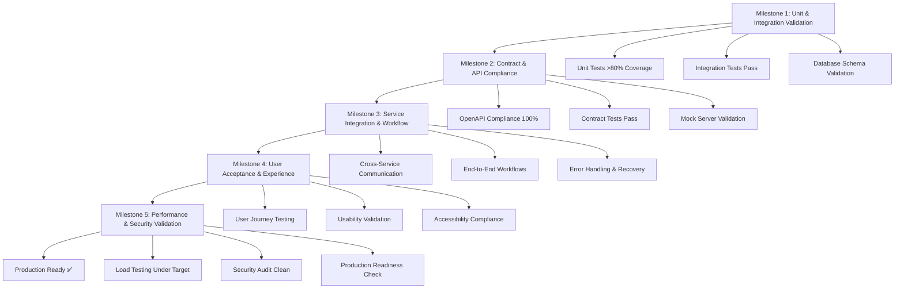

# Testing Milestone Framework for PersonalEA

## Overview

This framework defines a structured approach to testing milestones across the PersonalEA microservices architecture. Each milestone represents a key validation point in the development and deployment pipeline, ensuring quality, reliability, and user satisfaction.

## Milestone Structure

### **5-Stage Testing Pipeline**



## Milestone 1: Unit & Integration Validation

### **Objective**: Validate individual service functionality and basic integration

### **Entry Criteria**
- [ ] Service implementation complete
- [ ] Basic API endpoints implemented
- [ ] Database schema deployed
- [ ] Initial test framework setup

### **Test Categories**

#### **Unit Tests** (Target: >80% Coverage)
```typescript
// Example test structure for each service
describe('ServiceName Unit Tests', () => {
  describe('Core Business Logic', () => {
    it('should validate input parameters');
    it('should handle business rule validation');
    it('should process data transformation correctly');
    it('should generate expected outputs');
  });

  describe('Error Handling', () => {
    it('should handle invalid input gracefully');
    it('should throw appropriate errors for edge cases');
    it('should log errors with proper context');
  });

  describe('External Dependencies', () => {
    it('should handle external API failures');
    it('should implement retry logic correctly');
    it('should fallback gracefully when external services unavailable');
  });
});
```

#### **Integration Tests**
```typescript
describe('ServiceName Integration Tests', () => {
  describe('Database Operations', () => {
    it('should perform CRUD operations successfully');
    it('should handle database constraints properly');
    it('should maintain data consistency');
    it('should perform transactions correctly');
  });

  describe('External API Integration', () => {
    it('should authenticate with external services');
    it('should handle rate limiting appropriately');
    it('should process external API responses correctly');
  });
});
```

### **Success Criteria**
- ✅ Unit test coverage >80%
- ✅ All integration tests pass
- ✅ Code quality metrics meet standards
- ✅ No critical security vulnerabilities
- ✅ Database operations perform within acceptable limits

### **Tools and Commands**
```bash
# Run unit tests with coverage
npm run test:unit -- --coverage

# Run integration tests
npm run test:integration

# Check code quality
npm run lint && npm run type-check

# Security scan
npm audit && snyk test

# Database integration
npm run test:db
```

## Milestone 2: Contract & API Compliance

### **Objective**: Ensure API contracts are correctly implemented and services communicate properly

### **Entry Criteria**
- [ ] Milestone 1 completed successfully
- [ ] OpenAPI specifications finalized
- [ ] Mock servers configured
- [ ] Contract testing framework setup

### **Test Categories**

#### **OpenAPI Compliance Testing**
```bash
# Validate OpenAPI specifications
spectral lint docs/service-api-v1.yaml

# Validate API responses against schemas
dredd docs/service-api-v1.yaml http://localhost:3000/api/v1
```

#### **Contract Testing with Dredd**
```yaml
# dredd.yml configuration
reporter: apiary
custom:
  apiaryApiKey: your-api-key
dry-run: false
hookfiles: ./tests/hooks.js
language: nodejs
server: http://localhost:3000
server-wait: 3
init: false
names: false
blueprint: docs/service-api-v1.yaml
endpoint: http://localhost:3000
```

#### **Property-Based Testing with Schemathesis**
```bash
# Property-based API testing
schemathesis run docs/service-api-v1.yaml \
  --checks all \
  --hypothesis-phases=explicit,reuse,generate,target,shrink \
  --stateful=links \
  --base-url=http://localhost:3000/api/v1
```

#### **Cross-Service Contract Validation**
```typescript
describe('Cross-Service Contract Tests', () => {
  describe('Email Service → Goal Service', () => {
    it('should send action items in expected format');
    it('should handle goal service responses correctly');
    it('should maintain data consistency across services');
  });

  describe('Goal Service → Calendar Service', () => {
    it('should send scheduling requests in expected format');
    it('should handle calendar service responses correctly');
    it('should validate task scheduling workflows');
  });
});
```

### **Success Criteria**
- ✅ 100% OpenAPI specification compliance
- ✅ All contract tests pass with zero failures
- ✅ Property-based tests find no edge case failures
- ✅ Cross-service communication validates correctly
- ✅ API documentation matches implementation exactly

### **Tools and Commands**
```bash
# Contract validation pipeline
npm run validate:contracts

# Individual service contract tests
npm run test:contract:email
npm run test:contract:goals
npm run test:contract:calendar

# Property-based testing
npm run test:property-based

# Cross-service validation
npm run test:cross-service
```

## Milestone 3: Service Integration & Workflow

### **Objective**: Validate complete workflows and service orchestration

### **Entry Criteria**
- [ ] Milestone 2 completed successfully
- [ ] All services deployed to staging environment
- [ ] Service discovery and communication configured
- [ ] End-to-end test scenarios defined

### **Test Categories**

#### **End-to-End Workflow Testing**
```typescript
describe('PersonalEA Workflow Tests', () => {
  describe('Email to Goal Workflow', () => {
    it('should complete email sync → action item extraction → goal creation', async () => {
      // 1. Sync emails from Gmail
      const syncResult = await emailService.syncEmails(testUserId);
      expect(syncResult.status).toBe('success');

      // 2. Extract action items
      const actionItems = await emailService.extractActionItems(testUserId);
      expect(actionItems.length).toBeGreaterThan(0);

      // 3. Convert action item to goal
      const goalResult = await goalService.createGoalFromActionItem(
        actionItems[0].id, 
        testUserId
      );
      expect(goalResult.goal).toBeDefined();
      expect(goalResult.goal.title).toContain(actionItems[0].description);
    });
  });

  describe('Goal to Calendar Workflow', () => {
    it('should complete goal creation → task breakdown → calendar scheduling', async () => {
      // 1. Create and translate goal
      const goal = await goalService.translateGoal(testGoalData, testUserId);
      expect(goal.smart_goal).toBeDefined();

      // 2. Generate task breakdown
      const tasks = await goalService.generateTaskBreakdown(goal.id);
      expect(tasks.length).toBeGreaterThan(0);

      // 3. Schedule tasks in calendar
      const schedulingResult = await calendarService.scheduleTasks(
        tasks.map(t => t.id), 
        testUserId
      );
      expect(schedulingResult.scheduled_count).toBe(tasks.length);
    });
  });

  describe('Complete User Journey', () => {
    it('should handle complete PersonalEA workflow', async () => {
      const journeyResult = await testCompleteUserJourney({
        userId: testUserId,
        emailCount: 5,
        goalCount: 2,
        timeframe: '1 week'
      });

      expect(journeyResult.emailsProcessed).toBe(5);
      expect(journeyResult.goalsCreated).toBe(2);
      expect(journeyResult.tasksScheduled).toBeGreaterThan(0);
      expect(journeyResult.calendarEventsCreated).toBeGreaterThan(0);
    });
  });
});
```

#### **Service Resilience Testing**
```typescript
describe('Service Resilience Tests', () => {
  describe('Service Failure Scenarios', () => {
    it('should handle email service downtime gracefully');
    it('should continue functioning when calendar service unavailable');
    it('should queue operations when goal service temporarily down');
  });

  describe('Network Partition Testing', () => {
    it('should handle network timeouts correctly');
    it('should implement circuit breaker patterns');
    it('should recover automatically when services reconnect');
  });

  describe('Data Consistency', () => {
    it('should maintain consistency during partial failures');
    it('should handle eventual consistency correctly');
    it('should implement compensating transactions');
  });
});
```

### **Success Criteria**
- ✅ All end-to-end workflows complete successfully
- ✅ Service failure scenarios handled gracefully
- ✅ Data consistency maintained across all services
- ✅ Error recovery mechanisms work correctly
- ✅ Performance within acceptable bounds for complex workflows

## Milestone 4: User Acceptance & Experience

### **Objective**: Validate user experience and ensure usability requirements are met

### **Entry Criteria**
- [ ] Milestone 3 completed successfully
- [ ] User testing environment deployed
- [ ] Test users recruited and onboarded
- [ ] User testing scripts and scenarios prepared

**🔧 CRITICAL: User Testing Environment Verification**
```bash
# MANDATORY verification before user testing:
node verify-setup.js
```
**📋 Required Setup Documentation:**
- [ ] `RELIABLE_TESTING_SETUP.md` - Complete configuration guide reviewed
- [ ] `QUICK_SETUP_REFERENCE.md` - Essential settings verified
- [ ] Port 3000 confirmed PUBLIC in Codespaces
- [ ] CORS headers include Cache-Control, Pragma, Expires
- [ ] Goal translation tested end-to-end successfully

### **Test Categories**

#### **User Journey Testing**
```typescript
describe('User Experience Tests', () => {
  describe('New User Onboarding', () => {
    it('should guide user through account setup in <10 minutes');
    it('should connect email and calendar with clear instructions');
    it('should create first goal with AI assistance');
    it('should schedule first tasks automatically');
  });

  describe('Daily User Workflow', () => {
    it('should process morning email digest efficiently');
    it('should provide actionable goal recommendations');
    it('should optimize daily schedule with minimal user input');
    it('should handle schedule conflicts intelligently');
  });

  describe('Advanced User Features', () => {
    it('should support complex goal hierarchies');
    it('should handle multiple calendar integrations');
    it('should provide meaningful progress tracking');
    it('should offer intelligent optimization suggestions');
  });
});
```

#### **Usability Testing Protocol**
```yaml
# User Testing Session Structure
session_duration: 120 minutes
participants: 10-15 users per milestone
testing_method: moderated_remote_sessions

pre_session:
  - User demographic questionnaire
  - Technology proficiency assessment
  - Current productivity tool usage survey

session_structure:
  introduction: 10 minutes
  task_scenarios: 90 minutes
  feedback_interview: 20 minutes

task_scenarios:
  - scenario_1: "Set up PersonalEA and connect your email"
  - scenario_2: "Create your first productivity goal"
  - scenario_3: "Review and optimize your daily schedule"
  - scenario_4: "Handle a scheduling conflict"
  - scenario_5: "Track progress on your goals"

success_metrics:
  task_completion_rate: ">90%"
  time_to_completion: "within_expected_range"
  user_satisfaction: ">4.0/5.0"
  system_usability_scale: ">70"
  net_promoter_score: ">50"
```

#### **Accessibility Testing**
```typescript
describe('Accessibility Tests', () => {
  describe('WCAG 2.1 Compliance', () => {
    it('should meet Level AA color contrast requirements');
    it('should support keyboard navigation completely');
    it('should provide appropriate ARIA labels');
    it('should work with screen readers');
  });

  describe('Responsive Design', () => {
    it('should work on mobile devices (320px+)');
    it('should adapt to tablet layouts');
    it('should scale properly on high-DPI displays');
  });
});
```

### **Success Criteria**
- ✅ >90% task completion rate for critical user journeys
- ✅ >4.0/5.0 average user satisfaction rating
- ✅ <5% of users require support to complete core tasks
- ✅ WCAG 2.1 Level AA accessibility compliance
- ✅ System Usability Scale (SUS) score >70
- ✅ Time-to-value <15 minutes for new users

### **User Feedback Collection**
```typescript
interface UserFeedbackCollection {
  quantitative: {
    task_completion_times: number[];
    error_rates: number[];
    feature_usage_analytics: FeatureUsage[];
    satisfaction_scores: Rating[];
  };
  
  qualitative: {
    user_interviews: Interview[];
    feedback_surveys: Survey[];
    usability_observations: Observation[];
    suggestion_feedback: Suggestion[];
  };
}
```

## Milestone 5: Performance & Security Validation

### **Objective**: Ensure system meets performance requirements and security standards

### **Entry Criteria**
- [ ] Milestone 4 completed successfully
- [ ] Production-like environment configured
- [ ] Performance testing tools setup
- [ ] Security testing framework ready

### **Test Categories**

#### **Performance Testing**
```javascript
// Load Testing with k6
import http from 'k6/http';
import { check, sleep } from 'k6';

export let options = {
  stages: [
    { duration: '5m', target: 10 },   // Ramp up to 10 users
    { duration: '10m', target: 50 },  // Ramp up to 50 users
    { duration: '5m', target: 100 },  // Ramp up to 100 users
    { duration: '10m', target: 100 }, // Stay at 100 users
    { duration: '5m', target: 0 },    // Ramp down
  ],
  thresholds: {
    http_req_duration: ['p(95)<200'],     // 95% of requests under 200ms
    http_req_failed: ['rate<0.1'],        // Error rate under 10%
    http_req_receiving: ['p(95)<100'],    // Response time under 100ms
  },
};

export default function() {
  // Test critical user workflows under load
  testEmailSync();
  testGoalCreation();
  testCalendarScheduling();
  sleep(1);
}

function testEmailSync() {
  let response = http.post('http://staging.personalea.dev/api/v1/emails/sync', 
    JSON.stringify({ user_id: 'load-test-user' }),
    { headers: { 'Content-Type': 'application/json' } }
  );
  
  check(response, {
    'email sync status is 202': (r) => r.status === 202,
    'email sync response time < 200ms': (r) => r.timings.duration < 200,
  });
}
```

#### **Security Testing**
```bash
# OWASP ZAP Security Scan
zap-baseline.py -t http://staging.personalea.dev -J zap-report.json

# Dependency Vulnerability Scan
npm audit
snyk test --all-projects

# Container Security Scan
docker scan personalea/email-service:staging
docker scan personalea/goal-strategy-service:staging
docker scan personalea/calendar-service:staging

# SSL/TLS Configuration Test
testssl.sh staging.personalea.dev

# Authentication and Authorization Testing
npm run test:security:auth
npm run test:security:authorization
```

#### **Penetration Testing Checklist**
```yaml
security_test_categories:
  authentication:
    - JWT token validation
    - Session management
    - Password policies
    - OAuth2 flow security
    
  authorization:
    - Role-based access control
    - Resource-level permissions
    - Cross-user data access prevention
    
  input_validation:
    - SQL injection prevention
    - XSS protection
    - CSRF protection
    - File upload security
    
  data_protection:
    - Data encryption at rest
    - Data encryption in transit
    - PII handling compliance
    - Secure data deletion
    
  infrastructure:
    - Container security
    - Network security
    - API endpoint security
    - Error message information disclosure
```

### **Performance Requirements**
| Metric | Target | Critical Threshold |
|--------|--------|-------------------|
| API Response Time (95th percentile) | <200ms | <500ms |
| Page Load Time | <3 seconds | <5 seconds |
| Concurrent Users | 100+ | 50+ |
| Database Query Time | <50ms | <100ms |
| Memory Usage | <512MB per service | <1GB per service |
| CPU Usage | <70% under normal load | <90% under peak load |

### **Security Requirements**
| Category | Requirement | Validation Method |
|----------|------------|------------------|
| Vulnerabilities | Zero critical/high severity | Automated scanning |
| Data Encryption | All data encrypted in transit/rest | Configuration audit |
| Authentication | Multi-factor authentication support | Penetration testing |
| Authorization | Granular role-based access control | Access control testing |
| Compliance | GDPR/SOC2 compliance ready | Compliance audit |

### **Success Criteria**
- ✅ All performance thresholds met under expected load
- ✅ Zero critical or high-severity security vulnerabilities
- ✅ <1% error rate under normal operating conditions
- ✅ System recovers within 30 seconds from failure scenarios
- ✅ Security audit passes with no critical findings
- ✅ Compliance requirements met for target regulations

## Milestone Automation and CI/CD Integration

### **Automated Milestone Validation Pipeline**
```yaml
# .github/workflows/milestone-validation.yml
name: Milestone Validation Pipeline

on:
  push:
    branches: [develop, staging, main]
  pull_request:
    branches: [main]

jobs:
  milestone-1-unit-integration:
    runs-on: ubuntu-latest
    steps:
      - name: Run Unit Tests
        run: npm run test:unit:all
      - name: Run Integration Tests
        run: npm run test:integration:all
      - name: Validate Coverage
        run: npm run test:coverage -- --threshold 80

  milestone-2-contract-compliance:
    needs: milestone-1-unit-integration
    runs-on: ubuntu-latest
    steps:
      - name: Validate OpenAPI Specs
        run: spectral lint docs/*.yaml
      - name: Run Contract Tests
        run: npm run test:contract:all
      - name: Property-Based Testing
        run: npm run test:property-based:all

  milestone-3-service-integration:
    needs: milestone-2-contract-compliance
    runs-on: ubuntu-latest
    steps:
      - name: Deploy Staging Environment
        run: docker-compose -f docker-compose.staging.yml up -d
      - name: Run E2E Tests
        run: npm run test:e2e:all
      - name: Run Workflow Tests
        run: npm run test:workflow:all

  milestone-4-user-acceptance:
    needs: milestone-3-service-integration
    if: github.ref == 'refs/heads/staging'
    runs-on: ubuntu-latest
    steps:
      - name: Deploy UAT Environment
        run: docker-compose -f docker-compose.uat.yml up -d
      - name: Run Automated UX Tests
        run: npm run test:ux:automated
      - name: Generate User Testing Report
        run: npm run generate:user-testing-report

  milestone-5-performance-security:
    needs: milestone-4-user-acceptance
    if: github.ref == 'refs/heads/main'
    runs-on: ubuntu-latest
    steps:
      - name: Run Load Tests
        run: k6 run tests/performance/load-test.js
      - name: Run Security Scans
        run: npm run test:security:all
      - name: Generate Performance Report
        run: npm run generate:performance-report
```

## Milestone Reporting and Tracking

### **Milestone Dashboard**
```typescript
interface MilestoneDashboard {
  milestones: {
    milestone_1: {
      status: 'completed' | 'in_progress' | 'failed';
      completion_percentage: number;
      test_results: TestResults;
      last_updated: Date;
    };
    // ... other milestones
  };
  
  overall_progress: {
    completed_milestones: number;
    total_milestones: number;
    estimated_completion: Date;
    risk_indicators: RiskIndicator[];
  };
  
  quality_metrics: {
    test_coverage: number;
    performance_score: number;
    security_score: number;
    user_satisfaction: number;
  };
}
```

### **Risk Management Framework**
```typescript
interface RiskIndicator {
  category: 'performance' | 'security' | 'usability' | 'technical';
  severity: 'low' | 'medium' | 'high' | 'critical';
  description: string;
  mitigation_plan: string;
  timeline: string;
}
```

## Success Metrics Across All Milestones

### **Technical Quality Metrics**
- **Test Coverage**: >80% across all services
- **Code Quality**: Zero critical code quality issues
- **Performance**: All endpoints <200ms response time
- **Security**: Zero critical vulnerabilities
- **Reliability**: >99.9% uptime in staging

### **User Experience Metrics**
- **User Satisfaction**: >4.0/5.0 average rating
- **Task Completion**: >90% success rate for core workflows
- **Time to Value**: <15 minutes for new user onboarding
- **Support Tickets**: <5% of users requiring assistance
- **Feature Adoption**: >80% adoption of core features within 1 week

### **Business Impact Metrics**
- **Development Velocity**: 50% reduction in bug fixing time
- **Release Quality**: 90% reduction in production issues
- **User Retention**: >70% user retention after 1 month
- **Goal Achievement**: >60% of user goals marked as achieved
- **Time Savings**: Average 2+ hours saved per user per week

## Next Steps

1. **Implement Milestone Framework**: Set up automated milestone validation
2. **Configure Testing Infrastructure**: Deploy staging and testing environments
3. **Train Team**: Ensure all team members understand milestone requirements
4. **Begin Milestone 1**: Start with Calendar Service implementation using this framework
5. **Iterate and Improve**: Refine framework based on actual implementation experience

---

**Document Version**: 1.0  
**Framework Status**: Ready for Implementation  
**First Implementation Target**: Calendar Service  
**Last Updated**: 2025-06-22