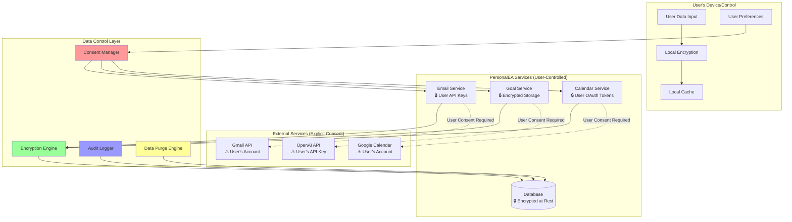
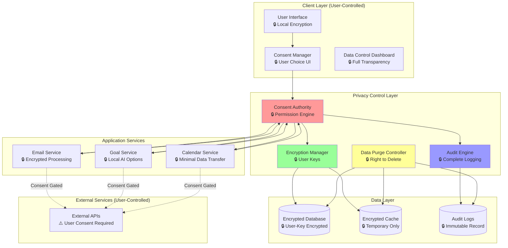

# Data Sovereignty Framework for PersonalEA

## 🔒 **Core Philosophy: "You-First" Data Control**

**Fundamental Principle**: No data leaves the user's control without encryption and explicit user authority.

This document establishes the data sovereignty framework that must be embedded throughout every aspect of the PersonalEA SPARC implementation, ensuring user data remains under user control at all times.

## 📋 **Data Sovereignty Principles**

### **1. User Data Ownership**
- Users own all their data completely
- Users control where their data is processed
- Users can export all their data at any time
- Users can delete all their data permanently

### **2. Explicit Consent for Data Movement**
- No data transmission without explicit user consent
- Clear explanation of what data moves where
- Granular control over data sharing permissions
- Revocable consent with immediate effect

### **3. Encryption by Default**
- All data encrypted at rest and in transit
- User-controlled encryption keys where possible
- Zero-knowledge architecture for sensitive data
- End-to-end encryption for data in motion

### **4. Local-First Processing**
- Process data locally whenever possible
- External services only when user explicitly approves
- Clear distinction between local and external processing
- Offline-capable core functionality

### **5. Data Minimization**
- Only collect data necessary for functionality
- Only transmit data required for specific operations
- Regular data purging based on user preferences
- No data retention beyond user-specified periods

## 🏗️ **SPARC Integration of Data Sovereignty**

### **S - Specification Phase: Privacy-First API Design**

#### **API Privacy Requirements**
```yaml
# Every API endpoint must include privacy metadata
privacy_classification:
  data_sensitivity: "high" | "medium" | "low"
  requires_consent: boolean
  data_retention: "session" | "temporary" | "persistent" | "user_controlled"
  encryption_required: boolean
  local_processing_possible: boolean
  external_services_involved: string[]

# Example: Goal translation endpoint
/api/v1/goals/translate:
  privacy_classification:
    data_sensitivity: "high"
    requires_consent: true
    data_retention: "user_controlled"
    encryption_required: true
    local_processing_possible: false
    external_services_involved: ["OpenAI API"]
    user_control_options:
      - use_local_ai_model
      - provide_own_api_key
      - opt_out_of_feature
```

#### **User Consent Management API**
```yaml
# Consent management endpoints
POST /api/v1/consent/request:
  description: Request user consent for data operation
  parameters:
    operation_type: string
    data_involved: DataClassification
    external_services: string[]
    retention_period: string
    user_benefits: string
    alternatives: ConsentAlternative[]

GET /api/v1/consent/status:
  description: Get current consent status for all data operations

PUT /api/v1/consent/revoke:
  description: Revoke consent and purge associated data
```

#### **Data Export/Control API**
```yaml
GET /api/v1/data/export:
  description: Export all user data in portable format
  formats: ["json", "csv", "standard_formats"]

DELETE /api/v1/data/purge:
  description: Permanently delete all user data
  confirmation_required: true
  grace_period: "7_days"

GET /api/v1/data/audit:
  description: Show where user data has been processed
  includes:
    - processing_locations
    - external_service_usage
    - data_retention_status
    - consent_history
```

### **P - Planning Phase: Privacy-Aware Architecture**

#### **Data Flow Classification**


#### **Privacy-by-Design Planning**
```typescript
interface PrivacyPlanningFramework {
  data_classification: {
    pii_data: PersonallyIdentifiableInformation[];
    sensitive_data: SensitiveDataCategory[];
    public_data: PublicDataCategory[];
    derived_data: DerivedDataCategory[];
  };
  
  processing_locations: {
    local_only: DataCategory[];
    controlled_cloud: DataCategory[];
    external_services: ExternalServiceMapping[];
    user_choice: UserControlledDataCategory[];
  };
  
  consent_requirements: {
    explicit_consent: DataOperation[];
    implied_consent: DataOperation[];
    no_consent_needed: DataOperation[];
    opt_out_available: DataOperation[];
  };
  
  retention_policies: {
    session_only: DataCategory[];
    user_controlled: DataCategory[];
    legal_requirement: DataCategory[];
    business_need: DataCategory[];
  };
}
```

### **A - Architecture Phase: Zero-Trust Data Architecture**

#### **Data Sovereignty Architecture Principles**
```typescript
// Core architecture enforcing data sovereignty
interface DataSovereigntyArchitecture {
  // 1. User-Controlled Encryption
  encryption: {
    user_managed_keys: boolean;
    client_side_encryption: boolean;
    zero_knowledge_storage: boolean;
    key_escrow_optional: boolean;
  };
  
  // 2. Consent-Driven Data Flow
  consent_engine: {
    granular_permissions: boolean;
    real_time_revocation: boolean;
    consent_inheritance: boolean;
    audit_trail: boolean;
  };
  
  // 3. Local-First Processing
  processing_hierarchy: {
    prefer_local: boolean;
    cached_ai_models: boolean;
    offline_capabilities: boolean;
    progressive_enhancement: boolean;
  };
  
  // 4. Data Minimization
  data_handling: {
    collect_minimum: boolean;
    process_minimum: boolean;
    store_minimum: boolean;
    transmit_minimum: boolean;
  };
}
```

#### **Service Architecture with Privacy Controls**


### **R - Research Phase: Privacy Technology Validation**

#### **Privacy-Preserving Technology Stack**
```typescript
interface PrivacyTechnologyStack {
  // Client-side encryption
  encryption_libraries: {
    web_crypto_api: boolean;
    libsodium: boolean;
    age_encryption: boolean;
    user_key_derivation: boolean;
  };
  
  // Local AI processing
  local_ai_options: {
    onnx_runtime: boolean;
    tensorflow_js: boolean;
    local_llm_models: boolean;
    edge_computing: boolean;
  };
  
  // Consent management
  consent_frameworks: {
    oauth2_granular_scopes: boolean;
    ux_consent_patterns: boolean;
    legal_compliance: boolean;
    technical_enforcement: boolean;
  };
  
  // Data sovereignty tools
  sovereignty_tools: {
    data_export_standards: boolean;
    retention_automation: boolean;
    audit_frameworks: boolean;
    compliance_monitoring: boolean;
  };
}
```

#### **Privacy Impact Assessment Template**
```yaml
privacy_impact_assessment:
  feature_name: string
  data_involved:
    types: DataType[]
    sensitivity_level: "low" | "medium" | "high" | "critical"
    volume: "minimal" | "moderate" | "large" | "extensive"
  
  processing_details:
    locations: ProcessingLocation[]
    external_services: ExternalService[]
    retention_period: string
    encryption_level: EncryptionLevel
  
  user_control:
    consent_type: "explicit" | "implied" | "none_needed"
    user_choice_available: boolean
    alternative_options: string[]
    revocation_possible: boolean
  
  risk_assessment:
    privacy_risks: PrivacyRisk[]
    mitigation_measures: MitigationMeasure[]
    residual_risk_level: "low" | "medium" | "high"
  
  compliance:
    gdpr_compliance: boolean
    ccpa_compliance: boolean
    other_regulations: string[]
```

### **C - Code Phase: Privacy-First Implementation**

#### **Consent Management Implementation**
```typescript
// src/services/consent-management.service.ts
export class ConsentManagementService {
  constructor(
    private encryptionService: EncryptionService,
    private auditService: AuditService,
    private userPreferencesRepository: UserPreferencesRepository,
    private logger: Logger
  ) {}

  async requestConsent(
    userId: string, 
    consentRequest: ConsentRequest
  ): Promise<ConsentResponse> {
    try {
      // 1. Log consent request for audit
      await this.auditService.logConsentRequest(userId, consentRequest);
      
      // 2. Check existing consent
      const existingConsent = await this.getExistingConsent(userId, consentRequest.operation);
      if (existingConsent && existingConsent.granted) {
        return { granted: true, consent_id: existingConsent.id };
      }
      
      // 3. Present consent options to user
      const consentOptions = this.buildConsentOptions(consentRequest);
      
      // 4. Return consent request for user decision
      return {
        granted: false,
        consent_id: generateUUID(),
        options: consentOptions,
        alternatives: this.getAlternatives(consentRequest),
        user_benefits: consentRequest.benefits,
        privacy_implications: this.analyzePrivacyImplications(consentRequest)
      };
      
    } catch (error) {
      this.logger.error('Consent request failed', { userId, error });
      throw new ConsentError('Failed to process consent request', 'CONSENT_REQUEST_ERROR');
    }
  }

  async grantConsent(
    userId: string, 
    consentId: string, 
    preferences: ConsentPreferences
  ): Promise<ConsentGrant> {
    try {
      const consentGrant: ConsentGrant = {
        id: consentId,
        user_id: userId,
        granted_at: new Date(),
        preferences: preferences,
        scope: preferences.data_scope,
        retention_period: preferences.retention_period,
        revocable: true,
        auto_expire: preferences.auto_expire
      };

      // Store encrypted consent
      await this.storeConsentGrant(consentGrant);
      
      // Log grant for audit
      await this.auditService.logConsentGrant(userId, consentGrant);
      
      return consentGrant;
      
    } catch (error) {
      this.logger.error('Consent grant failed', { userId, consentId, error });
      throw new ConsentError('Failed to grant consent', 'CONSENT_GRANT_ERROR');
    }
  }

  async revokeConsent(userId: string, consentId: string): Promise<ConsentRevocation> {
    try {
      // 1. Revoke consent immediately
      await this.markConsentRevoked(consentId);
      
      // 2. Trigger data purge for associated data
      await this.triggerDataPurge(userId, consentId);
      
      // 3. Notify affected services
      await this.notifyServicesOfRevocation(userId, consentId);
      
      // 4. Log revocation
      await this.auditService.logConsentRevocation(userId, consentId);
      
      return {
        revoked_at: new Date(),
        data_purge_initiated: true,
        estimated_purge_completion: addHours(new Date(), 24)
      };
      
    } catch (error) {
      this.logger.error('Consent revocation failed', { userId, consentId, error });
      throw new ConsentError('Failed to revoke consent', 'CONSENT_REVOCATION_ERROR');
    }
  }

  private async triggerDataPurge(userId: string, consentId: string): Promise<void> {
    // Identify all data associated with this consent
    const associatedData = await this.findDataByConsent(userId, consentId);
    
    // Schedule immediate purge
    for (const dataRef of associatedData) {
      await this.dataPurgeService.scheduleImmediatePurge(dataRef);
    }
  }
}
```

#### **User-Controlled Encryption Implementation**
```typescript
// src/services/user-encryption.service.ts
export class UserEncryptionService {
  constructor(
    private keyDerivationService: KeyDerivationService,
    private auditService: AuditService,
    private logger: Logger
  ) {}

  async encryptWithUserKey(
    userId: string, 
    data: any, 
    keyPurpose: KeyPurpose
  ): Promise<EncryptedData> {
    try {
      // 1. Derive user-specific encryption key
      const userKey = await this.deriveUserKey(userId, keyPurpose);
      
      // 2. Encrypt data with user's key
      const encrypted = await this.encrypt(JSON.stringify(data), userKey);
      
      // 3. Create encrypted data object
      const encryptedData: EncryptedData = {
        id: generateUUID(),
        user_id: userId,
        encrypted_content: encrypted.ciphertext,
        nonce: encrypted.nonce,
        key_purpose: keyPurpose,
        encryption_algorithm: 'ChaCha20-Poly1305',
        created_at: new Date()
      };
      
      // 4. Log encryption event (not the data)
      await this.auditService.logEncryptionEvent(userId, {
        data_id: encryptedData.id,
        key_purpose: keyPurpose,
        algorithm: encryptedData.encryption_algorithm
      });
      
      return encryptedData;
      
    } catch (error) {
      this.logger.error('User encryption failed', { userId, keyPurpose, error });
      throw new EncryptionError('Failed to encrypt with user key', 'USER_ENCRYPTION_ERROR');
    }
  }

  async decryptWithUserKey(
    userId: string, 
    encryptedData: EncryptedData
  ): Promise<any> {
    try {
      // 1. Verify user owns this data
      if (encryptedData.user_id !== userId) {
        throw new EncryptionError('User does not own this data', 'UNAUTHORIZED_DECRYPTION');
      }
      
      // 2. Derive user's key
      const userKey = await this.deriveUserKey(userId, encryptedData.key_purpose);
      
      // 3. Decrypt data
      const decrypted = await this.decrypt(
        encryptedData.encrypted_content, 
        encryptedData.nonce, 
        userKey
      );
      
      // 4. Log access (not the data)
      await this.auditService.logDecryptionEvent(userId, {
        data_id: encryptedData.id,
        accessed_at: new Date()
      });
      
      return JSON.parse(decrypted);
      
    } catch (error) {
      this.logger.error('User decryption failed', { userId, error });
      throw new EncryptionError('Failed to decrypt with user key', 'USER_DECRYPTION_ERROR');
    }
  }

  private async deriveUserKey(userId: string, purpose: KeyPurpose): Promise<CryptoKey> {
    // Use user's master key + purpose to derive specific key
    // This ensures user controls all encryption keys
    return this.keyDerivationService.deriveKey(userId, purpose);
  }
}
```

#### **Data Export and Control Implementation**
```typescript
// src/services/data-control.service.ts
export class DataControlService {
  constructor(
    private repositories: RepositoryCollection,
    private encryptionService: UserEncryptionService,
    private auditService: AuditService,
    private logger: Logger
  ) {}

  async exportAllUserData(userId: string, format: ExportFormat): Promise<UserDataExport> {
    try {
      // 1. Collect all user data from all services
      const userData = await this.collectAllUserData(userId);
      
      // 2. Decrypt data using user's keys
      const decryptedData = await this.decryptUserData(userId, userData);
      
      // 3. Format data according to user preference
      const formattedData = await this.formatDataForExport(decryptedData, format);
      
      // 4. Create export package
      const exportPackage: UserDataExport = {
        export_id: generateUUID(),
        user_id: userId,
        generated_at: new Date(),
        format: format,
        data: formattedData,
        metadata: {
          total_records: this.countRecords(formattedData),
          data_sources: this.getDataSources(formattedData),
          export_version: '1.0'
        }
      };
      
      // 5. Log export for audit
      await this.auditService.logDataExport(userId, {
        export_id: exportPackage.export_id,
        format: format,
        record_count: exportPackage.metadata.total_records
      });
      
      return exportPackage;
      
    } catch (error) {
      this.logger.error('Data export failed', { userId, format, error });
      throw new DataControlError('Failed to export user data', 'DATA_EXPORT_ERROR');
    }
  }

  async deleteAllUserData(userId: string, confirmation: DeleteConfirmation): Promise<DataDeletionResult> {
    try {
      // 1. Verify deletion confirmation
      if (!this.verifyDeletionConfirmation(userId, confirmation)) {
        throw new DataControlError('Invalid deletion confirmation', 'INVALID_CONFIRMATION');
      }
      
      // 2. Start grace period if configured
      if (confirmation.immediate_deletion) {
        return await this.executeImmediateDeletion(userId);
      } else {
        return await this.scheduleGracePeriodDeletion(userId, confirmation.grace_period || 7);
      }
      
    } catch (error) {
      this.logger.error('Data deletion failed', { userId, error });
      throw new DataControlError('Failed to delete user data', 'DATA_DELETION_ERROR');
    }
  }

  private async executeImmediateDeletion(userId: string): Promise<DataDeletionResult> {
    const deletionResults: DeletionResult[] = [];
    
    // Delete from all services
    for (const [serviceName, repository] of Object.entries(this.repositories)) {
      try {
        const result = await repository.deleteAllUserData(userId);
        deletionResults.push({
          service: serviceName,
          success: true,
          records_deleted: result.count
        });
      } catch (error) {
        deletionResults.push({
          service: serviceName,
          success: false,
          error: error.message
        });
      }
    }
    
    // Log complete deletion
    await this.auditService.logDataDeletion(userId, deletionResults);
    
    return {
      completed_at: new Date(),
      services_processed: deletionResults.length,
      total_records_deleted: deletionResults.reduce((sum, r) => sum + (r.records_deleted || 0), 0),
      deletion_results: deletionResults
    };
  }
}
```

## 🧪 **Privacy-First Testing Framework**

### **Data Sovereignty Testing Categories**

#### **1. Consent Flow Testing**
```typescript
describe('Data Sovereignty - Consent Management', () => {
  describe('Explicit Consent Required', () => {
    it('should block AI processing without user consent', async () => {
      const result = await goalService.translateGoal(testGoal, userId);
      
      expect(result.success).toBe(false);
      expect(result.reason).toBe('USER_CONSENT_REQUIRED');
      expect(result.consent_request).toBeDefined();
    });

    it('should process with valid user consent', async () => {
      await consentService.grantConsent(userId, consentId, {
        ai_processing: true,
        data_retention: '30_days'
      });
      
      const result = await goalService.translateGoal(testGoal, userId);
      
      expect(result.success).toBe(true);
    });

    it('should revoke consent and purge data immediately', async () => {
      await consentService.revokeConsent(userId, consentId);
      
      // Verify data is purged
      const userData = await dataService.findUserData(userId, consentId);
      expect(userData).toBeNull();
    });
  });
});
```

#### **2. Encryption Validation Testing**
```typescript
describe('Data Sovereignty - Encryption Controls', () => {
  describe('User-Controlled Encryption', () => {
    it('should encrypt all user data with user-derived keys', async () => {
      const sensitive_data = { goal: 'Personal goal data' };
      
      const encrypted = await encryptionService.encryptWithUserKey(
        userId, 
        sensitive_data, 
        'goal_data'
      );
      
      expect(encrypted.user_id).toBe(userId);
      expect(encrypted.encrypted_content).not.toContain('Personal goal data');
    });

    it('should prevent cross-user data access', async () => {
      const encrypted = await encryptionService.encryptWithUserKey(
        'user1', 
        { data: 'user1 data' }, 
        'test_data'
      );
      
      await expect(
        encryptionService.decryptWithUserKey('user2', encrypted)
      ).rejects.toThrow('UNAUTHORIZED_DECRYPTION');
    });
  });
});
```

#### **3. Data Export/Control Testing**
```typescript
describe('Data Sovereignty - Data Control', () => {
  describe('Data Portability', () => {
    it('should export all user data in standard format', async () => {
      const export_data = await dataControlService.exportAllUserData(userId, 'json');
      
      expect(export_data.data.goals).toBeDefined();
      expect(export_data.data.tasks).toBeDefined();
      expect(export_data.data.emails).toBeDefined();
      expect(export_data.metadata.total_records).toBeGreaterThan(0);
    });

    it('should completely delete all user data', async () => {
      const deletion_result = await dataControlService.deleteAllUserData(userId, {
        immediate_deletion: true,
        confirmation_phrase: 'DELETE ALL MY DATA'
      });
      
      expect(deletion_result.services_processed).toBeGreaterThan(0);
      expect(deletion_result.total_records_deleted).toBeGreaterThan(0);
      
      // Verify complete deletion
      const remaining_data = await dataService.findAnyUserData(userId);
      expect(remaining_data).toHaveLength(0);
    });
  });
});
```

#### **4. External Service Control Testing**
```typescript
describe('Data Sovereignty - External Service Controls', () => {
  describe('API Key Management', () => {
    it('should use user-provided OpenAI API keys', async () => {
      const user_api_key = 'sk-user-provided-key';
      
      await userPreferencesService.setAPIKey(userId, 'openai', user_api_key);
      
      const goal_translation = await goalService.translateGoal(testGoal, userId);
      
      // Verify user's key was used (mock verification)
      expect(mockOpenAI.lastUsedApiKey).toBe(user_api_key);
    });

    it('should offer local processing alternatives', async () => {
      const alternatives = await aiService.getProcessingAlternatives(userId, 'goal_translation');
      
      expect(alternatives).toContain('local_processing');
      expect(alternatives).toContain('user_provided_api_key');
      expect(alternatives).toContain('opt_out');
    });
  });
});
```

## 📊 **Privacy Compliance Metrics**

### **Technical Privacy Metrics**
- **Consent Coverage**: 100% of data operations require explicit consent
- **Encryption Rate**: 100% of user data encrypted with user-controlled keys
- **Data Minimization**: Only necessary data collected and processed
- **Local Processing**: >80% of operations can run locally
- **Data Export**: <24 hours for complete data export
- **Data Deletion**: <24 hours for complete data purge

### **User Control Metrics**
- **Consent Granularity**: Users can control each data operation independently
- **Revocation Speed**: Immediate effect of consent revocation
- **Transparency**: 100% audit trail of data processing
- **Alternative Options**: Multiple processing alternatives for each feature

### **Compliance Validation**
- **GDPR Article 7**: Explicit consent with easy withdrawal
- **GDPR Article 20**: Data portability in machine-readable format
- **GDPR Article 17**: Right to erasure (right to be forgotten)
- **CCPA**: Consumer rights to know, delete, and opt-out
- **SOC2 Type II**: Controls for security, availability, and confidentiality

## 🔒 **Implementation Priority**

### **Critical Privacy Features (Week 1)**
1. **Consent Management System**: Block all external data processing without consent
2. **User-Controlled Encryption**: Implement client-side encryption with user keys
3. **Data Export**: Enable complete user data export
4. **Audit Logging**: Track all data operations for transparency

### **Essential Privacy Features (Week 2-3)**
1. **Data Deletion**: Complete user data purge capability
2. **Local AI Options**: Provide local processing alternatives
3. **API Key Management**: User-provided external service keys
4. **Privacy Dashboard**: User interface for all privacy controls

### **Advanced Privacy Features (Week 4+)**
1. **Zero-Knowledge Storage**: Server cannot access user data
2. **Differential Privacy**: Protect user privacy in analytics
3. **Federated Learning**: Learn from user patterns without data sharing
4. **Homomorphic Encryption**: Process encrypted data without decryption

## ✅ **Privacy-First Success Criteria**

The PersonalEA system will meet the "You-First" data control philosophy when:

- ✅ **No Surprise Data Movement**: Every data transmission requires explicit user consent
- ✅ **User-Controlled Encryption**: Users control all encryption keys for their data
- ✅ **Complete Data Portability**: Users can export all their data in <24 hours
- ✅ **Immediate Data Deletion**: Users can permanently delete all data in <24 hours
- ✅ **Transparent Processing**: Users can audit all data processing activities
- ✅ **Local Processing Options**: Core functionality works offline/locally
- ✅ **Granular Consent**: Users control each data operation independently
- ✅ **External Service Control**: Users provide their own API keys for external services

---

**Framework Status**: **CRITICAL** - Must be implemented across all SPARC phases  
**Implementation Priority**: **HIGHEST** - Data sovereignty before feature development  
**Compliance Target**: GDPR, CCPA, SOC2 Type II ready  
**User Promise**: "Your data never leaves your control without your explicit authority"  
**Last Updated**: 2025-06-22