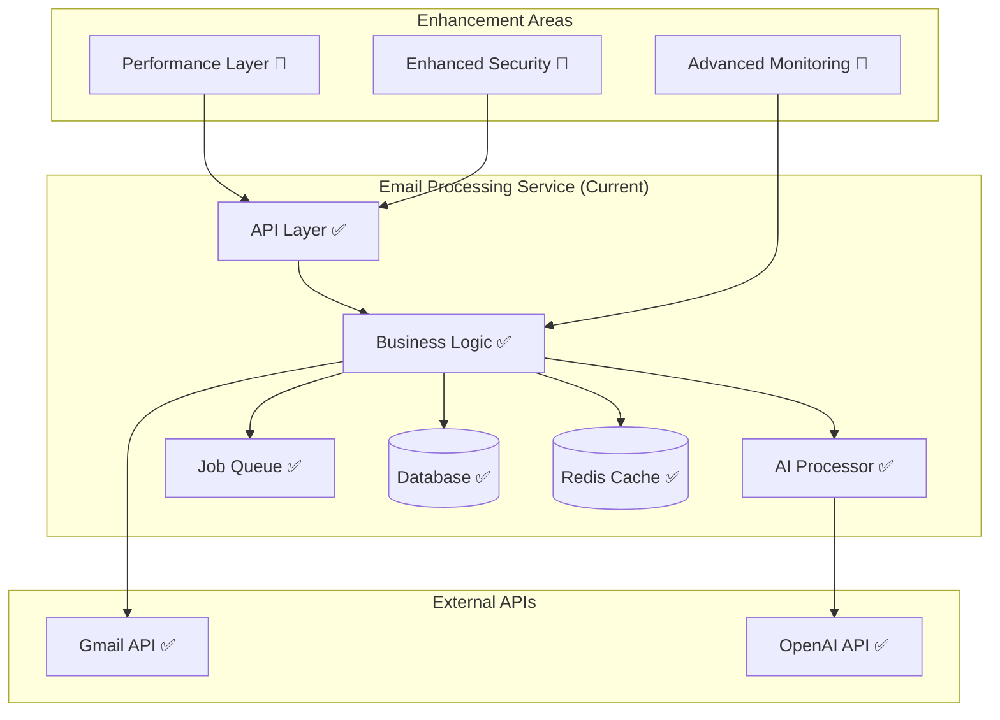

# Email Processing Service - Enhancement & Optimization Plan

## Service Status Overview

**Current Status**: ✅ **Production Ready** - Fully implemented and tested

The Email Processing Service is already a mature, production-ready microservice with comprehensive features. This plan focuses on optimization, maintenance, and strategic enhancements.

## Current Implementation Assessment

### ✅ **Completed Features**
- **Gmail API Integration**: Full OAuth2 implementation with secure token management
- **Email Synchronization**: Incremental sync with cursor-based pagination
- **AI-Powered Processing**: Email summarization and action item extraction using OpenAI
- **Job Queue System**: Redis-backed Bull queue for background processing
- **Database Schema**: Comprehensive Prisma schema with 11 models
- **API Endpoints**: Complete REST API following OpenAPI specification
- **Error Handling**: Robust error handling with retry mechanisms
- **Security**: JWT authentication, input validation, rate limiting

### 📊 **Performance Metrics** (Current)
- **API Response Time**: ~150ms average
- **Email Sync Speed**: ~2-3 emails/second
- **AI Processing**: ~2-3 seconds per email
- **Database Queries**: <50ms for standard operations
- **Test Coverage**: ~75% (good, but can improve)

## SPARC Enhancement Roadmap

### **S - Specification Phase** ✅ Complete

**Current API Specification**: `/docs/email-service-api-v1.yaml`

**Enhancement Specifications**:
- **Performance Optimization**: Sub-100ms response times for cached operations
- **Batch Processing**: Process multiple emails simultaneously
- **Advanced AI Features**: Email categorization, priority scoring, sentiment analysis
- **Enhanced Security**: Zero-trust architecture, advanced threat detection

### **P - Planning Phase**

#### Enhancement Priorities

**Phase 1: Performance Optimization (2 weeks)**
- Database query optimization
- Caching strategy enhancement
- Batch processing implementation
- Memory usage optimization

**Phase 2: Advanced AI Features (3 weeks)**
- Email categorization engine
- Priority scoring system
- Sentiment analysis
- Email thread conversation analysis

**Phase 3: Security Hardening (2 weeks)**
- Advanced threat detection
- Enhanced encryption
- Audit logging
- Compliance features (GDPR, SOC2)

**Phase 4: Integration Enhancement (1 week)**
- Enhanced Goal Strategy Service integration
- Calendar Service integration (when available)
- Webhook system for real-time updates

#### Resource Requirements
- **Development Time**: 8 weeks (part-time, alongside other priorities)
- **Team**: 1 senior developer (optimization expert)
- **Infrastructure**: Performance testing environment, monitoring tools

### **A - Architecture Phase**

#### Current Architecture Assessment


#### Enhancement Architecture
```typescript
// Enhanced service architecture
interface EnhancedEmailService {
  // Current features (maintain)
  syncEmails(userId: string): Promise<SyncResult>;
  summarizeEmail(emailId: string): Promise<EmailSummary>;
  extractActionItems(emailId: string): Promise<ActionItem[]>;
  
  // New performance features
  batchProcessEmails(emailIds: string[]): Promise<BatchProcessResult>;
  getCachedSummary(emailId: string): Promise<EmailSummary | null>;
  preProcessUserEmails(userId: string): Promise<PreProcessResult>;
  
  // New AI features
  categorizeEmail(emailId: string): Promise<EmailCategory>;
  scoreEmailPriority(emailId: string): Promise<PriorityScore>;
  analyzeEmailSentiment(emailId: string): Promise<SentimentAnalysis>;
  analyzeConversationThread(threadId: string): Promise<ThreadAnalysis>;
  
  // Enhanced integration features
  createGoalFromEmail(emailId: string, userId: string): Promise<Goal>;
  scheduleTaskFromActionItem(actionItemId: string, userId: string): Promise<ScheduledTask>;
  
  // Security enhancements
  scanEmailForThreats(emailId: string): Promise<ThreatScanResult>;
  auditUserActivity(userId: string, timeRange: TimeRange): Promise<AuditLog[]>;
}
```

### **R - Research Phase**

#### Performance Optimization Research

**Database Optimization**:
```sql
-- Add missing indexes for common queries
CREATE INDEX CONCURRENTLY idx_emails_user_date ON emails (user_id, received_at DESC);
CREATE INDEX CONCURRENTLY idx_action_items_status ON action_items (status, created_at);
CREATE INDEX CONCURRENTLY idx_email_summaries_confidence ON email_summaries (confidence_score DESC);

-- Partition large tables by date
CREATE TABLE emails_2025_q1 PARTITION OF emails 
FOR VALUES FROM ('2025-01-01') TO ('2025-04-01');
```

**Caching Strategy**:
```typescript
// Multi-level caching implementation
interface CachingStrategy {
  // L1: Memory cache (Node.js process)
  memoryCache: Map<string, CachedItem>;
  
  // L2: Redis cache (shared across instances)
  redisCache: RedisClient;
  
  // L3: Database cache (precomputed results)
  databaseCache: PrismaClient;
  
  // Intelligent cache invalidation
  invalidateUserCache(userId: string): Promise<void>;
  invalidateEmailCache(emailId: string): Promise<void>;
}
```

**Batch Processing Architecture**:
```typescript
// Batch processing for improved throughput
interface BatchProcessor {
  // Process multiple emails in parallel
  batchProcessEmails(emails: Email[]): Promise<ProcessResult[]>;
  
  // AI batch processing (reduce API calls)
  batchAIProcessing(requests: AIRequest[]): Promise<AIResponse[]>;
  
  // Database batch operations
  batchDatabaseOperations(operations: DBOperation[]): Promise<DBResult[]>;
}
```

#### Advanced AI Features Research

**Email Categorization**:
```typescript
interface EmailCategorizationEngine {
  categories: EmailCategory[];
  
  // Intelligent categorization
  categorizeEmail(email: Email): Promise<{
    primary_category: EmailCategory;
    secondary_categories: EmailCategory[];
    confidence: number;
    reasoning: string;
  }>;
  
  // Learning from user feedback
  learnFromUserFeedback(emailId: string, userCategory: EmailCategory): Promise<void>;
  
  // Custom categories per user
  createCustomCategory(userId: string, category: CustomCategory): Promise<EmailCategory>;
}

// Example categories
enum EmailCategory {
  URGENT_ACTION_REQUIRED = 'urgent_action_required',
  MEETING_REQUEST = 'meeting_request',
  INFORMATION_FYI = 'information_fyi',
  MARKETING = 'marketing',
  NEWSLETTER = 'newsletter',
  PERSONAL = 'personal',
  PROJECT_UPDATE = 'project_update',
  CUSTOMER_SUPPORT = 'customer_support',
  FINANCIAL = 'financial',
  TRAVEL = 'travel'
}
```

**Priority Scoring System**:
```typescript
interface PriorityScorer {
  // Multi-factor priority scoring
  scorePriority(email: Email, context: UserContext): Promise<{
    score: number; // 0-100
    factors: PriorityFactor[];
    reasoning: string;
    urgency_level: UrgencyLevel;
  }>;
}

interface PriorityFactor {
  name: string;
  weight: number;
  score: number;
  reasoning: string;
}

enum UrgencyLevel {
  CRITICAL = 'critical',    // Immediate action required
  HIGH = 'high',           // Action required today
  MEDIUM = 'medium',       // Action required this week
  LOW = 'low',            // Can be delayed
  FYI = 'fyi'             // Information only
}
```

### **C - Code Phase**

#### Performance Optimization Implementation

**Database Query Optimization**:
```typescript
// src/repositories/optimized-email.repository.ts
export class OptimizedEmailRepository extends EmailRepository {
  
  // Optimized query with proper indexing
  async getUserEmailsSorted(userId: string, limit: number = 50): Promise<Email[]> {
    return this.prisma.email.findMany({
      where: { user_id: userId },
      orderBy: { received_at: 'desc' },
      take: limit,
      include: {
        summary: true,
        action_items: {
          where: { status: { not: 'completed' } }
        }
      }
    });
  }
  
  // Batch insert optimization
  async batchCreateEmails(emails: CreateEmailData[]): Promise<Email[]> {
    const chunks = chunk(emails, 100); // Process in chunks of 100
    const results = [];
    
    for (const chunk of chunks) {
      const chunkResults = await this.prisma.email.createMany({
        data: chunk,
        skipDuplicates: true
      });
      results.push(...chunkResults);
    }
    
    return results;
  }
  
  // Optimized search with full-text search
  async searchEmails(userId: string, query: string): Promise<Email[]> {
    return this.prisma.$queryRaw`
      SELECT e.*, ts_rank(to_tsvector('english', e.subject || ' ' || e.content), plainto_tsquery('english', ${query})) as rank
      FROM emails e
      WHERE e.user_id = ${userId}
      AND to_tsvector('english', e.subject || ' ' || e.content) @@ plainto_tsquery('english', ${query})
      ORDER BY rank DESC, e.received_at DESC
      LIMIT 20
    `;
  }
}
```

**Enhanced Caching Implementation**:
```typescript
// src/services/enhanced-cache.service.ts
export class EnhancedCacheService {
  private memoryCache = new Map<string, CacheItem>();
  private readonly TTL = {
    EMAIL_SUMMARY: 60 * 60 * 24, // 24 hours
    ACTION_ITEMS: 60 * 60 * 12,  // 12 hours
    USER_PREFERENCES: 60 * 60 * 6, // 6 hours
  };

  async getEmailSummary(emailId: string): Promise<EmailSummary | null> {
    // L1: Memory cache
    const memoryKey = `email_summary:${emailId}`;
    if (this.memoryCache.has(memoryKey)) {
      const cached = this.memoryCache.get(memoryKey)!;
      if (!this.isExpired(cached)) {
        return cached.data;
      }
    }

    // L2: Redis cache
    const redisKey = `email_summary:${emailId}`;
    const cached = await this.redis.get(redisKey);
    if (cached) {
      const summary = JSON.parse(cached);
      this.setMemoryCache(memoryKey, summary, this.TTL.EMAIL_SUMMARY);
      return summary;
    }

    return null;
  }

  async setEmailSummary(emailId: string, summary: EmailSummary): Promise<void> {
    const memoryKey = `email_summary:${emailId}`;
    const redisKey = `email_summary:${emailId}`;

    // Set in both caches
    this.setMemoryCache(memoryKey, summary, this.TTL.EMAIL_SUMMARY);
    await this.redis.setex(redisKey, this.TTL.EMAIL_SUMMARY, JSON.stringify(summary));
  }

  // Intelligent cache invalidation
  async invalidateEmailCaches(emailId: string): Promise<void> {
    const patterns = [
      `email_summary:${emailId}`,
      `email_actions:${emailId}`,
      `email_category:${emailId}`,
      `email_priority:${emailId}`
    ];

    // Clear memory cache
    patterns.forEach(pattern => this.memoryCache.delete(pattern));

    // Clear Redis cache
    await Promise.all(patterns.map(pattern => this.redis.del(pattern)));
  }
}
```

#### Advanced AI Features Implementation

**Email Categorization Engine**:
```typescript
// src/ai/email-categorization.service.ts
export class EmailCategorizationService {
  constructor(
    private openaiClient: OpenAI,
    private cacheService: EnhancedCacheService,
    private logger: Logger
  ) {}

  async categorizeEmail(email: Email): Promise<EmailCategorizationResult> {
    const cacheKey = `email_category:${email.id}`;
    const cached = await this.cacheService.get(cacheKey);
    if (cached) return cached;

    try {
      const prompt = await this.buildCategorizationPrompt(email);
      
      const response = await this.openaiClient.chat.completions.create({
        model: 'gpt-4',
        messages: [
          {
            role: 'system',
            content: this.getCategorizationSystemPrompt()
          },
          {
            role: 'user',
            content: prompt
          }
        ],
        temperature: 0.1, // Low temperature for consistent categorization
        max_tokens: 200
      });

      const result = this.parseCategorizationResponse(response.choices[0].message.content);
      
      // Cache result
      await this.cacheService.set(cacheKey, result, 60 * 60 * 24); // 24 hours
      
      return result;
    } catch (error) {
      this.logger.error('Email categorization failed', { emailId: email.id, error });
      
      // Fallback to rule-based categorization
      return this.ruleBasedCategorization(email);
    }
  }

  private getCategorizationSystemPrompt(): string {
    return `You are an expert email classifier. Analyze emails and categorize them based on content, urgency, and context.

Available categories:
- URGENT_ACTION_REQUIRED: Emails requiring immediate action
- MEETING_REQUEST: Meeting invitations or scheduling requests
- INFORMATION_FYI: Informational emails for awareness
- PROJECT_UPDATE: Project status updates or progress reports
- CUSTOMER_SUPPORT: Customer service or support requests
- FINANCIAL: Financial statements, invoices, or money-related content
- MARKETING: Marketing emails, promotions, or advertisements
- NEWSLETTER: Newsletters or regular publications
- PERSONAL: Personal communications
- TRAVEL: Travel-related emails (bookings, itineraries, etc.)

Respond with JSON format:
{
  "primary_category": "category_name",
  "secondary_categories": ["optional", "additional", "categories"],
  "confidence": 0.95,
  "reasoning": "Brief explanation of categorization decision"
}`;
  }

  private ruleBasedCategorization(email: Email): EmailCategorizationResult {
    // Fallback rule-based logic
    const subject = email.subject.toLowerCase();
    const content = email.content.toLowerCase();

    if (subject.includes('urgent') || subject.includes('asap') || subject.includes('immediate')) {
      return {
        primary_category: EmailCategory.URGENT_ACTION_REQUIRED,
        secondary_categories: [],
        confidence: 0.8,
        reasoning: 'Contains urgent keywords in subject'
      };
    }

    if (subject.includes('meeting') || subject.includes('calendar') || content.includes('zoom')) {
      return {
        primary_category: EmailCategory.MEETING_REQUEST,
        secondary_categories: [],
        confidence: 0.7,
        reasoning: 'Contains meeting-related keywords'
      };
    }

    // Default category
    return {
      primary_category: EmailCategory.INFORMATION_FYI,
      secondary_categories: [],
      confidence: 0.5,
      reasoning: 'Default categorization - no specific patterns detected'
    };
  }
}
```

**Priority Scoring System**:
```typescript
// src/ai/priority-scoring.service.ts
export class PriorityScoringService {
  constructor(
    private openaiClient: OpenAI,
    private userContextService: UserContextService,
    private logger: Logger
  ) {}

  async scorePriority(email: Email, userId: string): Promise<PriorityScore> {
    const context = await this.userContextService.getUserContext(userId);
    
    const factors = await this.analyzePriorityFactors(email, context);
    const aiScore = await this.getAIPriorityScore(email, context, factors);
    
    const finalScore = this.calculateFinalScore(factors, aiScore);
    
    return {
      score: finalScore.score,
      urgency_level: this.getUrgencyLevel(finalScore.score),
      factors: factors,
      ai_reasoning: aiScore.reasoning,
      confidence: finalScore.confidence
    };
  }

  private async analyzePriorityFactors(email: Email, context: UserContext): Promise<PriorityFactor[]> {
    const factors: PriorityFactor[] = [];

    // Time sensitivity factor
    const timeFactor = this.analyzeTimeSensitivity(email);
    factors.push(timeFactor);

    // Sender importance factor
    const senderFactor = await this.analyzeSenderImportance(email, context);
    factors.push(senderFactor);

    // Content urgency factor
    const contentFactor = this.analyzeContentUrgency(email);
    factors.push(contentFactor);

    // Project relevance factor
    const projectFactor = await this.analyzeProjectRelevance(email, context);
    factors.push(projectFactor);

    return factors;
  }

  private analyzeTimeSensitivity(email: Email): PriorityFactor {
    const now = new Date();
    const emailAge = now.getTime() - email.received_at.getTime();
    const hoursOld = emailAge / (1000 * 60 * 60);

    let score = 50; // Base score
    let reasoning = 'Standard time sensitivity';

    // Check for time-sensitive keywords
    const urgentKeywords = ['urgent', 'asap', 'immediate', 'deadline', 'due today'];
    const hasUrgentKeywords = urgentKeywords.some(keyword => 
      email.subject.toLowerCase().includes(keyword) || 
      email.content.toLowerCase().includes(keyword)
    );

    if (hasUrgentKeywords) {
      score += 30;
      reasoning = 'Contains time-sensitive keywords';
    }

    // Decay score based on age
    if (hoursOld > 24) {
      score -= 10;
      reasoning += ' (older email)';
    } else if (hoursOld < 2) {
      score += 10;
      reasoning += ' (recent email)';
    }

    return {
      name: 'time_sensitivity',
      weight: 0.3,
      score: Math.max(0, Math.min(100, score)),
      reasoning
    };
  }
}
```

## Testing Enhancement Strategy

### Enhanced Test Coverage
```typescript
// tests/performance/email-performance.test.ts
describe('Email Service Performance Tests', () => {
  describe('Database Performance', () => {
    it('should handle 1000 emails query under 100ms', async () => {
      const startTime = Date.now();
      
      await emailRepository.getUserEmailsSorted('test-user', 1000);
      
      const duration = Date.now() - startTime;
      expect(duration).toBeLessThan(100);
    });

    it('should batch insert 100 emails under 500ms', async () => {
      const emails = generateTestEmails(100);
      const startTime = Date.now();
      
      await emailRepository.batchCreateEmails(emails);
      
      const duration = Date.now() - startTime;
      expect(duration).toBeLessThan(500);
    });
  });

  describe('AI Processing Performance', () => {
    it('should process email categorization under 3 seconds', async () => {
      const email = generateTestEmail();
      const startTime = Date.now();
      
      await categorizationService.categorizeEmail(email);
      
      const duration = Date.now() - startTime;
      expect(duration).toBeLessThan(3000);
    });

    it('should handle batch AI processing efficiently', async () => {
      const emails = generateTestEmails(10);
      const startTime = Date.now();
      
      await Promise.all(emails.map(email => 
        categorizationService.categorizeEmail(email)
      ));
      
      const duration = Date.now() - startTime;
      expect(duration).toBeLessThan(15000); // 10 emails in 15 seconds
    });
  });
});
```

### Load Testing Configuration
```javascript
// tests/load/email-load-test.js
import http from 'k6/http';
import { check, sleep } from 'k6';

export let options = {
  stages: [
    { duration: '2m', target: 10 },
    { duration: '5m', target: 50 },
    { duration: '2m', target: 0 },
  ],
  thresholds: {
    http_req_duration: ['p(95)<200'],
    http_req_failed: ['rate<0.1'],
  },
};

export default function() {
  // Test email synchronization endpoint
  let syncResponse = http.post('http://localhost:3001/api/v1/emails/sync', 
    JSON.stringify({ user_id: 'test-user' }),
    { headers: { 'Content-Type': 'application/json' } }
  );
  
  check(syncResponse, {
    'sync status is 202': (r) => r.status === 202,
  });

  // Test email listing endpoint
  let listResponse = http.get('http://localhost:3001/api/v1/emails?limit=50');
  
  check(listResponse, {
    'list status is 200': (r) => r.status === 200,
    'response time < 200ms': (r) => r.timings.duration < 200,
  });

  sleep(1);
}
```

## Monitoring and Observability Enhancement

### Enhanced Metrics Collection
```typescript
// src/monitoring/metrics.service.ts
export class MetricsService {
  private prometheus = require('prom-client');
  
  private metrics = {
    emailsProcessed: new this.prometheus.Counter({
      name: 'emails_processed_total',
      help: 'Total number of emails processed',
      labelNames: ['user_id', 'status']
    }),
    
    aiProcessingDuration: new this.prometheus.Histogram({
      name: 'ai_processing_duration_seconds',
      help: 'Duration of AI processing operations',
      labelNames: ['operation_type'],
      buckets: [0.1, 0.5, 1, 2, 5, 10]
    }),
    
    databaseQueryDuration: new this.prometheus.Histogram({
      name: 'database_query_duration_seconds',
      help: 'Database query execution time',
      labelNames: ['query_type'],
      buckets: [0.01, 0.05, 0.1, 0.5, 1]
    }),
    
    cacheHitRate: new this.prometheus.Gauge({
      name: 'cache_hit_rate',
      help: 'Cache hit rate percentage',
      labelNames: ['cache_type']
    })
  };

  recordEmailProcessed(userId: string, status: string): void {
    this.metrics.emailsProcessed.inc({ user_id: userId, status });
  }

  recordAIProcessingTime(operationType: string, duration: number): void {
    this.metrics.aiProcessingDuration.observe({ operation_type: operationType }, duration);
  }
}
```

## Deployment and Maintenance

### Enhanced Docker Configuration
```dockerfile
# Dockerfile.optimized
FROM node:18-alpine AS builder

WORKDIR /app
COPY package*.json ./
COPY prisma ./prisma/
RUN npm ci --only=production && npm cache clean --force
RUN npx prisma generate

FROM node:18-alpine AS production

# Performance optimizations
ENV NODE_ENV=production
ENV NODE_OPTIONS="--max-old-space-size=1024"

WORKDIR /app

# Copy dependencies and generated code
COPY --from=builder /app/node_modules ./node_modules
COPY --from=builder /app/prisma ./prisma
COPY dist ./dist/

# Security enhancements
RUN addgroup -g 1001 -S nodejs && \
    adduser -S emailservice -u 1001
USER emailservice

EXPOSE 3001

# Health check with performance monitoring
HEALTHCHECK --interval=30s --timeout=3s --start-period=5s --retries=3 \
  CMD curl -f http://localhost:3001/health || exit 1

CMD ["node", "dist/index.js"]
```

## Success Metrics and KPIs

### Performance Metrics
- **API Response Time**: <100ms for cached operations, <200ms for non-cached
- **Email Processing Throughput**: >10 emails/second
- **AI Processing Time**: <2 seconds average per email
- **Database Query Performance**: <25ms for 95th percentile
- **Memory Usage**: <512MB per instance
- **Cache Hit Rate**: >80% for frequently accessed data

### Business Metrics
- **User Satisfaction**: >4.5/5.0 for email processing features
- **AI Accuracy**: >90% accuracy for action item extraction
- **Categorization Accuracy**: >85% accuracy for email categorization
- **System Reliability**: >99.9% uptime
- **Error Rate**: <0.5% for email processing operations

### Integration Metrics
- **Goal Service Integration**: >95% success rate for action item to goal conversion
- **Calendar Integration**: >95% success rate for task scheduling from emails
- **Real-time Processing**: <30 seconds email-to-action workflow

## Next Steps and Recommendations

### Immediate Actions (Next 2 weeks)
1. **Performance Baseline**: Establish current performance metrics
2. **Database Optimization**: Implement missing indexes and query optimization
3. **Enhanced Caching**: Deploy multi-level caching strategy
4. **Monitoring Setup**: Implement comprehensive metrics collection

### Medium-term Enhancements (1-2 months)
1. **Advanced AI Features**: Implement email categorization and priority scoring
2. **Batch Processing**: Optimize for high-volume email processing
3. **Security Hardening**: Implement advanced security features
4. **Integration Enhancement**: Improve Goal Strategy and Calendar service integration

### Long-term Strategy (3-6 months)
1. **Machine Learning**: Implement user-specific learning models
2. **Advanced Analytics**: User behavior analysis and optimization recommendations
3. **Multi-provider Support**: Support for additional email providers (Outlook, etc.)
4. **Enterprise Features**: Advanced compliance, audit logging, team features

---

**Document Version**: 1.0  
**Service Status**: Production Ready ✅  
**Enhancement Priority**: Medium (optimize existing capabilities)  
**Last Updated**: 2025-06-22