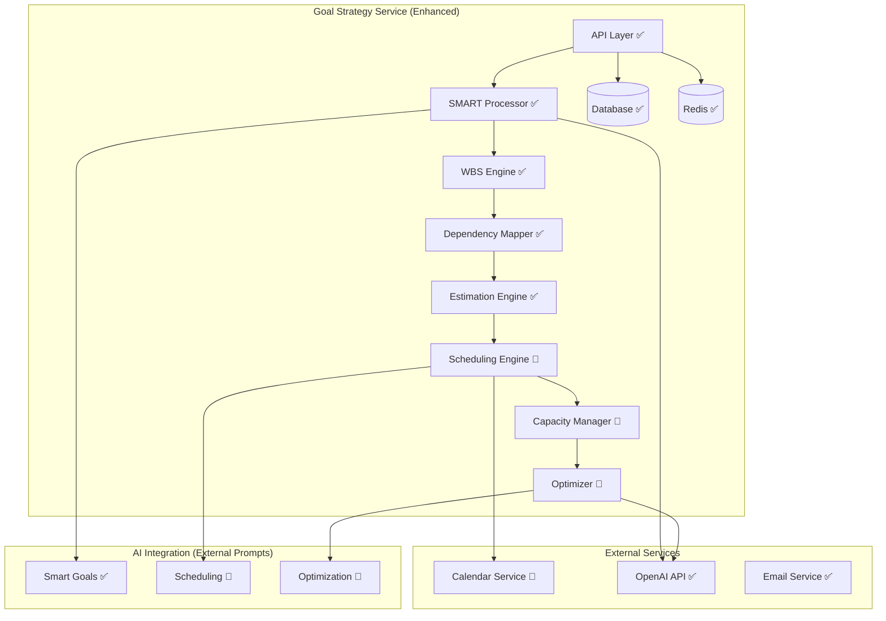

# Goal Strategy Service - Phase 4-6 Completion Plan

## Service Status Overview

**Current Status**: ✅ **Phases 1-3 Complete** - Ready for Calendar Integration & Advanced Features

The Goal Strategy Service has successfully completed its foundational implementation with sophisticated 8-step workflow capabilities. This plan focuses on completing Phases 4-6 to deliver the full vision of intelligent goal management with calendar integration.

## Current Implementation Assessment

### ✅ **Completed Phases (1-3)**

**Phase 1: Core Goal Management** ✅ Complete
- SMART Goal Translation with AI-powered conversation
- Critical Success Metric identification  
- Goal CRUD operations with AI enhancement
- Database schema implementation with 15+ models
- Milestone generation and management

**Phase 2: Advanced Planning** ✅ Complete
- Work Breakdown Structure (WBS) engine with recursive decomposition
- Dependency mapping and graph analysis
- Critical path calculation algorithms
- Multi-method estimation engine (expert judgment, analogy, three-point PERT)
- Task decomposition with template library
- Pattern recognition for task optimization

**Phase 3: Dependency & Estimation** ✅ Complete
- Complex dependency graph analysis
- Critical path optimization algorithms
- Historical learning system for estimation accuracy
- Confidence scoring for all AI operations
- Multi-method estimation with uncertainty handling

### 🔄 **Remaining Phases (4-6)**

**Phase 4: Calendar Integration** 🔄 Next Priority
- Calendar service integration and task scheduling
- Constraint-aware scheduling algorithms
- Conflict detection and resolution
- Focus time management and optimization

**Phase 5: Capacity Management** 🔄 Planned
- Workload balancing and resource allocation
- Team capacity analysis (starting with single-user)
- Performance monitoring and optimization
- Utilization tracking and recommendations

**Phase 6: Intelligence & Optimization** 🔄 Final Phase
- AI-powered optimization recommendations
- Advanced analytics and goal success prediction
- Learning system refinement for better accuracy
- System integration testing and performance tuning

## SPARC Implementation for Phases 4-6

### **S - Specification Phase** ✅ Already Complete

**API Extensions Required**:
```yaml
# Additional endpoints for calendar integration
POST   /api/v1/goals/{goalId}/schedule        # Schedule goal tasks
GET    /api/v1/goals/{goalId}/calendar        # Get calendar view of tasks
POST   /api/v1/goals/{goalId}/optimize        # AI-powered optimization
GET    /api/v1/users/{userId}/capacity        # Capacity analysis
POST   /api/v1/tasks/{taskId}/reschedule     # Reschedule individual task

# Capacity management endpoints
GET    /api/v1/users/{userId}/workload       # Current workload analysis
POST   /api/v1/users/{userId}/preferences    # Update scheduling preferences
GET    /api/v1/analytics/goals               # Goal analytics and insights
POST   /api/v1/optimization/suggestions      # Get optimization suggestions
```

### **P - Planning Phase**

#### **Phase 4: Calendar Integration Implementation** (Weeks 1-3)

**Week 1: Foundation & Integration Setup**
- Calendar Service API client implementation
- Scheduling algorithm core development
- Database schema extensions for calendar integration
- Basic availability analysis engine

**Week 2: Scheduling Engine Development**
- Constraint-aware task placement algorithm
- Multi-day task splitting with parent-child relationships
- Working hours and preference integration
- Basic conflict detection logic

**Week 3: Advanced Scheduling Features**
- AI-powered scheduling suggestions (external prompts)
- Conflict resolution with user choice options
- Focus time blocking and protection
- Integration testing with Calendar Service

#### **Phase 5: Capacity Management** (Weeks 4-5)

**Week 4: Capacity Analysis Engine**
- Workload calculation algorithms
- Resource allocation optimization
- Utilization tracking and metrics
- Performance bottleneck identification

**Week 5: Optimization & Balancing**
- Workload balancing recommendations
- Capacity-aware task assignment
- Performance monitoring dashboard
- User preference learning system

#### **Phase 6: Intelligence & Optimization** (Week 6)

**Week 6: AI-Powered Intelligence**
- Advanced optimization using external prompts
- Goal success prediction models
- Learning system refinement
- Comprehensive testing and performance optimization

### **A - Architecture Phase**

#### **Enhanced Service Architecture**


#### **Calendar Integration Architecture**
```typescript
// Enhanced Goal Strategy Service with Calendar Integration
interface EnhancedGoalStrategyService {
  // Existing functionality (maintain)
  translateGoal(goal: string, userId: string): Promise<SMARTGoal>;
  generateTaskBreakdown(goalId: string): Promise<Task[]>;
  mapDependencies(tasks: Task[]): Promise<DependencyGraph>;
  estimateTasks(tasks: Task[]): Promise<EstimationResult[]>;
  
  // Phase 4: Calendar Integration (new)
  scheduleGoalTasks(goalId: string, preferences?: SchedulingPreferences): Promise<SchedulingResult>;
  analyzeAvailability(userId: string, timeRange: TimeRange): Promise<AvailabilityAnalysis>;
  detectSchedulingConflicts(tasks: Task[], userId: string): Promise<ConflictReport>;
  optimizeSchedule(userId: string, criteria: OptimizationCriteria): Promise<ScheduleOptimization>;
  
  // Phase 5: Capacity Management (new)
  analyzeUserCapacity(userId: string): Promise<CapacityAnalysis>;
  balanceWorkload(userId: string, timeframe: TimeFrame): Promise<WorkloadBalance>;
  recommendCapacityOptimization(userId: string): Promise<CapacityRecommendations>;
  trackUtilization(userId: string, period: TimePeriod): Promise<UtilizationMetrics>;
  
  // Phase 6: Intelligence & Optimization (new)
  generateOptimizationSuggestions(userId: string): Promise<OptimizationSuggestions>;
  predictGoalSuccess(goalId: string): Promise<SuccessPrediction>;
  learnFromUserBehavior(userId: string, actions: UserAction[]): Promise<LearningUpdate>;
  providePeformanceInsights(userId: string): Promise<PerformanceInsights>;
}
```

### **R - Research Phase**

#### **Scheduling Algorithm Research**

**Constraint Satisfaction Problem (CSP) Approach**:
```typescript
interface SchedulingConstraints {
  // Time constraints
  working_hours: WorkingHours;
  break_requirements: BreakRequirements;
  deadline_constraints: Deadline[];
  
  // Capacity constraints
  max_concurrent_tasks: number;
  max_daily_hours: number;
  min_task_duration: number;
  max_task_duration: number;
  
  // Preference constraints
  preferred_work_times: TimePreference[];
  avoid_times: TimeAvoidance[];
  focus_time_requirements: FocusTimeRequirements;
  
  // Dependency constraints
  task_dependencies: TaskDependency[];
  milestone_deadlines: MilestoneDeadline[];
}

class ConstraintSatisfactionScheduler {
  solve(tasks: Task[], constraints: SchedulingConstraints): SchedulingSolution {
    // Use backtracking algorithm with constraint propagation
    return this.backtrackingSearch(tasks, constraints);
  }
  
  private backtrackingSearch(tasks: Task[], constraints: SchedulingConstraints): SchedulingSolution {
    if (this.isComplete(tasks)) {
      return this.createSolution(tasks);
    }
    
    const unscheduledTask = this.selectUnscheduledTask(tasks);
    const timeSlots = this.getOrderedTimeSlots(unscheduledTask, constraints);
    
    for (const timeSlot of timeSlots) {
      if (this.isConsistent(unscheduledTask, timeSlot, constraints)) {
        this.assign(unscheduledTask, timeSlot);
        
        const result = this.backtrackingSearch(tasks, constraints);
        if (result.success) {
          return result;
        }
        
        this.unassign(unscheduledTask);
      }
    }
    
    return { success: false, reason: 'No valid schedule found' };
  }
}
```

**AI-Powered Scheduling Optimization**:
```typescript
// External prompt for intelligent scheduling
// prompts/scheduling/schedule_optimization.md
interface SchedulingPrompt {
  system_prompt: string;
  user_context: {
    user_preferences: UserPreferences;
    historical_performance: PerformanceData;
    current_workload: WorkloadData;
    goal_priorities: GoalPriority[];
  };
  
  expected_response: {
    optimizations: ScheduleOptimization[];
    reasoning: string;
    confidence: number;
    alternative_approaches: AlternativeApproach[];
  };
}
```

#### **Capacity Management Research**

**Workload Balancing Algorithm**:
```typescript
interface CapacityManager {
  calculateCurrentCapacity(userId: string): Promise<{
    total_hours_available: number;
    committed_hours: number;
    available_hours: number;
    utilization_percentage: number;
    capacity_warnings: CapacityWarning[];
  }>;
  
  optimizeWorkloadDistribution(
    tasks: Task[], 
    timeframe: TimeFrame,
    constraints: CapacityConstraints
  ): Promise<{
    redistributed_tasks: TaskAssignment[];
    load_balancing_score: number;
    bottlenecks_identified: Bottleneck[];
    recommendations: LoadBalancingRecommendation[];
  }>;
  
  predictCapacityNeeds(
    goals: Goal[], 
    timeframe: TimeFrame
  ): Promise<{
    capacity_forecast: CapacityForecast;
    resource_requirements: ResourceRequirement[];
    scaling_recommendations: ScalingRecommendation[];
  }>;
}
```

### **C - Code Phase**

#### **Phase 4 Implementation: Calendar Integration**

**Scheduling Engine Implementation**:
```typescript
// src/services/scheduling.service.ts
export class SchedulingService {
  constructor(
    private calendarServiceClient: CalendarServiceClient,
    private constraintSolver: ConstraintSatisfactionScheduler,
    private aiService: AIService,
    private logger: Logger
  ) {}

  async scheduleGoalTasks(goalId: string, userId: string): Promise<SchedulingResult> {
    try {
      // 1. Get tasks for the goal
      const tasks = await this.taskRepository.getTasksByGoalId(goalId);
      
      // 2. Get user's calendar availability
      const availability = await this.calendarServiceClient.getAvailability(
        userId, 
        { start: new Date(), end: addDays(new Date(), 30) }
      );
      
      // 3. Get user scheduling preferences
      const preferences = await this.getUserSchedulingPreferences(userId);
      
      // 4. Build scheduling constraints
      const constraints = this.buildSchedulingConstraints(availability, preferences, tasks);
      
      // 5. Solve scheduling problem
      const solution = await this.constraintSolver.solve(tasks, constraints);
      
      if (!solution.success) {
        // 6. Get AI suggestions for schedule optimization
        const aiSuggestions = await this.getAISchedulingSuggestions(
          tasks, 
          constraints, 
          solution.reason
        );
        
        return {
          success: false,
          reason: solution.reason,
          ai_suggestions: aiSuggestions,
          alternative_schedules: aiSuggestions.alternatives
        };
      }
      
      // 7. Create calendar events
      const calendarEvents = await this.createCalendarEvents(solution.assignments, userId);
      
      // 8. Update task schedules in database
      await this.updateTaskSchedules(solution.assignments);
      
      return {
        success: true,
        scheduled_tasks: solution.assignments.length,
        calendar_events: calendarEvents,
        optimization_score: solution.optimizationScore,
        completion_forecast: solution.estimatedCompletion
      };
      
    } catch (error) {
      this.logger.error('Scheduling failed', { goalId, userId, error });
      throw new SchedulingError('Failed to schedule goal tasks', 'SCHEDULING_ERROR');
    }
  }

  private async getAISchedulingSuggestions(
    tasks: Task[], 
    constraints: SchedulingConstraints, 
    failureReason: string
  ): Promise<AISchedulingSuggestions> {
    const prompt = this.buildSchedulingPrompt(tasks, constraints, failureReason);
    
    const response = await this.aiService.generateResponse(
      'scheduling/schedule_optimization.md',
      prompt
    );
    
    return this.parseSchedulingSuggestions(response);
  }

  private buildSchedulingConstraints(
    availability: CalendarAvailability,
    preferences: UserPreferences,
    tasks: Task[]
  ): SchedulingConstraints {
    return {
      working_hours: preferences.working_hours,
      available_slots: availability.free_slots,
      task_dependencies: this.extractDependencies(tasks),
      break_requirements: preferences.break_requirements,
      focus_time_requirements: preferences.focus_time_preferences,
      deadline_constraints: tasks.map(t => ({
        task_id: t.id,
        deadline: t.due_date,
        priority: t.priority
      }))
    };
  }
}
```

**Calendar Service Integration**:
```typescript
// src/clients/calendar-service.client.ts
export class CalendarServiceClient {
  constructor(
    private httpClient: HttpClient,
    private config: CalendarServiceConfig,
    private logger: Logger
  ) {}

  async getAvailability(
    userId: string, 
    timeRange: TimeRange
  ): Promise<CalendarAvailability> {
    try {
      const response = await this.httpClient.get(
        `${this.config.baseUrl}/api/v1/calendar/availability`,
        {
          params: {
            user_id: userId,
            start_time: timeRange.start.toISOString(),
            end_time: timeRange.end.toISOString()
          }
        }
      );

      return response.data;
    } catch (error) {
      this.logger.error('Failed to get calendar availability', { userId, error });
      throw new CalendarServiceError('Availability check failed', 'AVAILABILITY_ERROR');
    }
  }

  async batchScheduleTasks(
    userId: string, 
    taskSchedules: TaskSchedule[]
  ): Promise<BatchSchedulingResult> {
    try {
      const events = taskSchedules.map(schedule => ({
        title: `Work on: ${schedule.task.title}`,
        description: schedule.task.description,
        start_time: schedule.start_time,
        end_time: schedule.end_time,
        event_type: 'task',
        task_id: schedule.task.id,
        goal_id: schedule.task.goal_id
      }));

      const response = await this.httpClient.post(
        `${this.config.baseUrl}/api/v1/calendar/events/batch`,
        { events, user_id: userId }
      );

      return response.data;
    } catch (error) {
      this.logger.error('Batch task scheduling failed', { userId, error });
      throw new CalendarServiceError('Batch scheduling failed', 'BATCH_SCHEDULING_ERROR');
    }
  }

  async detectConflicts(
    userId: string, 
    proposedSchedule: TaskSchedule[]
  ): Promise<ConflictReport> {
    try {
      const response = await this.httpClient.post(
        `${this.config.baseUrl}/api/v1/calendar/conflicts`,
        {
          user_id: userId,
          proposed_events: proposedSchedule.map(s => ({
            start_time: s.start_time,
            end_time: s.end_time,
            task_id: s.task.id
          }))
        }
      );

      return response.data;
    } catch (error) {
      this.logger.error('Conflict detection failed', { userId, error });
      throw new CalendarServiceError('Conflict detection failed', 'CONFLICT_DETECTION_ERROR');
    }
  }
}
```

#### **Phase 5 Implementation: Capacity Management**

**Capacity Analysis Engine**:
```typescript
// src/services/capacity-management.service.ts
export class CapacityManagementService {
  constructor(
    private taskRepository: TaskRepository,
    private calendarServiceClient: CalendarServiceClient,
    private userPreferencesService: UserPreferencesService,
    private logger: Logger
  ) {}

  async analyzeUserCapacity(userId: string, timeframe: TimeFrame): Promise<CapacityAnalysis> {
    try {
      // 1. Get user's committed time (existing calendar events)
      const committedTime = await this.calendarServiceClient.getCommittedTime(userId, timeframe);
      
      // 2. Get user's work preferences and availability
      const preferences = await this.userPreferencesService.getWorkingPreferences(userId);
      
      // 3. Calculate total available time
      const totalAvailableTime = this.calculateAvailableTime(timeframe, preferences);
      
      // 4. Get current task load
      const currentTasks = await this.taskRepository.getActiveTasksForUser(userId);
      const estimatedTaskTime = this.calculateEstimatedTaskTime(currentTasks);
      
      // 5. Analyze capacity utilization
      const utilizationAnalysis = this.analyzeUtilization(
        totalAvailableTime,
        committedTime,
        estimatedTaskTime
      );
      
      // 6. Identify capacity issues and opportunities
      const capacityInsights = this.generateCapacityInsights(utilizationAnalysis);
      
      return {
        timeframe,
        total_available_hours: totalAvailableTime,
        committed_hours: committedTime.total_hours,
        estimated_task_hours: estimatedTaskTime,
        utilization_percentage: utilizationAnalysis.utilization,
        capacity_status: utilizationAnalysis.status,
        insights: capacityInsights,
        recommendations: this.generateCapacityRecommendations(utilizationAnalysis)
      };
      
    } catch (error) {
      this.logger.error('Capacity analysis failed', { userId, error });
      throw new CapacityError('Failed to analyze user capacity', 'CAPACITY_ANALYSIS_ERROR');
    }
  }

  private analyzeUtilization(
    totalTime: number,
    committedTime: CommittedTime,
    estimatedTaskTime: number
  ): UtilizationAnalysis {
    const totalCommitted = committedTime.total_hours + estimatedTaskTime;
    const utilization = (totalCommitted / totalTime) * 100;
    
    let status: CapacityStatus;
    if (utilization > 100) {
      status = 'overcommitted';
    } else if (utilization > 90) {
      status = 'at_capacity';
    } else if (utilization > 70) {
      status = 'well_utilized';
    } else {
      status = 'under_utilized';
    }
    
    return {
      utilization,
      status,
      available_hours: Math.max(0, totalTime - totalCommitted),
      overcommit_hours: Math.max(0, totalCommitted - totalTime)
    };
  }
}
```

#### **Phase 6 Implementation: Intelligence & Optimization**

**AI-Powered Optimization Engine**:
```typescript
// src/services/optimization.service.ts
export class OptimizationService {
  constructor(
    private aiService: AIService,
    private goalRepository: GoalRepository,
    private taskRepository: TaskRepository,
    private userAnalyticsService: UserAnalyticsService,
    private logger: Logger
  ) {}

  async generateOptimizationSuggestions(userId: string): Promise<OptimizationSuggestions> {
    try {
      // 1. Gather user context and performance data
      const userContext = await this.gatherUserContext(userId);
      
      // 2. Analyze goal progress and bottlenecks
      const progressAnalysis = await this.analyzeGoalProgress(userId);
      
      // 3. Identify optimization opportunities
      const opportunities = await this.identifyOptimizationOpportunities(userContext, progressAnalysis);
      
      // 4. Generate AI-powered suggestions
      const aiSuggestions = await this.generateAISuggestions(userContext, opportunities);
      
      // 5. Prioritize and rank suggestions
      const rankedSuggestions = this.rankSuggestions(aiSuggestions, userContext);
      
      return {
        user_id: userId,
        generated_at: new Date(),
        suggestions: rankedSuggestions,
        optimization_score: this.calculateOptimizationScore(userContext),
        priority_areas: opportunities.high_impact_areas,
        expected_impact: this.estimateImpact(rankedSuggestions)
      };
      
    } catch (error) {
      this.logger.error('Optimization suggestion generation failed', { userId, error });
      throw new OptimizationError('Failed to generate optimization suggestions', 'OPTIMIZATION_ERROR');
    }
  }

  private async generateAISuggestions(
    userContext: UserContext, 
    opportunities: OptimizationOpportunity[]
  ): Promise<AISuggestion[]> {
    const prompt = this.buildOptimizationPrompt(userContext, opportunities);
    
    const response = await this.aiService.generateResponse(
      'optimization/goal_optimization.md',
      prompt
    );
    
    return this.parseOptimizationSuggestions(response);
  }

  async predictGoalSuccess(goalId: string): Promise<SuccessPrediction> {
    try {
      const goal = await this.goalRepository.findById(goalId);
      const tasks = await this.taskRepository.getTasksByGoalId(goalId);
      const historicalData = await this.userAnalyticsService.getGoalHistoricalData(goal.user_id);
      
      // Use historical patterns and current progress to predict success
      const features = this.extractPredictionFeatures(goal, tasks, historicalData);
      const prediction = await this.runSuccessPredictionModel(features);
      
      return {
        goal_id: goalId,
        success_probability: prediction.probability,
        confidence_level: prediction.confidence,
        key_factors: prediction.influencing_factors,
        risk_factors: prediction.risk_factors,
        recommendations: prediction.recommendations
      };
      
    } catch (error) {
      this.logger.error('Goal success prediction failed', { goalId, error });
      throw new PredictionError('Failed to predict goal success', 'PREDICTION_ERROR');
    }
  }
}
```

## Testing Strategy for Phases 4-6

### **Phase 4 Testing: Calendar Integration**
```typescript
describe('Calendar Integration Tests', () => {
  describe('Task Scheduling', () => {
    it('should schedule tasks without conflicts', async () => {
      const goalId = 'test-goal-123';
      const userId = 'test-user-456';
      
      const result = await schedulingService.scheduleGoalTasks(goalId, userId);
      
      expect(result.success).toBe(true);
      expect(result.scheduled_tasks).toBeGreaterThan(0);
      expect(result.calendar_events).toBeDefined();
    });

    it('should handle scheduling conflicts gracefully', async () => {
      // Create conflicting calendar events
      await setupConflictingEvents(userId, timeRange);
      
      const result = await schedulingService.scheduleGoalTasks(goalId, userId);
      
      if (!result.success) {
        expect(result.ai_suggestions).toBeDefined();
        expect(result.alternative_schedules).toHaveLength.toBeGreaterThan(0);
      }
    });

    it('should respect user preferences and constraints', async () => {
      const preferences = {
        working_hours: { start: '09:00', end: '17:00' },
        avoid_times: [{ start: '12:00', end: '13:00' }] // Lunch break
      };
      
      const result = await schedulingService.scheduleGoalTasks(goalId, userId);
      
      // Verify no tasks scheduled during lunch break
      const lunchConflicts = result.calendar_events.filter(event => 
        isTimeInRange(event.start_time, '12:00', '13:00')
      );
      expect(lunchConflicts).toHaveLength(0);
    });
  });

  describe('Constraint Satisfaction', () => {
    it('should solve complex dependency chains', async () => {
      const tasks = createTasksWithComplexDependencies();
      const constraints = createTestConstraints();
      
      const solution = await constraintSolver.solve(tasks, constraints);
      
      expect(solution.success).toBe(true);
      expect(solution.assignments).toHaveLength(tasks.length);
      validateDependencyOrder(solution.assignments);
    });
  });
});
```

### **Phase 5 Testing: Capacity Management**
```typescript
describe('Capacity Management Tests', () => {
  describe('Capacity Analysis', () => {
    it('should accurately calculate user capacity', async () => {
      const analysis = await capacityService.analyzeUserCapacity(userId, timeframe);
      
      expect(analysis.total_available_hours).toBeGreaterThan(0);
      expect(analysis.utilization_percentage).toBeBetween(0, 200);
      expect(analysis.capacity_status).toBeOneOf(['under_utilized', 'well_utilized', 'at_capacity', 'overcommitted']);
    });

    it('should identify overcommitment scenarios', async () => {
      // Setup scenario with too many tasks
      await setupOvercommittedScenario(userId);
      
      const analysis = await capacityService.analyzeUserCapacity(userId, timeframe);
      
      expect(analysis.capacity_status).toBe('overcommitted');
      expect(analysis.recommendations).toContain('reduce_workload');
    });
  });

  describe('Workload Balancing', () => {
    it('should redistribute tasks to balance workload', async () => {
      const tasks = createUnbalancedTaskLoad();
      
      const result = await capacityService.optimizeWorkloadDistribution(tasks, timeframe, constraints);
      
      expect(result.load_balancing_score).toBeGreaterThan(0.7);
      expect(result.redistributed_tasks).toHaveLength(tasks.length);
    });
  });
});
```

### **Phase 6 Testing: Intelligence & Optimization**
```typescript
describe('Intelligence & Optimization Tests', () => {
  describe('Optimization Suggestions', () => {
    it('should generate relevant optimization suggestions', async () => {
      const suggestions = await optimizationService.generateOptimizationSuggestions(userId);
      
      expect(suggestions.suggestions).toHaveLength.toBeGreaterThan(0);
      expect(suggestions.optimization_score).toBeBetween(0, 100);
      expect(suggestions.priority_areas).toBeDefined();
    });

    it('should provide actionable recommendations', async () => {
      const suggestions = await optimizationService.generateOptimizationSuggestions(userId);
      
      suggestions.suggestions.forEach(suggestion => {
        expect(suggestion.action_required).toBeDefined();
        expect(suggestion.expected_impact).toBeGreaterThan(0);
        expect(suggestion.implementation_effort).toBeDefined();
      });
    });
  });

  describe('Success Prediction', () => {
    it('should predict goal success probability', async () => {
      const prediction = await optimizationService.predictGoalSuccess(goalId);
      
      expect(prediction.success_probability).toBeBetween(0, 1);
      expect(prediction.confidence_level).toBeBetween(0, 1);
      expect(prediction.key_factors).toHaveLength.toBeGreaterThan(0);
    });
  });
});
```

## Performance Targets for Phases 4-6

### **Phase 4: Calendar Integration Performance**
- **Task Scheduling**: <3 seconds for 10 tasks
- **Conflict Detection**: <1 second for complex schedules
- **Calendar API Calls**: <500ms per request
- **Constraint Solving**: <2 seconds for complex dependency graphs

### **Phase 5: Capacity Management Performance**
- **Capacity Analysis**: <1 second for 30-day analysis
- **Workload Balancing**: <2 seconds for 50 tasks
- **Utilization Calculations**: <500ms real-time updates
- **Recommendation Generation**: <1 second

### **Phase 6: Intelligence Performance**
- **Optimization Suggestions**: <5 seconds (includes AI processing)
- **Success Prediction**: <2 seconds per goal
- **Learning Updates**: <1 second for batch processing
- **Analytics Queries**: <500ms for dashboard updates

## Success Metrics

### **Technical Metrics**
- **Calendar Integration Success Rate**: >95%
- **Scheduling Accuracy**: >90% user acceptance of suggested schedules
- **Capacity Prediction Accuracy**: Within 10% of actual utilization
- **AI Suggestion Relevance**: >80% user adoption of suggestions

### **User Experience Metrics**
- **Time to Schedule**: <30 seconds for complete goal scheduling
- **Conflict Resolution**: >90% of conflicts resolved automatically
- **User Satisfaction**: >4.2/5.0 for scheduling features
- **Feature Adoption**: >75% of users using calendar integration within 1 week

### **Business Impact Metrics**
- **Goal Completion Rate**: 20% increase with calendar integration
- **Time Management Efficiency**: 30% reduction in manual scheduling time
- **Productivity Improvement**: Measurable increase in task completion rates
- **User Retention**: >80% retention for users who complete Phase 4 setup

## Risk Mitigation

### **Calendar Service Dependency Risk**
- **Risk**: Calendar Service not ready for integration
- **Mitigation**: Implement mock Calendar Service for testing, parallel development
- **Contingency**: Phase 4 can be delayed while maintaining Phase 5-6 development

### **Performance Risk**
- **Risk**: Complex scheduling algorithms too slow
- **Mitigation**: Implement caching, optimize algorithms, fallback to simpler approaches
- **Monitoring**: Performance benchmarks, real-time monitoring

### **User Adoption Risk**
- **Risk**: Calendar integration too complex for users
- **Mitigation**: Extensive user testing, progressive complexity, excellent UX design
- **Strategy**: Start with simple scheduling, gradually introduce advanced features

## Next Steps

### **Immediate Actions (This Week)**
1. **Calendar Service Coordination**: Confirm Calendar Service implementation timeline
2. **Database Schema Updates**: Prepare schema extensions for calendar integration
3. **Testing Environment**: Setup integration testing with Calendar Service mocks
4. **Team Coordination**: Align Goal Strategy and Calendar Service development

### **Phase 4 Implementation (Weeks 1-3)**
1. **Week 1**: Calendar Service client implementation, basic scheduling algorithms
2. **Week 2**: Constraint-aware scheduling, conflict detection
3. **Week 3**: AI-powered suggestions, integration testing

### **Phase 5-6 Implementation (Weeks 4-6)**
1. **Week 4-5**: Capacity management implementation
2. **Week 6**: Intelligence & optimization features
3. **Ongoing**: Comprehensive testing, performance optimization

---

**Document Version**: 1.0  
**Current Phase**: 3 Complete, 4-6 Pending  
**Implementation Priority**: High (completes core PersonalEA vision)  
**Dependencies**: Calendar Service implementation  
**Last Updated**: 2025-06-22