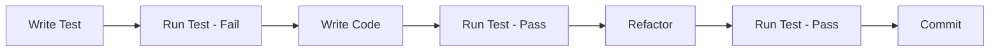

# Goal & Strategy Service Test Architecture

## Overview

This document defines the comprehensive test architecture for the PersonalEA Goal & Strategy Service, covering Phases 1-3 with a focus on Test-Driven Development (TDD) and browser automation.

## Architecture Principles

### 1. Test-First Development (TDD)
- Write tests before implementation
- Red-Green-Refactor cycle
- Focus on behavior, not implementation details
- Tests as living documentation

### 2. Layered Testing Strategy
```
┌─────────────────────────────────┐
│   End-to-End Browser Tests      │ ← User Journey Validation
├─────────────────────────────────┤
│   Integration Tests             │ ← API & Service Integration
├─────────────────────────────────┤
│   Component Tests               │ ← Business Logic Validation
├─────────────────────────────────┤
│   Unit Tests                    │ ← Individual Function Testing
└─────────────────────────────────┘
```

### 3. Test Isolation
- Independent test execution
- Mock external dependencies
- Deterministic test data
- Clean state between tests

### 4. Continuous Feedback
- Fast unit tests (<100ms)
- Focused integration tests (<1s)
- Strategic browser tests (<10s)
- Parallel test execution

## Technology Stack

### Core Testing Framework
- **Jest**: Unit and integration testing
- **Playwright**: Browser automation
- **Supertest**: API endpoint testing
- **MSW (Mock Service Worker)**: Service mocking
- **Faker.js**: Test data generation

### Supporting Tools
- **TypeScript**: Type-safe test development
- **ESLint**: Test code quality
- **NYC**: Code coverage reporting
- **Allure**: Test reporting
- **Docker**: Test environment consistency

## Phase Coverage

### Phase 1: SMART Goal Translation
- AI-powered goal analysis testing
- Interactive clarification flow validation
- SMART criteria validation rules
- Browser UI interaction tests

### Phase 2: Critical Success Metrics
- Metric selection algorithm testing
- Baseline establishment validation
- Progress tracking accuracy
- Dashboard visualization tests

### Phase 3: Milestone Breakdown
- AI milestone generation testing
- Dependency mapping validation
- Timeline distribution tests
- Progress tracking UI tests

## Test Categories

### 1. Unit Tests
- Pure function testing
- Business logic validation
- Utility function coverage
- Error handling verification

### 2. Integration Tests
- API endpoint validation
- Database operation testing
- Service communication tests
- External API integration

### 3. Browser Automation Tests
- User journey validation
- UI component interaction
- Cross-browser compatibility
- Responsive design testing

### 4. Contract Tests
- API contract validation
- Schema compliance testing
- Version compatibility
- Breaking change detection

### 5. Performance Tests
- Response time validation
- Load testing scenarios
- Resource usage monitoring
- Scalability verification

### 6. Security Tests
- Authentication testing
- Authorization validation
- Input sanitization
- OWASP compliance

## Test Organization

```
test-architecture/
├── goal-strategy/
│   ├── phase1-smart-goals/
│   │   ├── unit/
│   │   ├── integration/
│   │   └── browser/
│   ├── phase2-metrics/
│   │   ├── unit/
│   │   ├── integration/
│   │   └── browser/
│   ├── phase3-milestones/
│   │   ├── unit/
│   │   ├── integration/
│   │   └── browser/
│   ├── integration/
│   │   ├── api-tests/
│   │   ├── service-tests/
│   │   └── workflow-tests/
│   ├── browser-automation/
│   │   ├── scenarios/
│   │   ├── page-objects/
│   │   └── fixtures/
│   ├── fixtures/
│   │   ├── test-data/
│   │   ├── mocks/
│   │   └── stubs/
│   └── patterns/
│       ├── test-builders/
│       ├── custom-matchers/
│       └── helpers/
```

## Testing Workflow

### 1. Development Cycle


### 2. CI/CD Pipeline
```yaml
stages:
  - unit-tests
  - integration-tests
  - browser-tests
  - performance-tests
  - security-tests
  - deployment
```

### 3. Test Execution Strategy
- **Local Development**: Unit tests on file save
- **Pre-commit**: Unit + integration tests
- **Pull Request**: Full test suite
- **Main Branch**: All tests + performance

## Quality Metrics

### Coverage Targets
- Unit Tests: >90%
- Integration Tests: >80%
- Browser Tests: Critical paths 100%
- Overall Coverage: >85%

### Performance Targets
- Unit Test Suite: <30 seconds
- Integration Test Suite: <2 minutes
- Browser Test Suite: <5 minutes
- Full Test Suite: <10 minutes

### Quality Gates
- No failing tests
- Coverage thresholds met
- Performance budgets maintained
- Zero critical security issues

## Implementation Timeline

### Week 1-2: Foundation
- Test infrastructure setup
- Basic test patterns
- CI/CD pipeline configuration
- Initial test coverage

### Week 3-4: Phase 1 Tests
- SMART goal translation tests
- AI integration mocking
- Browser automation setup
- API endpoint testing

### Week 5-6: Phase 2-3 Tests
- Metric validation tests
- Milestone generation tests
- Complete browser scenarios
- Performance test suite

## Next Steps

1. Review and approve test architecture
2. Set up test infrastructure
3. Create initial test templates
4. Begin Phase 1 test implementation
5. Establish test review process

---

**Document Version**: 1.0  
**Status**: Ready for Implementation  
**Created**: 2025-06-23  
**Owner**: Test Architecture Team