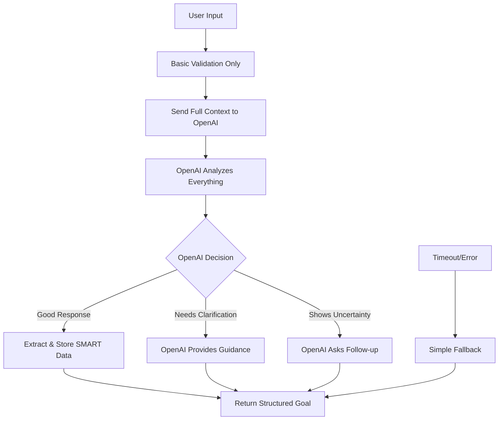

# Simplified OpenAI-First Approach Plan

## Problem Analysis

### Current Issues
1. **Technical Bug**: `timeoutPromise` reference error on line 648 causing hangs
2. **Over-aggressive vague detection**: "Maybe 500 lines of code" triggers fallback instead of letting OpenAI handle it
3. **Complex pre-processing**: Too much logic before OpenAI gets to analyze the input
4. **Missing core purpose**: Should extract/store SMART goals, not replace OpenAI intelligence

### User Feedback
- "Let OpenAI do most of the heavy lifting"
- "Extract and store the valuable information to proceed to the next steps"
- "500 lines of code is either good or bad - OpenAI should determine this"
- "The word 'maybe' indicates uncertainty - LLM should ask if they're uncertain"

## Simplified Architecture

### Core Principle: Trust OpenAI's Intelligence



### What We Remove
1. **Vague response detection** - Delete lines 457-545
2. **Metric evaluation logic** - Delete lines 547-672  
3. **Complex fallback functions** - Simplify to basic timeout handling
4. **Domain-specific pre-processing** - Let OpenAI handle all domain knowledge

### What We Keep
1. **Basic timeout protection** - 15-20 second global timeout
2. **Response guarantee mechanism** - Ensure server always responds
3. **OpenAI integration** - Enhanced prompts with full context
4. **Data extraction** - Structure the final SMART goal components

## New Simplified Flow

### 1. Goal Clarification Endpoint
```javascript
app.post('/api/v1/goals/:goalId/clarify', requireOpenAI, async (req, res) => {
  // Basic response guarantee
  let responseAlreadySent = false;
  const sendResponse = (data) => { /* ... */ };
  const globalTimeout = setTimeout(() => { /* simple fallback */ }, 20000);
  
  try {
    const { clarifications, goalContext } = req.body;
    const currentComponent = Object.keys(clarifications)[Object.keys(clarifications).length - 1];
    const userInput = clarifications[currentComponent];
    
    // ONLY basic validation - no pre-processing
    if (!userInput || userInput.trim().length === 0) {
      return sendResponse({ /* ask for input */ });
    }
    
    // Send EVERYTHING to OpenAI with full context
    const completion = await Promise.race([
      openai.chat.completions.create({
        model: "gpt-4",
        messages: [
          {
            role: "system",
            content: `You are a SMART goal expert. The user is working on the "${currentComponent}" component of their goal.
            
            GOAL CONTEXT: ${goalContext.title}
            CURRENT COMPONENT: ${currentComponent}
            USER INPUT: "${userInput}"
            
            Your job:
            1. Analyze if their input is adequate for this component
            2. If it shows uncertainty (like "maybe"), acknowledge it and help them build confidence
            3. If it's inadequate (like "lines of code" for senior developer goals), explain why and suggest better alternatives
            4. If it's good, incorporate it and provide encouraging feedback
            5. Always provide actionable next steps
            
            Return JSON:
            {
              "needsFollowUp": true/false,
              "feedback": "Your response to the user",
              "suggestions": ["suggestion1", "suggestion2", "suggestion3"],
              "improvedComponent": {
                "value": "Enhanced component description",
                "confidence": 0.0-1.0,
                "missing": ["any remaining gaps"]
              }
            }`
          },
          {
            role: "user", 
            content: `Please help me with the ${currentComponent} component. My input: "${userInput}"`
          }
        ],
        temperature: 0.7,
        max_tokens: 800
      }),
      new Promise((_, reject) => setTimeout(() => reject(new Error('OpenAI timeout')), 15000))
    ]);
    
    const aiResponse = JSON.parse(completion.choices[0].message.content);
    
    // Extract and structure the response
    if (aiResponse.needsFollowUp) {
      // OpenAI determined more clarification needed
      clearTimeout(globalTimeout);
      sendResponse({
        success: true,
        data: {
          needsFollowUp: true,
          feedback: aiResponse.feedback,
          suggestions: aiResponse.suggestions
        },
        message: aiResponse.feedback
      });
    } else {
      // OpenAI approved the input, create improved goal
      const improvedGoal = {
        id: req.params.goalId,
        correlation_id: `corr-${Date.now()}`,
        title: "Improved SMART Goal",
        criteria: {
          [currentComponent]: aiResponse.improvedComponent,
          // ... other components with defaults
        },
        confidence: aiResponse.improvedComponent.confidence,
        aiFeedback: aiResponse.feedback
      };
      
      clearTimeout(globalTimeout);
      sendResponse({
        success: true,
        data: improvedGoal,
        message: aiResponse.feedback
      });
    }
    
  } catch (error) {
    // Simple fallback
    clearTimeout(globalTimeout);
    sendResponse({
      success: true,
      data: { needsFollowUp: true, feedback: "Please try again or be more specific." },
      message: "Please try again"
    });
  }
});
```

## Benefits of Simplified Approach

### 1. **Leverages OpenAI's Strengths**
- Natural language understanding
- Domain expertise across all fields
- Contextual analysis
- Uncertainty detection
- Quality assessment

### 2. **Eliminates Complex Logic**
- No more vague response patterns
- No more domain-specific rules
- No more metric evaluation algorithms
- No more fallback guidance functions

### 3. **Focuses on Core Purpose**
- Extract structured SMART goal data
- Store valuable information for future use
- Provide clean API responses
- Handle timeouts gracefully

### 4. **Improves User Experience**
- Consistent AI-powered guidance
- Natural conversation flow
- Better handling of uncertainty
- More intelligent responses

## Implementation Steps

1. **Fix immediate bug** - Remove `timeoutPromise` reference error
2. **Remove complex logic** - Delete vague detection and metric evaluation
3. **Enhance OpenAI prompts** - Give full context and clear instructions
4. **Simplify response handling** - Focus on data extraction
5. **Test with real scenarios** - Validate "Maybe 500 lines" works correctly

## Expected Results

- "Maybe 500 lines of code" → OpenAI detects uncertainty and asks for confidence level
- "500 lines of code" → OpenAI evaluates if appropriate for the goal and provides feedback
- All responses → Fast, intelligent, contextual guidance
- No more browser hangs → Simple, reliable timeout handling