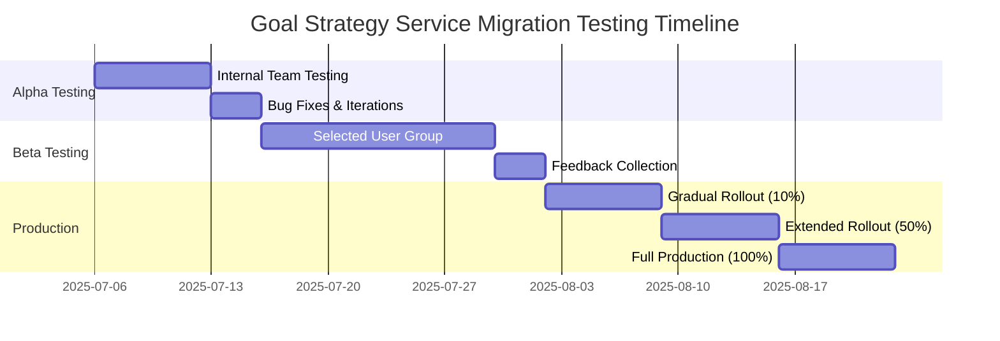
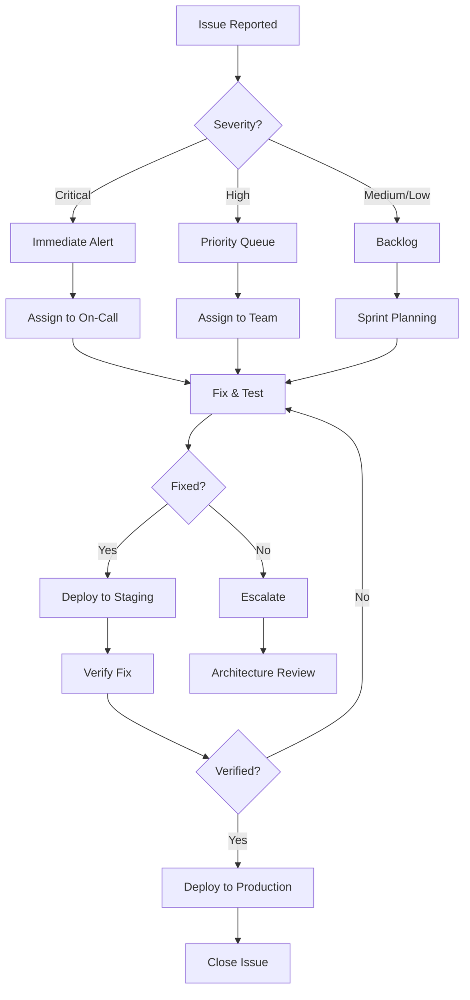

# Comprehensive User Testing Framework for Goal Strategy Service Migration

## Executive Summary

This framework provides a structured approach to testing the migration from the old goal strategy service to the new LLM-driven architecture. It includes automated E2E tests, manual testing protocols, A/B testing infrastructure, user feedback mechanisms, and performance benchmarking to ensure a seamless transition.

## Framework Overview

### 1. Testing Pyramid Structure

```
         ╔══════════════════════════════╗
         ║    Manual Exploratory Tests    ║  5%
         ╠══════════════════════════════╣
         ║    End-to-End User Tests     ║  15%
         ╠══════════════════════════════╣
         ║   Integration Tests          ║  30%
         ╠══════════════════════════════╣
         ║     Unit Tests              ║  50%
         ╚══════════════════════════════╝
```

### 2. Testing Phases Timeline



## 1. Automated E2E Testing Suite

### 1.1 Test Architecture

```typescript
// test-framework/core/TestOrchestrator.ts
export interface TestOrchestrator {
  suites: {
    userJourneys: UserJourneyTestSuite;
    edgeCases: EdgeCaseTestSuite;
    performance: PerformanceTestSuite;
    accessibility: AccessibilityTestSuite;
    migration: MigrationTestSuite;
  };
  
  reporters: {
    html: HTMLReporter;
    json: JSONReporter;
    realtime: RealtimeReporter;
    memory: MemoryPersistenceReporter;
  };
  
  monitors: {
    performance: PerformanceMonitor;
    errors: ErrorTracker;
    userBehavior: BehaviorAnalytics;
  };
}
```

### 1.2 Core Test Scenarios

#### A. User Journey Tests

```typescript
// tests/e2e/user-journeys/goal-creation-flow.spec.ts
describe('Goal Creation User Journey', () => {
  test.describe.parallel('Different User Personas', () => {
    test('Tech-Savvy Professional Journey', async ({ page }) => {
      // 1. Setup & Navigation
      await page.goto('/');
      await page.waitForLoadState('networkidle');
      
      // 2. API Configuration
      await test.step('Configure OpenAI API', async () => {
        await page.click('[data-testid="configure-api-btn"]');
        await page.fill('[data-testid="api-key-input"]', testData.apiKey);
        await page.click('[data-testid="save-api-key"]');
        await expect(page.locator('[data-testid="api-configured"]')).toBeVisible();
      });
      
      // 3. Goal Input
      await test.step('Enter Professional Goal', async () => {
        await page.fill('[data-testid="goal-input"]', 
          'I want to become a senior software architect at a FAANG company');
        await page.click('[data-testid="transform-goal-btn"]');
      });
      
      // 4. SMART Transformation
      await test.step('Review SMART Goal', async () => {
        await page.waitForSelector('[data-testid="smart-goal-display"]');
        const smartGoal = await page.locator('[data-testid="smart-goal-text"]').textContent();
        expect(smartGoal).toContain('Specific');
        expect(smartGoal).toContain('Measurable');
        expect(smartGoal).toContain('Achievable');
        expect(smartGoal).toContain('Relevant');
        expect(smartGoal).toContain('Time-bound');
      });
      
      // 5. Interactive Refinement
      await test.step('Refine with Chat', async () => {
        await page.click('[data-testid="refine-goal-btn"]');
        await page.fill('[data-testid="chat-input"]', 
          'I have 5 years of experience and want to focus on distributed systems');
        await page.keyboard.press('Enter');
        await page.waitForSelector('[data-testid="chat-response"]');
        await expect(page.locator('[data-testid="confidence-score"]')).toHaveText(/[8-9]\d%/);
      });
      
      // 6. Complete Workflow
      await test.step('Generate Full Plan', async () => {
        await page.click('[data-testid="generate-milestones"]');
        await page.waitForSelector('[data-testid="milestones-list"]');
        
        await page.click('[data-testid="generate-wbs"]');
        await page.waitForSelector('[data-testid="wbs-tree"]');
        
        await page.click('[data-testid="estimate-tasks"]');
        await page.waitForSelector('[data-testid="estimation-summary"]');
      });
      
      // 7. Export & Save
      await test.step('Export Project Plan', async () => {
        await page.click('[data-testid="export-plan-btn"]');
        const download = await page.waitForEvent('download');
        expect(download.suggestedFilename()).toMatch(/project-plan-\d+\.json/);
      });
    });
    
    test('Small Business Owner Journey', async ({ page }) => {
      // Similar structure with business-focused goals
    });
    
    test('Student Journey', async ({ page }) => {
      // Similar structure with academic goals
    });
    
    test('Fitness Enthusiast Journey', async ({ page }) => {
      // Similar structure with health/fitness goals
    });
  });
});
```

#### B. Migration-Specific Tests

```typescript
// tests/e2e/migration/service-comparison.spec.ts
describe('Old vs New Service Comparison', () => {
  test('Goal Transformation Quality Comparison', async ({ browser }) => {
    const context = await browser.newContext();
    
    // Test same goal on both services
    const testGoal = 'I want to improve my public speaking skills';
    
    // Old Service Test
    const oldServicePage = await context.newPage();
    await oldServicePage.goto(process.env.OLD_SERVICE_URL);
    const oldResult = await transformGoalOldService(oldServicePage, testGoal);
    
    // New Service Test
    const newServicePage = await context.newPage();
    await newServicePage.goto(process.env.NEW_SERVICE_URL);
    const newResult = await transformGoalNewService(newServicePage, testGoal);
    
    // Compare Results
    const comparison = await compareResults(oldResult, newResult);
    expect(comparison.qualityScore).toBeGreaterThan(0.8);
    expect(comparison.responseTime.new).toBeLessThan(comparison.responseTime.old);
    
    // Store comparison for analysis
    await storeComparisonResult(testGoal, comparison);
  });
});
```

### 1.3 Performance Testing

```typescript
// tests/performance/load-testing.spec.ts
import { test, expect } from '@playwright/test';
import { performanceMetrics } from '../utils/performance';

describe('Performance Benchmarks', () => {
  test('API Response Time Under Load', async ({ page }) => {
    const metrics = await performanceMetrics.runLoadTest({
      concurrent: 50,
      duration: '5m',
      scenario: 'goal-transformation',
      endpoints: [
        '/api/v1/goals/translate',
        '/api/v1/chat/message',
        '/api/v1/milestones/generate'
      ]
    });
    
    expect(metrics.avgResponseTime).toBeLessThan(2000); // 2s average
    expect(metrics.p95ResponseTime).toBeLessThan(5000); // 5s for 95th percentile
    expect(metrics.errorRate).toBeLessThan(0.01); // Less than 1% errors
  });
  
  test('Frontend Performance Metrics', async ({ page }) => {
    await page.goto('/');
    
    const metrics = await page.evaluate(() => {
      const navigation = performance.getEntriesByType('navigation')[0];
      const paint = performance.getEntriesByName('first-contentful-paint')[0];
      
      return {
        pageLoad: navigation.loadEventEnd - navigation.fetchStart,
        fcp: paint.startTime,
        tti: navigation.interactive,
        memory: performance.memory?.usedJSHeapSize
      };
    });
    
    expect(metrics.pageLoad).toBeLessThan(3000); // 3s page load
    expect(metrics.fcp).toBeLessThan(1500); // 1.5s FCP
    expect(metrics.tti).toBeLessThan(4000); // 4s TTI
  });
});
```

### 1.4 Accessibility Testing

```typescript
// tests/accessibility/wcag-compliance.spec.ts
import { test, expect } from '@playwright/test';
import { injectAxe, checkA11y } from 'axe-playwright';

describe('WCAG 2.1 AA Compliance', () => {
  test.beforeEach(async ({ page }) => {
    await page.goto('/');
    await injectAxe(page);
  });
  
  test('Homepage Accessibility', async ({ page }) => {
    await checkA11y(page, null, {
      detailedReport: true,
      detailedReportOptions: {
        html: true
      }
    });
  });
  
  test('Keyboard Navigation Flow', async ({ page }) => {
    // Tab through entire application
    const focusableElements = await page.$$('a, button, input, select, textarea, [tabindex]');
    
    for (const element of focusableElements) {
      await page.keyboard.press('Tab');
      const isFocused = await element.evaluate(el => el === document.activeElement);
      expect(isFocused).toBeTruthy();
    }
  });
  
  test('Screen Reader Announcements', async ({ page }) => {
    // Test ARIA labels and live regions
    await page.fill('[data-testid="goal-input"]', 'Test goal');
    await page.click('[data-testid="transform-goal-btn"]');
    
    // Check for ARIA live region updates
    const liveRegion = await page.locator('[aria-live="polite"]');
    await expect(liveRegion).toContainText(/Goal transformed successfully/);
  });
});
```

## 2. Manual Testing Protocols

### 2.1 Exploratory Testing Checklist

```markdown
# Exploratory Testing Protocol

## Pre-Test Setup
- [ ] Clear browser cache and cookies
- [ ] Disable browser extensions
- [ ] Note browser version and OS
- [ ] Prepare test data variations

## Test Areas

### 1. User Onboarding Flow
- [ ] First-time user experience clarity
- [ ] API key configuration intuitiveness
- [ ] Error message helpfulness
- [ ] Navigation flow logic

### 2. Goal Input Variations
- [ ] Test with extremely vague goals
- [ ] Test with highly technical goals
- [ ] Test with non-English characters
- [ ] Test with maximum length input
- [ ] Test with minimal input (1-2 words)

### 3. Chat Interface Edge Cases
- [ ] Rapid message sending
- [ ] Long conversation threads
- [ ] Network interruption during chat
- [ ] Conflicting refinement requests
- [ ] Conversation context retention

### 4. Cross-Browser Compatibility
- [ ] Chrome (latest 3 versions)
- [ ] Firefox (latest 3 versions)
- [ ] Safari (latest 2 versions)
- [ ] Edge (latest 3 versions)
- [ ] Mobile browsers (iOS Safari, Chrome Android)

### 5. Performance Degradation
- [ ] Slow network conditions (3G)
- [ ] High latency scenarios
- [ ] Large response handling
- [ ] Memory leak detection
```

### 2.2 User Acceptance Testing Scripts

```typescript
// test-scripts/uat/goal-creation-uat.ts
export const goalCreationUAT = {
  title: "Goal Creation User Acceptance Test",
  version: "1.0",
  
  scenarios: [
    {
      id: "UAT-001",
      title: "Basic Goal Transformation",
      persona: "New User",
      
      steps: [
        {
          action: "Navigate to homepage",
          expected: "Clear value proposition visible",
          validation: ["CTA button prominent", "Benefits listed"]
        },
        {
          action: "Click 'Get Started' without API key",
          expected: "API configuration prompt appears",
          validation: ["Clear instructions", "Example key format shown"]
        },
        {
          action: "Enter valid API key",
          expected: "Success confirmation",
          validation: ["Visual feedback", "Navigation enabled"]
        },
        {
          action: "Enter goal: 'I want to be healthier'",
          expected: "Transform button becomes active",
          validation: ["Button enabled", "Character count shown"]
        },
        {
          action: "Click Transform",
          expected: "SMART goal generated within 5 seconds",
          validation: ["Loading state shown", "All SMART components present"]
        }
      ],
      
      acceptanceCriteria: {
        timeLimit: "5 minutes",
        errorTolerance: "No critical errors",
        satisfactionScore: ">= 4/5"
      }
    }
  ]
};
```

## 3. A/B Testing Infrastructure

### 3.1 Feature Flag Configuration

```typescript
// config/feature-flags.ts
export const featureFlags = {
  migrations: {
    goalTransformation: {
      name: "new-goal-transformation-service",
      enabled: true,
      rolloutPercentage: 10, // Start with 10% of users
      
      variants: {
        control: {
          name: "old-service",
          weight: 90,
          endpoint: "/api/v1/goals/translate-legacy"
        },
        treatment: {
          name: "new-llm-service",
          weight: 10,
          endpoint: "/api/v1/goals/translate"
        }
      },
      
      metrics: [
        "transformation-success-rate",
        "user-satisfaction-score",
        "time-to-complete",
        "refinement-iterations",
        "api-response-time"
      ]
    }
  }
};
```

### 3.2 A/B Test Monitoring

```typescript
// monitoring/ab-test-monitor.ts
export class ABTestMonitor {
  async trackConversion(userId: string, variant: string, metric: string, value: any) {
    await this.analytics.track({
      userId,
      event: 'ab_test_conversion',
      properties: {
        testName: 'goal-transformation-migration',
        variant,
        metric,
        value,
        timestamp: new Date().toISOString()
      }
    });
  }
  
  async generateReport(testId: string, duration: string) {
    const results = await this.fetchTestResults(testId, duration);
    
    return {
      summary: {
        winner: this.calculateWinner(results),
        confidence: this.calculateConfidence(results),
        recommendation: this.getRecommendation(results)
      },
      
      metrics: {
        successRate: {
          control: results.control.successRate,
          treatment: results.treatment.successRate,
          lift: this.calculateLift(results.control.successRate, results.treatment.successRate)
        },
        
        userSatisfaction: {
          control: results.control.avgSatisfaction,
          treatment: results.treatment.avgSatisfaction,
          lift: this.calculateLift(results.control.avgSatisfaction, results.treatment.avgSatisfaction)
        },
        
        performance: {
          control: results.control.avgResponseTime,
          treatment: results.treatment.avgResponseTime,
          improvement: this.calculateImprovement(results.control.avgResponseTime, results.treatment.avgResponseTime)
        }
      }
    };
  }
}
```

## 4. User Feedback Collection

### 4.1 In-App Feedback Widget

```typescript
// components/feedback/FeedbackWidget.tsx
export const FeedbackWidget: React.FC = () => {
  const [isOpen, setIsOpen] = useState(false);
  const [feedback, setFeedback] = useState<Feedback>({
    rating: 0,
    category: '',
    message: '',
    context: {}
  });
  
  const handleSubmit = async () => {
    await submitFeedback({
      ...feedback,
      context: {
        ...feedback.context,
        page: window.location.pathname,
        sessionId: getSessionId(),
        variant: getABTestVariant(),
        timestamp: new Date().toISOString()
      }
    });
  };
  
  return (
    <div className="feedback-widget">
      <button onClick={() => setIsOpen(!isOpen)}>
        Feedback
      </button>
      
      {isOpen && (
        <div className="feedback-form">
          <StarRating 
            value={feedback.rating} 
            onChange={(rating) => setFeedback({...feedback, rating})}
          />
          
          <select 
            value={feedback.category}
            onChange={(e) => setFeedback({...feedback, category: e.target.value})}
          >
            <option value="">Select Category</option>
            <option value="goal-quality">Goal Quality</option>
            <option value="ui-ux">User Interface</option>
            <option value="performance">Performance</option>
            <option value="feature-request">Feature Request</option>
            <option value="bug-report">Bug Report</option>
          </select>
          
          <textarea
            placeholder="Tell us more..."
            value={feedback.message}
            onChange={(e) => setFeedback({...feedback, message: e.target.value})}
          />
          
          <button onClick={handleSubmit}>Submit Feedback</button>
        </div>
      )}
    </div>
  );
};
```

### 4.2 Post-Session Survey

```typescript
// surveys/post-session-survey.ts
export const postSessionSurvey = {
  id: "post-goal-creation-v1",
  trigger: "goal-workflow-complete",
  
  questions: [
    {
      id: "overall-satisfaction",
      type: "rating",
      question: "How satisfied are you with the goal creation experience?",
      scale: 5,
      required: true
    },
    {
      id: "goal-quality",
      type: "rating",
      question: "How well did the SMART goal capture your intent?",
      scale: 5,
      required: true
    },
    {
      id: "would-recommend",
      type: "nps",
      question: "How likely are you to recommend this tool to a friend?",
      scale: 10,
      required: true
    },
    {
      id: "most-valuable",
      type: "multiple-choice",
      question: "What was the most valuable part of the experience?",
      options: [
        "SMART goal transformation",
        "Interactive chat refinement",
        "Milestone generation",
        "Task estimation",
        "Visual presentation"
      ]
    },
    {
      id: "improvements",
      type: "open-text",
      question: "What could we improve?",
      maxLength: 500
    }
  ],
  
  incentive: {
    type: "feature-unlock",
    description: "Complete survey to unlock advanced features"
  }
};
```

## 5. Performance Benchmarking

### 5.1 Key Performance Indicators

```typescript
// benchmarks/kpi-definitions.ts
export const performanceKPIs = {
  responseTime: {
    goalTransformation: {
      target: 2000, // 2 seconds
      acceptable: 3000, // 3 seconds
      critical: 5000 // 5 seconds
    },
    chatResponse: {
      target: 1000, // 1 second
      acceptable: 2000, // 2 seconds
      critical: 3000 // 3 seconds
    }
  },
  
  throughput: {
    concurrentUsers: {
      target: 1000,
      acceptable: 500,
      critical: 100
    },
    requestsPerSecond: {
      target: 100,
      acceptable: 50,
      critical: 10
    }
  },
  
  reliability: {
    uptime: {
      target: 0.999, // 99.9%
      acceptable: 0.995, // 99.5%
      critical: 0.99 // 99%
    },
    errorRate: {
      target: 0.001, // 0.1%
      acceptable: 0.01, // 1%
      critical: 0.05 // 5%
    }
  }
};
```

### 5.2 Continuous Performance Monitoring

```typescript
// monitoring/performance-monitor.ts
export class ContinuousPerformanceMonitor {
  private metrics: MetricsCollector;
  private alerts: AlertManager;
  
  async startMonitoring() {
    // Real User Monitoring (RUM)
    this.collectRealUserMetrics();
    
    // Synthetic Monitoring
    this.runSyntheticTests();
    
    // APM Integration
    this.integrateAPM();
  }
  
  private collectRealUserMetrics() {
    // Browser Performance API
    if (typeof window !== 'undefined') {
      const observer = new PerformanceObserver((list) => {
        for (const entry of list.getEntries()) {
          this.metrics.record({
            type: entry.entryType,
            name: entry.name,
            duration: entry.duration,
            timestamp: entry.startTime
          });
        }
      });
      
      observer.observe({ entryTypes: ['navigation', 'resource', 'measure'] });
    }
  }
  
  private async runSyntheticTests() {
    setInterval(async () => {
      const results = await this.runTestSuite([
        this.testGoalTransformation,
        this.testChatInteraction,
        this.testMilestoneGeneration
      ]);
      
      await this.analyzeResults(results);
    }, 300000); // Every 5 minutes
  }
  
  private async analyzeResults(results: TestResults) {
    for (const kpi of Object.keys(performanceKPIs)) {
      const value = results[kpi];
      const thresholds = performanceKPIs[kpi];
      
      if (value > thresholds.critical) {
        await this.alerts.critical(`${kpi} exceeded critical threshold: ${value}`);
      } else if (value > thresholds.acceptable) {
        await this.alerts.warning(`${kpi} exceeded acceptable threshold: ${value}`);
      }
    }
  }
}
```

## 6. Testing Schedule

### 6.1 Alpha Testing Phase (Internal Team)

**Duration**: 7 days

**Daily Schedule**:
- **Day 1-2**: Core functionality testing
  - Goal transformation accuracy
  - Chat interaction reliability
  - API integration stability
  
- **Day 3-4**: Edge case and stress testing
  - Unusual input handling
  - Concurrent user simulation
  - Error recovery scenarios
  
- **Day 5-6**: Performance and accessibility
  - Load testing
  - Response time optimization
  - WCAG compliance verification
  
- **Day 7**: Bug fixes and preparation for beta

### 6.2 Beta Testing Phase (Selected Users)

**Duration**: 14 days

**Week 1**:
- Recruit 50-100 beta testers across different personas
- Provide onboarding and support documentation
- Daily monitoring and issue tracking
- Mid-week feedback collection

**Week 2**:
- Implement high-priority fixes
- A/B test new vs old service (25/75 split)
- Collect detailed usage analytics
- End-of-beta survey and interviews

### 6.3 Production Rollout Phase

**Duration**: 21 days

**Week 1**: 10% rollout
- Monitor error rates and performance
- Collect user feedback
- Quick iteration on issues

**Week 2**: 50% rollout
- Broader user exposure
- A/B test analysis
- Performance under load

**Week 3**: 100% rollout
- Full migration
- Legacy service deprecation plan
- Success metrics evaluation

## 7. Test Data Management

### 7.1 Test Data Categories

```typescript
// test-data/categories.ts
export const testDataCategories = {
  goals: {
    simple: [
      "I want to lose weight",
      "I want to learn Spanish",
      "I want to save money"
    ],
    complex: [
      "I want to transition from software engineering to product management while maintaining my current salary",
      "I want to build a sustainable business that helps reduce carbon emissions in urban areas"
    ],
    edge: [
      "😀🎯🚀", // Emoji only
      "a".repeat(1000), // Very long
      "I want to " + "really ".repeat(50) + "succeed", // Repetitive
      "<script>alert('xss')</script>", // Security test
      "私は日本語を学びたい" // Non-English
    ]
  },
  
  apiKeys: {
    valid: process.env.TEST_OPENAI_KEY,
    invalid: "sk-invalid-key-12345",
    expired: "sk-expired-key-12345",
    rateLimited: "sk-rate-limited-12345"
  },
  
  users: {
    personas: generateTestPersonas(),
    sessions: generateTestSessions(),
    behaviors: generateUserBehaviors()
  }
};
```

### 7.2 Test Data Generation

```typescript
// test-data/generators.ts
export class TestDataGenerator {
  generateRealisticGoal(persona: Persona): string {
    const templates = {
      professional: [
        "I want to get promoted to {role} at {company} within {timeframe}",
        "I want to increase my salary by {percentage}% through {method}"
      ],
      health: [
        "I want to lose {amount} pounds by {method} in {timeframe}",
        "I want to run a {distance} in under {time}"
      ],
      learning: [
        "I want to become proficient in {skill} to {purpose}",
        "I want to earn a {certification} in {field}"
      ]
    };
    
    return this.fillTemplate(
      this.selectTemplate(templates, persona),
      persona
    );
  }
  
  generateTestScenario(complexity: 'simple' | 'medium' | 'complex'): TestScenario {
    return {
      id: uuid(),
      complexity,
      steps: this.generateSteps(complexity),
      expectedOutcome: this.generateExpectedOutcome(complexity),
      acceptanceCriteria: this.generateCriteria(complexity)
    };
  }
}
```

## 8. Success Metrics & KPIs

### 8.1 Migration Success Criteria

```typescript
// metrics/success-criteria.ts
export const migrationSuccessCriteria = {
  functional: {
    goalQualityScore: {
      target: 0.85, // 85% quality compared to old service
      measurement: "AI evaluation + user ratings"
    },
    featureParity: {
      target: 1.0, // 100% feature parity
      measurement: "Feature checklist completion"
    },
    bugDensity: {
      target: 0.01, // Less than 1 bug per 100 operations
      measurement: "Bugs found / total operations"
    }
  },
  
  performance: {
    responseTime: {
      target: 0.8, // 20% faster than old service
      measurement: "Median response time ratio"
    },
    throughput: {
      target: 2.0, // 2x higher throughput
      measurement: "Requests per second ratio"
    },
    errorRate: {
      target: 0.5, // 50% fewer errors
      measurement: "Error rate ratio"
    }
  },
  
  user: {
    satisfactionScore: {
      target: 4.5, // Out of 5
      measurement: "Post-interaction survey"
    },
    taskCompletionRate: {
      target: 0.95, // 95% task completion
      measurement: "Completed flows / started flows"
    },
    adoptionRate: {
      target: 0.80, // 80% choose new over old in A/B
      measurement: "User choice in A/B test"
    }
  }
};
```

### 8.2 Monitoring Dashboard

```typescript
// dashboards/testing-dashboard.ts
export const testingDashboard = {
  realtime: {
    activeTests: "Current running test count",
    passRate: "Last hour pass rate",
    avgResponseTime: "Last 5 min average",
    errorRate: "Last hour error rate",
    activeUsers: "Current active testers"
  },
  
  daily: {
    testCoverage: "Code coverage percentage",
    bugDiscoveryRate: "New bugs found today",
    userFeedbackScore: "Average rating today",
    performanceTrend: "Response time trend"
  },
  
  phase: {
    alpha: {
      progress: "Tests completed / total",
      blockers: "Critical issues count",
      readiness: "Beta readiness score"
    },
    beta: {
      userCount: "Active beta testers",
      feedbackCount: "Feedback submissions",
      satisfactionTrend: "NPS trend"
    },
    production: {
      rolloutPercentage: "Current rollout %",
      successRate: "Migration success rate",
      rollbackRisk: "Rollback risk score"
    }
  }
};
```

## 9. Issue Tracking & Resolution

### 9.1 Issue Classification

```typescript
// issue-tracking/classification.ts
export const issueClassification = {
  severity: {
    critical: {
      description: "Blocks core functionality",
      sla: "2 hours",
      examples: ["Cannot save goals", "API key not accepted"]
    },
    high: {
      description: "Major feature impaired",
      sla: "24 hours",
      examples: ["Chat not responding", "Slow performance"]
    },
    medium: {
      description: "Minor feature issue",
      sla: "3 days",
      examples: ["UI glitch", "Formatting issue"]
    },
    low: {
      description: "Cosmetic or edge case",
      sla: "1 week",
      examples: ["Typo", "Pixel alignment"]
    }
  },
  
  category: {
    functional: "Feature not working as expected",
    performance: "Speed or resource usage issue",
    ui: "User interface problem",
    integration: "API or service integration issue",
    security: "Security vulnerability",
    accessibility: "Accessibility barrier"
  }
};
```

### 9.2 Resolution Workflow



## 10. Continuous Improvement

### 10.1 Feedback Loop Implementation

```typescript
// continuous-improvement/feedback-loop.ts
export class FeedbackLoop {
  async processFeedback() {
    const feedback = await this.collectFromAllSources();
    const insights = await this.analyzePatterns(feedback);
    const actions = await this.generateActionItems(insights);
    
    return {
      insights,
      actions,
      timeline: this.prioritizeActions(actions)
    };
  }
  
  private async collectFromAllSources() {
    return {
      automated: await this.getTestResults(),
      manual: await this.getManualTestFeedback(),
      user: await this.getUserFeedback(),
      monitoring: await this.getMonitoringAlerts(),
      support: await this.getSupportTickets()
    };
  }
  
  private async analyzePatterns(feedback: Feedback) {
    const ml = new FeedbackAnalyzer();
    
    return {
      commonIssues: ml.findCommonPatterns(feedback),
      userSentiment: ml.analyzeSentiment(feedback.user),
      performanceTrends: ml.analyzePerformance(feedback.monitoring),
      riskAreas: ml.identifyRisks(feedback)
    };
  }
}
```

### 10.2 Test Evolution Strategy

```typescript
// test-evolution/strategy.ts
export const testEvolutionStrategy = {
  quarterly: {
    reviewTestSuite: "Analyze test effectiveness",
    updateScenarios: "Add new user scenarios",
    optimizePerformance: "Reduce test execution time",
    expandCoverage: "Identify untested areas"
  },
  
  triggers: {
    newFeature: "Add corresponding tests",
    bugFound: "Add regression test",
    userFeedback: "Create scenario test",
    performanceIssue: "Add performance test"
  },
  
  maintenance: {
    pruneObsolete: "Remove outdated tests quarterly",
    refactorDuplicates: "Consolidate similar tests",
    updateDependencies: "Keep test tools current",
    documentChanges: "Maintain test documentation"
  }
};
```

## Implementation Checklist

### Phase 1: Framework Setup (Week 1)
- [ ] Set up Playwright test infrastructure
- [ ] Configure test data management system
- [ ] Implement feedback collection widgets
- [ ] Set up performance monitoring
- [ ] Create A/B testing infrastructure
- [ ] Establish issue tracking workflow

### Phase 2: Test Development (Week 2-3)
- [ ] Write automated E2E test suites
- [ ] Create manual testing protocols
- [ ] Develop performance benchmarks
- [ ] Implement accessibility tests
- [ ] Build test data generators
- [ ] Set up continuous monitoring

### Phase 3: Execution & Analysis (Week 4+)
- [ ] Run alpha testing phase
- [ ] Analyze and fix critical issues
- [ ] Execute beta testing program
- [ ] Collect and analyze feedback
- [ ] Perform A/B test analysis
- [ ] Prepare production rollout plan

## Conclusion

This comprehensive testing framework ensures a smooth, data-driven migration from the old goal strategy service to the new LLM-driven architecture. By combining automated testing, manual validation, user feedback, and performance monitoring, we can confidently deliver a superior user experience while minimizing migration risks.

The framework emphasizes:
- **User-centric testing** across all personas
- **Data-driven decisions** through A/B testing
- **Continuous improvement** through feedback loops
- **Risk mitigation** through phased rollout
- **Quality assurance** through comprehensive coverage

Success will be measured not just by technical metrics, but by user satisfaction and adoption rates, ensuring the new service truly improves upon the legacy system.